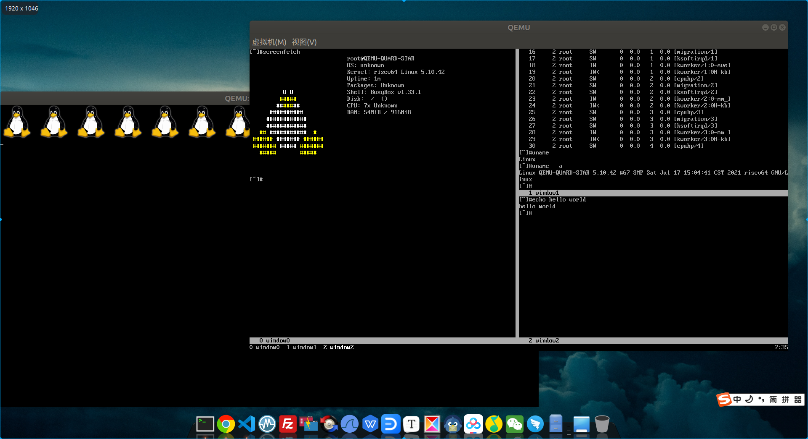
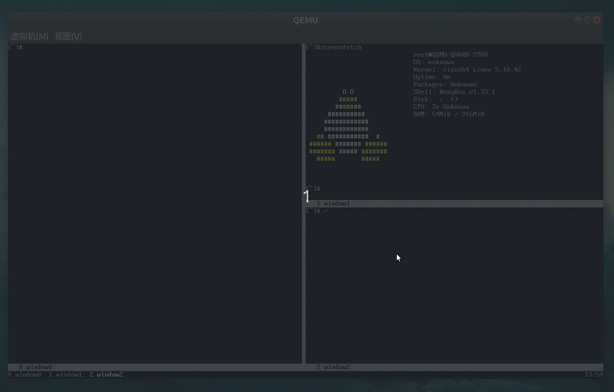

# 作者的碎碎念（开发日记）

- 
    2021.07.04(下午):增加了Quard Star开发板定义，8核支持，增加中断控制器、串口、pflash。添加低阶启动代码固化在pflash运行。
- 
    2021.07.05(晚上):增加了opensbi源码并添加platform支持代码，低阶启动代码添加加载sbi功能。
- 
    2021.07.09(晚上):增加了opensbi设备树中domain定义，并增加安全域的工程代码，使用安全域串口3打印；增加u-boot代码并引导进入非安全域执行，使用串口0打印。
- 
    2021.07.10(中午):增加uboot的platform定义以及配置等代码。
- 
    2021.07.10(下午):使用之前制作的根文件系统及内核映像尝试引导正确，设备树文件有所改动，且发现了点问题，1.当前版本的opensbi fix下一级设备树文件时会添加不可用的domain到设备树的reserved-memory节点，但存在重叠的情况，这在u-boot中解析设备树时是会报warring的，因此这里将域修改为分块的域，并不优雅但暂时就这么解决。2.u-boot在启动bl1阶段会拷贝代码到ddr高地址，而如果我们将高地址配置为了不可访问的安全domain时，当前u-boot的riscv实现中没有检查是否是reserved-memory区域，这里我们为了简单期间直接在我们的board platform代码层添加hook函数修改gd->ram_top来实现，其实这种方式最简单高效，如果都从设备树里解析未免过度设计了，这里本就只是启动引导的一小段环节而已，但是看起来uboot的趋势越来越向解析设备树方向靠近了。3.另外发现linux5.10.42在qemu使用-device virtio-gpu-device驱动工作不正常，内核oops了，目前不清楚是qemu-6.0.0的问题还是内核的代码，这个我有空去查一下。
- 
    2021.07.11(上午):添加linux kernel的编译，busybox的简易编译，编写根文件系统映像的打包脚本，添加简易etc配置文件，终于shell运行成功，后面要开始完善一些系统配置，用户态程序以及增加新显示驱动设备，我们打算移植Qt界面到系统内。另外安全域内的固件打算移植一些RTOS系统，看是移植FreeRTOS还是RTThread比较好呢(⊙o⊙)?
- 
    2021.07.12(晚上):使用-device virtio-gpu-device选项添加virtio显示设备时，内核出现了oops，地址跑飞的问题，我稍微花了点时间查找了一下，直接错误出现在linux-5.10.42/drivers/gpu/drm/virtio/virtgpu_kms.c:242行此处vgdev为空指针，直接访问会出错。为什么会是空指针呢，原来是因为110行处初始化时检查VIRTIO_F_VERSION_1不通过，因此驱动并没有正常被加载，而后release时出现空指针。明确了这个问题我们就要去qemu源码里查找一下为什么不支持这个VIRTIO_F_VERSION_1这个feature，经过查找终于发现在qemu-6.0.0/hw/virtio/virtio-mmio.c:712处，只有定义了proxy->legacy为false时才能添加这个feature，而722行给出默认配置为true，因此我们在运行qemu选项添加-global virtio-mmio.force-legacy=false选项后，终于一切正常了。这里我们参考一下这篇[qemu开发邮件](https://www.mail-archive.com/search?l=qemu-devel@nongnu.org&q=subject:%22Re%5C%3A+%5C%5BQemu%5C-devel%5C%5D+%5C%5BPATCH+v3%5C%5D+virtio%5C-mmio%5C%3A+implement+modern+%5C%28v2%5C%29%2C+personality+%5C%28virtio%5C-1%5C%29%22&o=newest&f=1)不难发现，force-legacy定义为false才是更新版本的定义，但可能是考虑兼容性的问题qemu默认还是给出了true才用传统的virtio行为。解决了这个问题，我们重新添加内核参数配置，以及内核定义一个我们的quard_star_defconfigs文件，添加显示linux启动logo的配置，再次启动qemu，ok！以下为上文部分描述中代码片段：

    ```c
    ……
    110 if (!virtio_has_feature(dev_to_virtio(dev->dev), VIRTIO_F_VERSION_1))
    111		return -ENODEV;
    ……
    242 virtio_gpu_modeset_fini(vgdev);
    ……
    ```

    ```c
    ……
    712 if (!proxy->legacy) {
    713     virtio_add_feature(&vdev->host_features, VIRTIO_F_VERSION_1);
    714 }
    ……
    722 DEFINE_PROP_BOOL("force-legacy", VirtIOMMIOProxy, legacy, true),
    ……
    ```

- 
    2021.07.13(晚上):将启动使用的shell从busybox提供的sh改为标准的bash，以方便后续开发。不过最麻烦的就是ncurses库的编译安装了，动态库可以从交叉编译工具链中拷贝，但是一些终端相关的配置文件和数据就要去编译ncurses库来安装了，好在基本上搞定了。另外注意从这里开始，我们新增给系统roofs.img中添加的内容都是通过目标虚拟机挂载共享目录然后安装的，而不是最处由脚本构建打包的，因此务必注意除非img被破坏，否则不要重新构建img，尽可能使用虚拟机本身去修改img内的文件。
- 
    2021.07.14(晚上):添加rtc和syscon到系统内，解决了虚拟机内时间戳不准确问题，解决了reboot不能复位系统，另外之前内核resetvec字段没有定义到rom的基地址，而是默认的0x1000(qemu-6.0.0/target/riscv/cpu.c的"resetvec"字段可以看到默认值)，虽没有产生错误，但是cpu启动时确认读入0x1000地址，与我们的期望不符，这次reboot可以看到其错误，修改后问题解决。关于上述cpu执行启动地址问题你可以添加qemu启动选项-d in_asm -D qemu_run_asm.log来观察行为。另外目前的实现reboot和poweroff这两个配置在kernel的设备树中其实是不太优雅的设计，我们使用的linux内核版本中sbi已经支持了poweroff，所以syscon-poweroff注册会失败，而syscon-reboot会注册成功，因为sbi还没有实现reboot，鉴于opensbi还在快速开发阶段，相信这个问题已经在逐渐完善了，感兴趣的朋友可以关注下这些项目的主线开发分支情况，这里我们就不去纠结这个设计了。
- 
    2021.07.15(晚上):将sudo和screenfetch移植到系统内，screenfetch稍微修改了一点，毕竟我们是busybox但是换了标准的bash，检测有的错误。另外今天在@zhiliao007(wenqing.li@aliyun.com)的帮助下确认了开启这个项目的所需要使用apt安装的包，由于我启动项目时使用的pc已经安装了很多开发环境了，因此一直没能确认如果是新的Ubuntu主机需要安装什么基础库，这里提出感谢。
- 
    2021.07.17(下午):这几天工作有点忙，终于周末有空继续这个项目了，首先是运行qemu时使用gtk显示界面是目前看起来最理想的方式，为了使用更大分辨率建议添加配置使其自动缩放启动参数如下--display gtk,zoom-to-fit=false。然后我将我一直在用的一些比较好用的工具继续向系统移植tree,screen,cu这三个工具，尤其是screen，毕竟只有终端的日子可能还要持续很久，那么一个漂亮的多终端工具就非常重要了，这些工具的移植配置还算是容易，但是终端窗口大小从主机测动态传入就比较麻烦了，这时候我们之前的fw_cfg就起到了大作用，我们启动脚本计算了终端窗口大小通过fw_cfg传入目标机，然后目标机通过cat /sys/firmware/qemu_fw_cfg/by_name/opt/qemu_cmdline/raw就可以读取到。不过注意了，由于qemu是在6.0版本才给riscv架构添加fw_cfg，而linux5.10.42还没有更新到，因此我们这里手动稍微修改下内核里的cofing平台过滤配置就可以使用啦。相信最新版主线上linux内核已经更新了这个功能，所以如果想体验新内核也可以更新最新内核来尝鲜。下面放张图看看开发到当前的效果。

    

- 
    2021.07.18(下午):从昨天晚上开始准备着手把freertos移植到trusted_domain中，但是下载了目前最新版本的freertos发现官方没有只有riscv S模式的移植包，都是基于M模式，那就自己来干吧，反正FreeRTOS是我最最熟悉的操作系统，经过一晚上加今天大半天的时间，终于移植成功了，主要是三部分，Tick使用sbi系统调用sbi_set_timer，任务上下文调度主要在S模式不要操作错CSR寄存器了，最后是portYIELD使用sbi_send_ipi向自己核心发送软中断进行。目前基本功能移植成功，目前已知还有两个细节需要优化，一是使用了中断栈但不能支持嵌套，sscratch没有利用到也不高效，这个需要分析下看究竟能否支持中断嵌套，二是浮点栈帧没有保存恢复，这个下次添加时要仔细考虑，最好能实现惰性压栈。不过目前的移植对于大部分需求来讲已经满足了。不知道是不是全网首发的S模式Freertos移植，反正我是没找到有人发布。毕竟S模式下，实时性可能会备受打击，但是目前我在qemu测试还好，当然我需要进一步测试，后面添加一些实时系统和linux系统ipc通讯的测试看看。
- 
    2021.07.24(上午):这周头痛没太多进展，这次主要是使用了 https://github.com/riscv/riscv-gnu-toolchain  tag:2021.08.07（ gitee镜像：https://gitee.com/mirrors/riscv-gnu-toolchain ），仓库分别编译了用于linux的编译器和用于裸机开发的编译器，这样有三个好处，第一是裸机开发能使用newlib的c库，第二是不依赖别人提供的工具链，方便我们debug时跟踪源码，第三是我们编译了gdb工具无论是裸机还是linux上的app应用调试可以使用gdb分析问题。更新了编译器后重新编译target_root_app时我更新了一些编译脚本，优化了之前编译时忽略的细节，详细内容可以查看target_root_app目录内的[README.md](./target_root_app/README.md)，大部分都没有问题了，但是screen工作不正常，粗略的debug了一下还没找到问题，后面有空再查找这个问题了。
- 
    2021.07.26(晚上):周末台风天一直在debug screen工作不正常的问题，今天晚上终于给解决了。这里一定要记录下曲折的心路历程(＞﹏＜)！首先是执行screen后出现“[screen is terminating]”后就瞬间退出了，很莫名其妙，第一想法就是打开编译screen的Makefile文件，把“OPTIONS= -DDEBUG”打开，然后再次执行，会在/tmp/debug/{SCREEN,screen}.*产生log信息，查找log并对比了之前正常工作log，完全没发现什么异常，然后我尝试交叉编译了strace工具，没有什么异常发现，没有办法，只好去交叉编译了gdb工具（交叉编译gdb时会报出很多错误，主要还是官方的编译脚本有漏洞，均是路径错误，我手动修改后最终编译成功）生成了一个可以在目标板运行 的gdb工具，拷贝到目标板中，使用gdb调试一点点定位问题，再次打开编译screen的Makefile文件，修改成“CFLAGS = -g -O0 -D_GNU_SOURCE”方便我们使用gdb调试。很快我就发现screen.c:1235这里会调用fork，并且主进程在之后并没有做产生异常就收到了SIGHUP信号退出了，因此出现异常的应该是这里创建的子进程。我想起来之前strace可能没有检查子进程的log，于是重新使用“strace -f /bin/screen”检查，却还是没发现什么异常，奇怪！只好继续用gdb跟踪子进程，方法是进入gdb后，使用“set follow-fork-mode child”命令来指示gdb跟踪子进程，经过一番定位最终screen.c:1428的MakeWindow(&nwin)返回了-1引起错误，进一步跟踪发现产生错误的调用关系是这样：
    
    ```
    screen.c:1428:MakeWindow(&nwin)
    >>>>window.c:628:OpenDevice(nwin.args, nwin.lflag, &type, &TtyName)
    >>>>>>>>window.c:1132:OpenPTY(namep)
    >>>>>>>>>>>>pty.c:334:openpty(&f, &s, TtyName, NULL, NULL)
    ```
    
    看来问题就出在openpty，这个函数定义在glibc中login/openpty.c:86行，使用gdb深入查找我们发现openpty.c:99:master = getpt ();返回了-1，而getpt的定义有三个分别在login/getpt.c和sysdeps/unix/bsd/getpt.c和sysdeps/unix/sysv/linux/getpt.c，我大概猜到问题了，应该是我们自己编译的编译器和下载bootlin上的编译器这样使用了不同的getpt，经过确认我们自己编译器使用的是sysdeps/unix/sysv/linux/getpt.c，而bootlin上的编译器我只能猜测使用的是sysdeps/unix/bsd/getpt.c，那么区别是什么呢？linux风格的pty设备是打开/dev/ptmx进而在/dev/pts目录内产生pty节点设备，而BSD风格的pty设备则是直接使用/dev/pty*设备。那么我自己编写了简单的测试代码open设备/dev/ptmx，发现果然返回-1，只好进一步查看内核的相关配置，发现其实内核里对两种风格的pty设备都支持了，如下：
    
    ```
    CONFIG_UNIX98_PTYS=y
    CONFIG_LEGACY_PTYS=y
    CONFIG_LEGACY_PTY_COUNT=256
    ```
    
    但是要注意到[内核文档>devices.rst](https://elixir.bootlin.com/linux/v5.10.42/source/Documentation/admin-guide/devices.rst)第155行提到了要将devpts挂载到/dev/pts这样linux风格的pty设备才能使用，原来是这样( ^_^ )！我们在目标文件系统配置文件/etc/fstab使用mdev的方式生成/dev目录，但是并没有给我们创建/dev/pts目录，因此不能直接在/etc/fstab添加挂载设备信息，那我们就还是在/etc/init.d/rcS启动脚本中添加，在/sbin/mdev -s后添加
    
    ```shell
    mkdir /dev/pts
    mount -t devpts devpts /dev/pts
    ```
    
    OK，测试一下screen，完美运行，大功告成。
- 
    2021.07.27(晚上):添加了运行脚本full-screen选项，希望能全屏启动且分辨率适配主机环境，然后发现qemu的gtk前端UI有点问题，在图形驱动工作前处于低分辨率，完成配置后分辨率正确后，gtk会更新窗画面，但是如果gtk进入全屏模式就不会更新，最终整个全屏显示就出问题了，最终定位到qemu-6.0.0/ui/gtk.c:601这里gd_update_windowsize函数只会在非全屏模式更新size，于是我们做以下修改:

    ```c
    if(vc->s->full_screen){
        gtk_menu_item_activate(GTK_MENU_ITEM(vc->s->full_screen_item));
        gtk_menu_item_activate(GTK_MENU_ITEM(vc->s->full_screen_item));
    } else {
        gd_update_windowsize(vc);
    }
    ```

    这样就可以针对全屏的情况下刷新正确的size。
- 
    2021.07.28(晚上):trusted_domain裸机程序可以使用newlib了，因此修改了一下启动脚本并做了相关newlib桩函数的移植，然后编译发现出错，原来是因为我们使用编译选项-mcmodel=medany来保证程序可以链接到0x80000000以上的高地址，但是默认编译的带newlib的编译器使用了-mcmodel=medlow来编译c库，因此无法链接，又踩到一个坑，只好重新编译了。最终总结编译命令如下:

    ```shell
    # 用于裸机带newlib的gcc
    ./configure --prefix=/opt/gcc-riscv64-unknown-elf --with-cmodel=medany
    make -j16
    # 用于linux带glibc的gcc
    ./configure --prefix=/opt/gcc-riscv64-unknown-linux-gnu
    make linux -j16
    ```
    到这里我们的编译器基本更换完成，后面如果遇到问题终于不用担心别人提供的二进制开发工具是否存在问题了，我们拥有全部的源码可以自行编译、debug、fix问题，O(∩_∩)O哈哈~ 
- 
    2021.07.29(晚上):添加了qt-5.12.11，顺利完成了交叉编译，之前尝试了qt-5.15.2版本，发现该版本在不打开opengl的情况下存在bug无法正常编译，[Qt bugreports](https://bugreports.qt.io/browse/QTBUG-88017)上已经有描述该问题了，因此我们这里使用比较稳定的lts版本5.12.11。
- 
    2021.07.30(晚上):内核增加CONFIG_INPUT_EVDEV选项以方便qt应用使用/dev/input/event*设备来获取鼠标和键盘输入事件。编译了几个测试示例qt gui应用，一切正常，注意添加一些环境变量确保qt应用运转正常。目前还没完全部署好Qt库到代码里，我想多测试一些功能再考虑细节的部署问题，让部署和调试变得优雅。

    ```
    export QT_QPA_FB_DRM=1
    export QT_QPA_GENERIC_PLUGINS=evdevkeyboard
    export QT_QPA_GENERIC_PLUGINS=evdevmouse
    export QT_QPA_EVDEV_MOUSE_PARAMETERS=/dev/input/event0
    export QT_QPA_EVDEV_KEYBOARD_PARAMETERS=/dev/input/event1
    export QT_PLUGIN_PATH=/home/root/plugins
    ```

    另外年初不是基于Qt移植了个世嘉和FC的模拟器，刚好也把这个项目也部署到现在的环境里看看效果，编译非常顺利，试运行如下图：

    

    

    哈哈哈哈哈哈哈，这太搞笑了，居然成功在x86的pc中运行qemu模拟的riscv平台里运行linux系统并移植的基于fb的qt框架里跑模拟m68k架构应用程序成功运行了世嘉md游戏，层层套娃，试玩一下，帧率不可言表，哈哈哈哈（笑哭）！
- 
    2021.08.01(下午):添加网络相关的配置脚本，修改启动脚本配置网络dhcp等功能，添加网络相关的工具ethtool和iperf。比较顺利没啥大问题注意下/etc/inittab内的语法是busybox的不是sysvinit的不要搞错了。
- 
    2021.08.02(晚上):添加一系列启动脚本，内容参考自buildroot的配置。添加zlib和openssh源码，添加编译脚本并部署完成，qemu使用端口转发22端口到物理机3522端口，ssh和sftp已测试完全可用，这周末开始完成一些网络相关的内容，不过个人在网路这块还是小白初学者，好在这块目前完全没有遇到坑，而且资料教程颇多，我最近也要开始好好学习这方面的底层知识，后面本项目看情况缓更。
- 
    2021.08.06(晚上):target_root_app里的一些工具编译可能在原版的ubuntu18.04上不能直接编译通过，为了确保能顺利偏移通过，以目前的版本看来，automake的版本选用1.16.1，pkg-config选择0.29.2，我们直接引入源码安装到host_output目录下，后续使用host_output下的automake工具执行编译流程。
- 
    2021.08.14(下午):最近在持续补充博客文档。今天上海暴雨倾盆，一口气完成了三篇已经更新到ch15。唉，说起来今天还是七夕节，为什么我要在家些博客呢？当然是因为今天约女孩子没约到啊（苦涩）！！！这次更新够多了，休息去刷剧了。
- 
    2021.08.18(晚上):尝试了一下openjdk11的交叉编译，依赖太多了，尤其是x11那一套库，不过倒是成功完成了，而且这次是彻底把automake，pkg-config的实现逻辑搞明白了。openjdk zero实在是性能太差了，运行一条查看版本的命令都要执行七八分钟，回头有机会研究下jit的实现代码，虽然我还不觉得自己有能力移植到rv上，但是这个事情还是蛮有趣的。
- 
    2021.08.21(上午):继续加速把系列博客编辑完成，一口气完成3节，目前到了ch19节，已有计划还剩下ch20-ch25这6节，争取接下来几天全部更新完成，加油↖(^ω^)↗。
- 
    2021.08.21(晚上):没想到早上说尽快把文档编辑完成，结果下午到晚上一口气就全部更完了，后面这个项目就将真正进入缓更期了，笔者后面也需要去学习补充自己还不熟悉的技术栈了。
- 
    2021.10.16(下午):又回来更新这个项目了，首先就是给我们的虚拟SOC添加三个i2c控制器，这里我们选择qemu已有的实现imx-i2c，这个是在NXP的imx系列中的i2c ip，还是比较顺利的，很容易就添加好了，之后我们在i2c0上挂载一块 at24c64 eeprom，编写设备树文件，在linux内核中添加相关驱动，很轻松就识别到了i2c控制器以及at24c64，执行如下命令可以测试eeprom的读写情况。

    ```
    echo hello > /sys/bus/i2c/devices/0-0050/eeprom
    cat /sys/bus/i2c/devices/0-0050/eeprom
    ```

- 
    2021.10.17(上午):继续给我们的虚拟SOC添加两个spi控制器，这里我们选择qemu已有的实现sifive_spi，轻车熟路，之后我们在spi0上挂载一块is25wp256的norflash，编写设备树文件，在linux内核中添加相关驱动，记得添加mtd设备驱动，然后就很顺利的看到有/dev/mtd1的设备出现（mtd0是之前我们的SOC内部直连的并行pflash），mtd设备测试就不多说了，直接操作mtdblock1就可以，也可以使用mtd_debug小工具来操作。我们的soc内部控制器开始越来越丰富了，因此这里要整理一下qemu-6.0.0/hw/riscv/quard_star.c代码，之前是基本上从virt.c简化而来的，由于侧重点不同因此对于我们来说其代码可读性不好，这里我重构了下，针对每个不同的控制器分别编写独立的create函数，现在代码整洁多了。

    ```c
    static void quard_star_machine_init(MachineState *machine)
    {
        quard_star_cpu_create(machine);
        quard_star_interrupt_controller_create(machine);
        quard_star_memory_create(machine);
        quard_star_flash_create(machine);
        quard_star_syscon_create(machine);
        quard_star_rtc_create(machine);
        quard_star_serial_create(machine);
        quard_star_i2c_create(machine);
        quard_star_spi_create(machine);
    
        quard_star_virtio_mmio_create(machine);
        quard_star_fw_cfg_create(machine);
    }
    ```

- 
    2021.10.30(上午):最近心情状态稳定很多，还挺开心的，继续更新这个项目，首先就是设备树文件，之前也是为了直观一点点添加内容的，这对于初学者渐进式的学习很有帮助，但是随着设备数信息愈发膨胀，平铺式的写法将难以阅读，必须重构为结构化的形式，这里重新编写以下三个文件quard_star_sbi.dts、quard_star_uboot.dts、quard_star.dtsi，dtsi为公共的SOC内部设备信息，另外两份dts则引用dtsi并针对各自的需要使能相关控制器，而挂载到控制器之上的外部设备同样也写在dts中而不是dtsi中。另外将这个仓库导入CodeFactor中，根据提示优化了部分风格不良的代码，后续不仅要让代码正确运行，还要对代码风格和可读性做进一步要求。
- 
    2021.11.06(上午):首先是优化了uboot中distro boot script，现在我们支持tftpboot，后续debug时就不用每次构建带有内核信息的文件系统，仅仅需要编译生成启动固件然后通过tftp加载即可，脚本内容如下，是通过加载主机tftp服务器中boot.cfg文件判断是否内容为“tftp”，如果没有这个文件或内容不是tftp则还是走之前的启动流程。

    ```
    # try use tftp load boot.cfg
    mw.l ${kernel_addr_r} 0x0
    dhcp ${kernel_addr_r} /boot.cfg
    
    # load bootfile according to boot.cfg
    if itest.l *${kernel_addr_r} == 0x70746674; 
    then 
        echo tftpboot...
        dhcp ${kernel_addr_r} /linux_kernel/Image
        dhcp ${fdt_addr_r} /uboot/quard_star_uboot.dtb
    else
        echo virtioboot...
        load virtio 0:1 ${kernel_addr_r} /Image
        load virtio 0:1 ${fdt_addr_r} /quard_star.dtb
    fi
    
    # boot kernel
    booti ${kernel_addr_r} - ${fdt_addr_r}
    ```

- 
    2021.11.06(下午):应该是这周最后一次更新，说起来今天还有点小忧伤，这篇更新完毕晚上准备给自己做顿盐焗鸡翅。不扯废话了，这次我们给虚拟SOC添加一个USB控制器，qemu中有dwc3的半成品实现，为啥是半成品呢——因为只实现了host模式，而没有实现otg。dwc3这个控制器想必做嵌入式的朋友都太熟悉了，Synopsys的ip，我在非常多的SOC中都见过这个控制器。阅读代码看到这个dwc3仿真似乎是Xilinx写的，被包含在xlnx-usb-subsystem中一部分，这里我们不使用XILINX_VERSAL的代码，直接创建一个dwc3设备。代码还是很简单的，如下：

    ```c
    static void quard_star_usbs_create(MachineState *machine)
    {
        QuardStarState *s = RISCV_VIRT_MACHINE(machine);
    
        object_initialize_child(OBJECT(s), "dwc3", &s->usb,
                                TYPE_USB_DWC3);
    
        sysbus_realize(SYS_BUS_DEVICE(&s->usb), &error_fatal);
    
        sysbus_mmio_map(SYS_BUS_DEVICE(&s->usb), 0, 
                                virt_memmap[QUARD_STAR_USB].base);
        qdev_pass_gpios(DEVICE(&s->usb.sysbus_xhci), DEVICE(&s->usb), SYSBUS_DEVICE_GPIO_IRQ);
        sysbus_connect_irq(SYS_BUS_DEVICE(&s->usb), 0,
                        qdev_get_gpio_in(DEVICE(s->plic), QUARD_STAR_USB_IRQ));
    }
    ```

    编写设备树文件，然后配置内核CONFIG_USB_DWC3=y，运行，这里居然出现了oops，看起来是访问异常，难道说部分寄存器没实现导致读写出错了吗？翻看了代码qemu-6.0.0/hw/usb/hcd-dwc3.c:587这边模拟器是register_read_memory/register_write_memory来访问寄存器的，qemu和内核两头加打印，最终定位到是内核linux-5.10.65/drivers/usb/dwc3/core.c:290这里访问DWC3_DCTL出错，其实问题很明确，qemu注释写明了只支持host因此device相关的寄存器都是没有实现的，那么内核里的驱动为什么还访问设备寄存器呢，毕竟我们在设备树里指定了dr_mode为host，最终修改283行判断代码添加另一个条件检查dr_mode来跳过device寄存器。考虑Xilinx自己的驱动代码是5.13才加入内核主线的，因此查了下最新的内核5.15的驱动代码有所变化，但这个判断条件仍没有修改，是否修复了看不出来，这里就先暂且放下，先按我这个修改使用。

    ```c
    if (dwc->current_dr_role == DWC3_GCTL_PRTCAP_HOST ||
        dwc->dr_mode == USB_DR_MODE_HOST)
    return 0;
    ```

    搞定之后进入系统一切顺利，使用lsusb可以看到控制器信息。

    ```
    [~]#lsusb 
    Bus 001 Device 001: ID 1d6b:0002
    Bus 002 Device 001: ID 1d6b:0003
    ```

- 
    2021.11.07(上午):添加了gpio和dma控制器，比较简单好理解的控制器。
- 
    2021.11.07(下午):添加了sdmmc控制器，现在我们可以有sd卡了。
- 
    2021.11.14(下午):这周没怎么开发这个项目，因为R星发布了GTA三部曲最终版，童年经典游戏，所以果断回味经典去了。不过还是有进度的，计划给这个项目做一个maskrom添加多种boot方式和升级固件的功能，因此初步完成了syscon的设计，添加了一个boot状态寄存器，可以通过qemu参数指定boot状态。稍晚点把代码整理好提交。
- 
    2021.11.19(晚上):把maskrom中pflash/spi/sd三种boot的代码完成了，这里要强调下maskrom中的spi和sdhci的驱动编写的非常简单而粗糙，为什么呢，因为我们要简化maskrom的代码设计，尽可能使用极少的rom和ram空间，真实的soc设计时这些静态ram的成本是很高的，当然这份驱动代码还要考虑更多性能和兼容性的问题，这里我们没有仔细斟酌，仅作示例（这里发现了个奇怪的现象，spi的驱动在maskrom和lowlevelboot状态下性能差异很大，这可能是qemu的问题，后续有空研究下）。lowlevelboot代码增加了spi和sd的情况，这里注意下代码改为在sram的地址空间执行，但是之前pflash的代码因为我们使用了纯汇编编写，因此地址是无关的，除了一个_pen变量的取址方式是需要pc，这边特殊处理下即可，这样我们的lowlevelboot代码就可以在pflash和sarm两种方式都能执行正确了。现在maskrom代码就只差升级功能没完成了，这里我计划使用xmodem协议，另外计划再写个PC升级工具用于配合升级流程。另外又整理了一些框图流程图。
- 
    2021.11.20(早上):移植xmodem传输协议到mask_rom，成功测试可以通过uart烧写lowlevelboot.bin到sram内，需要做一个好用的pc工具来对接升级，计划考虑用pyqt或者Qt来写。
- 
    2021.11.21(晚上):优化代码，添加CI来对uart升级功能进行测试，但是CI问题很多，conda的环境总是有问题，好在终于解决了，而且把之前的CI脚本做了更新，现在代码更加干净整洁了。另外，我今天心情特别糟糕，特别糟糕，特别糟糕，特别糟糕，特别糟糕，特别糟糕，特别糟糕，特别糟糕，特别糟糕，特别糟糕，特别糟糕，特别糟糕，特别糟糕，特别糟糕，特别糟糕。我想我是否应该去看心理医生了。哭。
- 
    2021.11.22(晚上):状态恢复了，心情很好很开心，是的，我现在情绪波动真的很大，我也不知道该怎么处理。好了聊正事，心情不错，今天抽空研究下为什么之前写的spi flash的驱动在maskrom上运行及其慢，而进入lowlevelboot阶段则不会运行那么慢了，虽然作为示例驱动实现的写法为低效率的轮寻，但也不应该在不同阶段执行速度不一样，这里怀疑是qemu本身实现的问题。首先qemu是拥有一个tcg子系统，用于将guest指令转换为host上的指令，我们可以从这里入手，首先运行qemu时添加参数-d op -D qemu.log，这样会将运行产生的tcg中间IR码打印出来，如下示例:

    ```
    OP:
        ld_i32 tmp0,env,$0xfffffffffffffff0
        brcond_i32 tmp0,$0x0,lt,$L0

        ---- 0000000000000000
        mov_i32 tmp0,$0x1
        st_i32 tmp0,env,$0xfffffffffffff168
        mov_i64 x3/gp,$0xe2000
        goto_tb $0x0
        mov_i64 pc,$0x4
        exit_tb $0x7fe43effe000
        set_label $L0
        exit_tb $0x7fe43effe003
    
    …………
    ```

    好嘛，这一看才发现，在maskrom阶段执行的IR码的翻译都是一条一条单指令翻译的，而到lowlevelboot阶段则是按照TB块翻译的，难怪仿真效率差这么多，这看起来像是bug，我们来追踪下qemu源码看下为什么会产生这种现象。首先找到：qemu-6.0.0/accel/tcg/translate-all.c:1862，代码片段：

    ```c
    phys_pc = get_page_addr_code(env, pc);

    if (phys_pc == -1) {
        /* Generate a one-shot TB with 1 insn in it */
        //QQM mark
        cflags = (cflags & ~CF_COUNT_MASK) | CF_LAST_IO | 1;
    }
    ```

    这里如果phys_pc为-1,则TB块的大小为1,实测果然是这里为-1了，而我们的pc地址在maskrom阶段是0地址开始的，继续追踪代码到qemu-6.0.0/accel/tcg/cputlb.c:1518，函数get_page_addr_code_hostp中代码片段如下：

    ```c
    if (unlikely(!tlb_hit(entry->addr_code, addr))) {
        if (!VICTIM_TLB_HIT(addr_code, addr)) {
            tlb_fill(env_cpu(env), addr, 0, MMU_INST_FETCH, mmu_idx, 0);
            index = tlb_index(env, mmu_idx, addr);
            entry = tlb_entry(env, mmu_idx, addr);

            if (unlikely(entry->addr_code & TLB_INVALID_MASK)) {
                /*
                 * The MMU protection covers a smaller range than a target
                 * page, so we must redo the MMU check for every insn.
                 */
                return -1;
            }
        }
        assert(tlb_hit(entry->addr_code, addr));
    }
    ```
    
    这里条件entry->addr_code & TLB_INVALID_MASK为真，这里非常有问题，为什么0地址在上电状态下TLB_INVALID_MASK，其他地址就没这个问题，继续跟踪发现函数tlb_set_page_with_attrs中代码片段如下：

    ```
    if (size < TARGET_PAGE_SIZE) {
        /* Repeat the MMU check and TLB fill on every access.  */
        address |= TLB_INVALID_MASK;
    }
    ```

    向上追踪此处的异常size来源于tlb_set_page，而针对RISCV平台的调用在发生在qemu-6.0.0/target/riscv/cpu_helper.c文件内riscv_cpu_tlb_fill函数内通过get_physical_address_pmp获取tlb_size后传递给tlb_set_page，到这里就进入到riscv的平台专有代码的，看来距离真相接近了。继续追踪代码发现在qemu-6.0.0/target/riscv/pmp.c文件内的pmp_is_range_in_tlb-->pmp_get_tlb_size函数tlb_sa在第一个4K区域内，会返回1这个size。

    ```c
    static target_ulong pmp_get_tlb_size(CPURISCVState *env, int pmp_index,
                                        target_ulong tlb_sa, target_ulong tlb_ea)
    {
        target_ulong pmp_sa = env->pmp_state.addr[pmp_index].sa;
        target_ulong pmp_ea = env->pmp_state.addr[pmp_index].ea;

        if (pmp_sa >= tlb_sa && pmp_ea <= tlb_ea) {
            //printf("1 %ld %ld %ld %ld\n",pmp_sa,tlb_sa,pmp_ea,tlb_ea);
            return pmp_ea - pmp_sa + 1;
        }

        if (pmp_sa >= tlb_sa && pmp_sa <= tlb_ea && pmp_ea >= tlb_ea) {
            return tlb_ea - pmp_sa + 1;
        }

        if (pmp_ea <= tlb_ea && pmp_ea >= tlb_sa && pmp_sa <= tlb_sa) {
            return pmp_ea - tlb_sa + 1;
        }

        return 0;
    }
    ```

    这里的问题就是env->pmp_state.addr\[pmp_index\].sa和env->pmp_state.addr\[pmp_index\].ea都等于0,而代码运行在这里时，pmp_state根本就没有做任何配置，sa和ea都是内存alloc后的默认值，阅读pmp_update_rule_addr实现不难发现，上电状态下pmp模块应该为PMP_AMATCH_OFF状态sa应为0,ea应为最大值，这样之前的pmp_is_range_in_tlb就不会返回那个奇怪的1值了。这里显然是个严重问题，guest在未初始配置pmp时，tlb_size获取错误。

    ```c
    void pmp_update_rule_addr(CPURISCVState *env, uint32_t pmp_index)
    {
        uint8_t this_cfg = env->pmp_state.pmp[pmp_index].cfg_reg;
        target_ulong this_addr = env->pmp_state.pmp[pmp_index].addr_reg;
        target_ulong prev_addr = 0u;
        target_ulong sa = 0u;
        target_ulong ea = 0u;

        if (pmp_index >= 1u) {
            prev_addr = env->pmp_state.pmp[pmp_index - 1].addr_reg;
        }

        switch (pmp_get_a_field(this_cfg)) {
        case PMP_AMATCH_OFF:
            sa = 0u;
            ea = -1;
            break;

        case PMP_AMATCH_TOR:
            sa = prev_addr << 2; /* shift up from [xx:0] to [xx+2:2] */
            ea = (this_addr << 2) - 1u;
            break;

        case PMP_AMATCH_NA4:
            sa = this_addr << 2; /* shift up from [xx:0] to [xx+2:2] */
            ea = (sa + 4u) - 1u;
            break;

        case PMP_AMATCH_NAPOT:
            pmp_decode_napot(this_addr, &sa, &ea);
            break;

        default:
            sa = 0u;
            ea = 0u;
            break;
        }

        env->pmp_state.addr[pmp_index].sa = sa;
        env->pmp_state.addr[pmp_index].ea = ea;
    }
    ```

    由于这部分代码逻辑比较复杂，目前我还没找到一个合适的地方添加对pmp_state.addr初值的init，所以，目前我的解决办法是在maskrom代码内一开始的位置添加

    ```asm
    csrw pmpcfg0, 0
  	csrw pmpcfg1, 0
  	csrw pmpcfg2, 0
  	csrw pmpcfg3, 0
    ```

    以此将pmp配置到正确的初始值，修改和再次测试spi flash的驱动，果然问题解决。最后qemu的tcg非常有意思，这里推荐一些[博客](https://airbus-seclab.github.io/qemu_blog/tcg_p1.html)给大家，感兴趣可以阅读。
- 
    2021.12.04(凌晨):目前项目功能添加的差不多了，没有太多想法，只差些细节优化可以慢慢来做。然后这两天突发奇想想给这个项目做个漂亮的GUI前端，以一块开发板的形式展现出来，可以点击开发板上的开关启动qemu，并且点击串口，vga接口来查看仿真的输出，点击flash器件加载固件等等，虽说技术价值不大，但是很好玩很有趣就好了。经过一天的努力，终于肝到凌晨这个工具初具形态了。我来录制个gif给大家看看。

    

- 
    2021.12.05(晚上):gui前端tools修修代码风格，添加命令行选项，更新主界面里不美观的建模，这里特别鸣谢[MignonZhu](https://github.com/MignonZhu)提供3D模型的，让UI变的更加好看。另外GIMP我现在使用相当熟练了，完全不输PS，甚至更好。
- 
    2021.12.18(下午):最近上班有点忙，开始没时间搞这个了。三天前我度过了最孤单的一次生日，26周岁的我真的对生命越来越恍惚了，不知道自己还会单纯善良到何时，也不知道未来究竟在何方，不过如今的我已然麻木不再奢求什么，此生就守着心中的白月光到永远吧。回到开发计划：本来计划添加一个audio play的系统，目前添加了i2s控制器和wm8750 codec，但是内核的驱动没有现成了得自己写，目前框架写好了，但是qemu这边发现主机pulseaudio底层也有点问题，不是很有空调试，先暂时设备树写disabled提交了代码。
- 
    2022.04.19(晚上):qemu最新的7.0.0版本在今天如期发布了，还是带来了很多riscv相关的更新，包括rvv、rvh扩展，支持了kvm，我们就第一时间将quard-star的实现向7.0.0版本移植，API方面改动并不多，主要是为了kvm支持添加了更标准rvclint和rvplic，这边我们先暂时不实现kvm支持，先让原功能全部跑通，等后面周末我有空再来进行代码优化。另外我之前提到的pmp_state.addr初值的init问题官方已经解决了，因此我们可以删除之前mask_rom中的csrw pmpcfg0, 0相关代码了。移植完成测试发现freertos相关代码在cpu7中运行到中途出现了无法继续调度的问题，这个暂时挂起等待后面抽空研究。
- 
    2022.04.23(晚上):搞错了，freertos相关代码在cpu7中运行到中途出现了无法继续调度的问题是由于之前一次修改设备树时没有配置好保留内存区域导致linux启动后覆盖了cpu7需要的内存空间导致的，目前问题已解决。
- 
    2022.06.05(下午):添加了onenand ip用于学习nand falsh相关内容，以及ubifs，我们使用这个模型qemu-7.0.0/hw/block/onenand.c，添加到我们的quard star soc中，另外注意该ip的寄存器空间size为0x20000。这里要注意下，模拟的flash大小为256M，但是运行时使用-drive if=mtd,bus=1,unit=0,format=raw,file=$SHELL_FOLDER/output/fw/nandflash.img,id=mtd2这个提供的文件映像应为264M，因为驱动内会使用最后8M的备用区空间来存储坏快表等信息。
- 
    2022.06.08(晚上):添加了xlnx-can ip，基本没有遇到什么问题，不过在测试host上使用vcan与guest上的can通信，结果发现数据包字节序似乎不正确，因此对比kernel内的驱动代码以及qemu的代码发现xlnx的can格式和socket can格式是不匹配的，需要转换，这里阅读《ug1085-zynq-ultrascale-trm.pdf》的Table 20‐3: CAN Message Format就能发现这个问题，奇怪的是qemu-7.0.0/hw/net/can/xlnx-zynqmp-can.c内实现的似乎没有转换xlnx CAN Message Format而是把Socket CAN Format直接转发了，因此导致了错误。我这里添加或修改以下函数，问题得到解决（这里我没有向qemu上游发送patch，因为我不确定是否真实的zynq也存在该问题）：

    ```c
    #define XCAN_IDR_IDE_MASK		0x00080000U
    #define XCAN_IDR_ID1_MASK		0xFFE00000U
    #define XCAN_IDR_ID2_MASK		0x0007FFFEU
    #define XCAN_IDR_RTR_MASK		0x00000001U
    #define XCAN_IDR_SRR_MASK		0x00100000U
    #define XCAN_IDR_ID1_SHIFT		21
    #define XCAN_IDR_ID2_SHIFT		1
    #define CAN_SFF_ID_BITS		    11
    #define CAN_EFF_ID_BITS		    29
    
    static uint32_t id_xcan2can(uint32_t id)
    {
        uint32_t ret_id = 0; 
        /* Change Xilinx CAN ID format to socketCAN ID format */
        if (id & XCAN_IDR_IDE_MASK) {
            /* The received frame is an Extended format frame */
            ret_id = (id & XCAN_IDR_ID1_MASK) >> 3;
            ret_id |= (id & XCAN_IDR_ID2_MASK) >>
                    XCAN_IDR_ID2_SHIFT;
            ret_id |= QEMU_CAN_EFF_FLAG;
            if (id & XCAN_IDR_RTR_MASK)
                ret_id |= QEMU_CAN_RTR_FLAG;
        } else {
            /* The received frame is a standard format frame */
            ret_id = (id & XCAN_IDR_ID1_MASK) >>
                    XCAN_IDR_ID1_SHIFT;
            if (id & XCAN_IDR_SRR_MASK)
                ret_id |= QEMU_CAN_RTR_FLAG;
        }
        return ret_id;
    }

    static uint32_t id_can2xcan(uint32_t id)
    {
        uint32_t ret_id = 0;
        if (id & QEMU_CAN_EFF_FLAG) {
            /* Extended CAN ID format */
            ret_id = ((id & QEMU_CAN_EFF_MASK) << XCAN_IDR_ID2_SHIFT) &
                XCAN_IDR_ID2_MASK;
            ret_id |= (((id & QEMU_CAN_EFF_MASK) >>
                (CAN_EFF_ID_BITS - CAN_SFF_ID_BITS)) <<
                XCAN_IDR_ID1_SHIFT) & XCAN_IDR_ID1_MASK;
            ret_id |= XCAN_IDR_IDE_MASK | XCAN_IDR_SRR_MASK;
            if (id & QEMU_CAN_RTR_FLAG)
                ret_id |= XCAN_IDR_RTR_MASK;
        } else {
            /* Standard CAN ID format */
            ret_id = ((id & QEMU_CAN_SFF_MASK) << XCAN_IDR_ID1_SHIFT) &
                XCAN_IDR_ID1_MASK;
            if (id & QEMU_CAN_RTR_FLAG)
                ret_id |= XCAN_IDR_SRR_MASK;
        }
        return ret_id;
    }

    static void generate_frame(qemu_can_frame *frame, uint32_t *data)
    {
        frame->can_id = id_xcan2can(data[0]);
        frame->can_dlc = FIELD_EX32(data[1], TXFIFO_DLC, DLC);

        frame->data[0] = FIELD_EX32(data[2], TXFIFO_DATA1, DB0);
        frame->data[1] = FIELD_EX32(data[2], TXFIFO_DATA1, DB1);
        frame->data[2] = FIELD_EX32(data[2], TXFIFO_DATA1, DB2);
        frame->data[3] = FIELD_EX32(data[2], TXFIFO_DATA1, DB3);

        frame->data[4] = FIELD_EX32(data[3], TXFIFO_DATA2, DB4);
        frame->data[5] = FIELD_EX32(data[3], TXFIFO_DATA2, DB5);
        frame->data[6] = FIELD_EX32(data[3], TXFIFO_DATA2, DB6);
        frame->data[7] = FIELD_EX32(data[3], TXFIFO_DATA2, DB7);
    }

    static void update_rx_fifo(XlnxZynqMPCANState *s, const qemu_can_frame *frame)
    {
        bool filter_pass = false;
        uint16_t timestamp = 0;

        /* If no filter is enabled. Message will be stored in FIFO. */
        if (!((ARRAY_FIELD_EX32(s->regs, AFR, UAF1)) |
        (ARRAY_FIELD_EX32(s->regs, AFR, UAF2)) |
        (ARRAY_FIELD_EX32(s->regs, AFR, UAF3)) |
        (ARRAY_FIELD_EX32(s->regs, AFR, UAF4)))) {
            filter_pass = true;
        }

        /*
        * Messages that pass any of the acceptance filters will be stored in
        * the RX FIFO.
        */
        if (ARRAY_FIELD_EX32(s->regs, AFR, UAF1)) {
            uint32_t id_masked = s->regs[R_AFMR1] & frame->can_id;
            uint32_t filter_id_masked = s->regs[R_AFMR1] & s->regs[R_AFIR1];

            if (filter_id_masked == id_masked) {
                filter_pass = true;
            }
        }

        if (ARRAY_FIELD_EX32(s->regs, AFR, UAF2)) {
            uint32_t id_masked = s->regs[R_AFMR2] & frame->can_id;
            uint32_t filter_id_masked = s->regs[R_AFMR2] & s->regs[R_AFIR2];

            if (filter_id_masked == id_masked) {
                filter_pass = true;
            }
        }

        if (ARRAY_FIELD_EX32(s->regs, AFR, UAF3)) {
            uint32_t id_masked = s->regs[R_AFMR3] & frame->can_id;
            uint32_t filter_id_masked = s->regs[R_AFMR3] & s->regs[R_AFIR3];

            if (filter_id_masked == id_masked) {
                filter_pass = true;
            }
        }

        if (ARRAY_FIELD_EX32(s->regs, AFR, UAF4)) {
            uint32_t id_masked = s->regs[R_AFMR4] & frame->can_id;
            uint32_t filter_id_masked = s->regs[R_AFMR4] & s->regs[R_AFIR4];

            if (filter_id_masked == id_masked) {
                filter_pass = true;
            }
        }

        if (!filter_pass) {
            trace_xlnx_can_rx_fifo_filter_reject(frame->can_id, frame->can_dlc);
            return;
        }

        /* Store the message in fifo if it passed through any of the filters. */
        if (filter_pass && frame->can_dlc <= MAX_DLC) {

            if (fifo32_is_full(&s->rx_fifo)) {
                ARRAY_FIELD_DP32(s->regs, INTERRUPT_STATUS_REGISTER, RXOFLW, 1);
            } else {
                timestamp = CAN_TIMER_MAX - ptimer_get_count(s->can_timer);

                fifo32_push(&s->rx_fifo, id_can2xcan(frame->can_id));

                fifo32_push(&s->rx_fifo, deposit32(0, R_RXFIFO_DLC_DLC_SHIFT,
                                                R_RXFIFO_DLC_DLC_LENGTH,
                                                frame->can_dlc) |
                                        deposit32(0, R_RXFIFO_DLC_RXT_SHIFT,
                                                R_RXFIFO_DLC_RXT_LENGTH,
                                                timestamp));

                /* First 32 bit of the data. */
                fifo32_push(&s->rx_fifo, deposit32(0, R_TXFIFO_DATA1_DB0_SHIFT,
                                                R_TXFIFO_DATA1_DB0_LENGTH,
                                                frame->data[0]) |
                                        deposit32(0, R_TXFIFO_DATA1_DB1_SHIFT,
                                                R_TXFIFO_DATA1_DB1_LENGTH,
                                                frame->data[1]) |
                                        deposit32(0, R_TXFIFO_DATA1_DB2_SHIFT,
                                                R_TXFIFO_DATA1_DB2_LENGTH,
                                                frame->data[2]) |
                                        deposit32(0, R_TXFIFO_DATA1_DB3_SHIFT,
                                                R_TXFIFO_DATA1_DB3_LENGTH,
                                                frame->data[3]));
                /* Last 32 bit of the data. */
                fifo32_push(&s->rx_fifo, deposit32(0, R_TXFIFO_DATA2_DB4_SHIFT,
                                                R_TXFIFO_DATA2_DB4_LENGTH,
                                                frame->data[4]) |
                                        deposit32(0, R_TXFIFO_DATA2_DB5_SHIFT,
                                                R_TXFIFO_DATA2_DB5_LENGTH,
                                                frame->data[5]) |
                                        deposit32(0, R_TXFIFO_DATA2_DB6_SHIFT,
                                                R_TXFIFO_DATA2_DB6_LENGTH,
                                                frame->data[6]) |
                                        deposit32(0, R_TXFIFO_DATA2_DB7_SHIFT,
                                                R_TXFIFO_DATA2_DB7_LENGTH,
                                                frame->data[7]));

                ARRAY_FIELD_DP32(s->regs, INTERRUPT_STATUS_REGISTER, RXOK, 1);
                trace_xlnx_can_rx_data(frame->can_id, frame->can_dlc,
                                    frame->data[0], frame->data[1],
                                    frame->data[2], frame->data[3],
                                    frame->data[4], frame->data[5],
                                    frame->data[6], frame->data[7]);
            }

            can_update_irq(s);
        }
    }
    ```

- 
    2022.06.09(晚上):最近添加了can/pwm/timer/adc这些模型到quard star soc中，均验证正确，然后今天添加了cadence的gem网卡模型，编写好设备树dts文件后，运行却发现uboot无法启动了，而且完全没有打印输出，经过一番查找定位，终于找到了问题，u-boot-2021.07/drivers/serial/serial-uclass.c:79:serial_find_console_or_panic函数未能正常完成而产生了panic_str断言，继续追逐最终确认在以下代码处返回了-ENOMEM（-12）错误最终导致问题。
    
    ```c
    -> u-boot-2021.07/drivers/serial/serial-uclass.c:69:
        lists_bind_fdt(gd->dm_root, offset_to_ofnode(node), devp, false)
    -> u-boot-2021.07/drivers/core/lists.c:245:
        ret = device_bind_with_driver_data(parent, entry, name, id->data, node, &dev);
    -> u-boot-2021.07/drivers/core/device.c:62:
        dev = calloc(1, sizeof(struct udevice));
    ```

    其实根本原因是由于dtb文件的大小增加导致uboot在代码重定向前的堆内存开销增大导致的，因此修改办法为，在uboot中的qemu-quard-star_defconfig文件增加以下配置覆盖默认的堆内存大小。
    
    ```
    CONFIG_SYS_MALLOC_F_LEN=0x10000
    ```

- 
    2022.06.12(上午): 添加PL111后在5.10版本的kernel配置驱动就可以正确启用设备，但是在linux-next上却无法正确完成设备枚举，而且居然没有任何错误打印。因此跟踪了下问题，首先定位到drivers/gpu/drm/pl111/pl111_drv.c:72:pl111_modeset_init返回了-EPROBE_DEFER错误，由于无法找到panel，因此转而跟踪drivers/gpu/drm/panel/panel-simple.c发现启动过程中完全没有调用panel_simple_platform_probe函数，这是什么原因呢？为此只好去调查内核的驱动框架的代码，定位这个文件——drivers/base/dd.c，设备通过设备树解析后开始进一步匹配attach，大致路径为device_attach-->__device_attach_driver-->driver_match_device/driver_probe_device，此时发现match_device正常，probe_device失败，进一步调查__driver_probe_device-->really_probe-->device_links_check_suppliers，此时发现位于drivers/base/core.c:890:device_links_check_suppliers函数1038行返回了-EPROBE_DEFER错误，因此panel-simple就完全没有去调用probe函数，这里打印出dev_name(link->supplier)信息发现，原来是添加的设备树新添加的power-supply和backlight本身没有probe，因此panel就无法probe，原来只是自己忘记配置这两个驱动在config文件里了🤣，我搁着绕了一大圈，就这么简单个小错误，在此记录下以示警戒自己，不过这次阅读代码也有好处，就是把内核的驱动框架和设备树解析更加熟悉了。

    ```dts
    panel {
		compatible = "panel-dpi";
		label = "lcd";
		power-supply = <&reg_3p3v>;
		backlight = <&backlight>;
		status = "okay";

		panel-timing {
			clock-frequency = <25175000>;
			hactive = <640>;
			hback-porch = <40>;
			hfront-porch = <24>;
			hsync-len = <96>;
			vactive = <480>;
			vback-porch = <32>;
			vfront-porch = <11>;
			vsync-len = <2>;
		};

		port {
			lcdc_panel: endpoint {
				remote-endpoint = <&lcdc_pads>;
			};
		};
	};
    ``` 

- 
    2022.06.12(上午): 添加了watchdog模型，这个比较简单，顺便研究了一下watchdogd机制。
- 
    2022.06.12(下午): 现在常见的硬件ip模型基本上全了，突然想在uboot阶段就驱动PL111输出一个开机logo，本来我以为很简单，没想到uboot居然没有PL111的video驱动，那就自己手写一个非常简单粗糙的吧

    ```c
    // SPDX-License-Identifier: GPL-2.0+

    #define LOG_CATEGORY UCLASS_VIDEO

    #include <common.h>
    #include <clk.h>
    #include <display.h>
    #include <dm.h>
    #include <log.h>
    #include <panel.h>
    #include <reset.h>
    #include <video.h>
    #include <video_bridge.h>
    #include <asm/io.h>
    #include <asm/arch/gpio.h>
    #include <dm/device-internal.h>
    #include <dm/device_compat.h>
    #include <linux/bitops.h>
    #include <config.h>
    
    #define VIDEO_PL111_MAX_XRES (1024)
    #define VIDEO_PL111_MAX_YRES (768)
    #define VIDEO_PL111_MAX_BPP  (24)
    
    struct pl111_priv {
    	void __iomem *regs;
    	enum video_log2_bpp l2bpp;
    };
    
    /* PL111 main registers */
    #define CLCD_TIM0		0x00000000
    #define CLCD_TIM1		0x00000004
    #define CLCD_TIM2		0x00000008
    #define CLCD_TIM3		0x0000000c
    #define CLCD_UBAS		0x00000010
    #define CLCD_LBAS		0x00000014
    
    #define CLCD_PL111_CNTL		0x00000018
    #define CLCD_PL111_IENB		0x0000001c
    #define CLCD_PL111_RIS		0x00000020
    #define CLCD_PL111_MIS		0x00000024
    #define CLCD_PL111_ICR		0x00000028
    #define CLCD_PL111_UCUR		0x0000002c
    #define CLCD_PL111_LCUR		0x00000030
    
    #define CNTL_LCDEN		(1 << 0)
    #define CNTL_LCDBPP1		(0 << 1)
    #define CNTL_LCDBPP2		(1 << 1)
    #define CNTL_LCDBPP4		(2 << 1)
    #define CNTL_LCDBPP8		(3 << 1)
    #define CNTL_LCDBPP16		(4 << 1)
    #define CNTL_LCDBPP16_565	(6 << 1)
    #define CNTL_LCDBPP16_444	(7 << 1)
    #define CNTL_LCDBPP24		(5 << 1)
    #define CNTL_LCDBW		(1 << 4)
    #define CNTL_LCDTFT		(1 << 5)
    #define CNTL_LCDMONO8		(1 << 6)
    #define CNTL_LCDDUAL		(1 << 7)
    #define CNTL_BGR		(1 << 8)
    #define CNTL_BEBO		(1 << 9)
    #define CNTL_BEPO		(1 << 10)
    #define CNTL_LCDPWR		(1 << 11)
    #define CNTL_LCDVCOMP(x)	((x) << 12)
    #define CNTL_LDMAFIFOTIME	(1 << 15)
    #define CNTL_WATERMARK		(1 << 16)
    
    enum pl111_pix_fmt {
    	PF_BPP1 = 0,
    	PF_BPP2,
    	PF_BPP4,
    	PF_BPP8,
    	PF_BPP16,
    	PF_BPP24,
    	PF_BPP16_565,
    	PF_BPP12_444
    };
    
    static u32 pl111_get_pixel_format(enum video_log2_bpp l2bpp)
    {
    	enum pl111_pix_fmt pf;
    
    	switch (l2bpp) {
    	case VIDEO_BPP1:
    		pf = PF_BPP1;
    		break;
    	case VIDEO_BPP2:
    		pf = PF_BPP2;
    		break;
    	case VIDEO_BPP4:
    		pf = PF_BPP4;
    		break;
    	case VIDEO_BPP8:
    		pf = PF_BPP8;
    		break;
    	case VIDEO_BPP16:
    		pf = PF_BPP16_565;
    		break;
    	case VIDEO_BPP32:
    	default:
    		log_warning("warning %dbpp not supported yet, %dbpp     instead\n",
    			    VNBITS(l2bpp), VNBITS(VIDEO_BPP16));
    		pf = PF_BPP16_565;
    		break;
    	}
    
    	log_debug("%d bpp -> ltdc pf %d\n", VNBITS(l2bpp), pf);
    
    	return (u32)pf;
    }
    
    static void pl111_enable(struct pl111_priv *priv)
    {
    	size_t regs_addr = (size_t)priv->regs;
    	setbits_le32(regs_addr + CLCD_PL111_CNTL, CNTL_LCDPWR);
    }
    
    static void pl111_set_mode(struct pl111_priv *priv,
    				struct display_timing *timings, ulong     fb_addr)
    {
    	size_t regs_addr = (size_t)priv->regs;
    	u32 ppl, hsw, hfp, hbp;
    	u32 lpp, vsw, vfp, vbp;
    	u32 format;
    
    	ppl = (timings->hactive.typ / 16) - 1;
    	hsw = timings->hsync_len.typ;
    	hfp = timings->hfront_porch.typ;
    	hbp = timings->hback_porch.typ;
    
    	lpp = timings->vactive.typ - 1;
    	vsw = timings->vsync_len.typ;
    	vfp = timings->vfront_porch.typ;
    	vbp = timings->vback_porch.typ;
    
    	writel((ppl << 2) | (hsw << 8) | (hfp << 16) | (hbp <<     24),
    	       regs_addr + CLCD_TIM0);
    	writel(lpp | (vsw << 10) | (vfp << 16) | (vbp << 24),
    	       regs_addr + CLCD_TIM1);
    
    	format = pl111_get_pixel_format(priv->l2bpp);
    
    	writel(CNTL_LCDEN | CNTL_LCDTFT | CNTL_BGR | (format <<     1), regs_addr + CLCD_PL111_CNTL);
    
    	writel((uint32_t)fb_addr, regs_addr + CLCD_UBAS);
    }
    
    static int pl111_probe(struct udevice *dev)
    {
    	struct video_uc_plat *uc_plat = dev_get_uclass_plat(dev)    ;
    	struct video_priv *uc_priv = dev_get_uclass_priv(dev);
    	struct pl111_priv *priv = dev_get_priv(dev);
    	struct display_timing timings;
    	struct clk pclk;
    	struct reset_ctl rst;
    	int ret;
    
    	priv->regs = (void *)dev_read_addr(dev);
    	if ((fdt_addr_t)priv->regs == FDT_ADDR_T_NONE) {
    		dev_err(dev, "pl111 dt register address error\n");
    		return -EINVAL;
    	}
    
    	ret = clk_get_by_index(dev, 0, &pclk);
    	if (ret) {
    		dev_err(dev, "peripheral clock get error %d\n", ret)    ;
    		return ret;
    	}
    
    	ret = clk_enable(&pclk);
    	if (ret) {
    		dev_err(dev, "peripheral clock enable error %d\n",     ret);
    		return ret;
    	}
    
    	ret = ofnode_decode_display_timing(dev_ofnode(dev),
    						0, &timings);
    	if (ret) {
    		dev_err(dev, "decode display timing error %d\n",     ret);
    		return ret;
    	}
    
    	/* TODO Below parameters are hard-coded for the moment..    . */
    	priv->l2bpp = VIDEO_BPP16;
    
    	/* Configure & start LTDC */
    	pl111_set_mode(priv, &timings, uc_plat->base);
    	pl111_enable(priv);
    
    	uc_priv->xsize = timings.hactive.typ;
    	uc_priv->ysize = timings.vactive.typ;
    	uc_priv->bpix = priv->l2bpp;
    
    	video_set_flush_dcache(dev, true);
    
    	return 0;
    }
    
    static int pl111_bind(struct udevice *dev)
    {
    	struct video_uc_plat *uc_plat = dev_get_uclass_plat(dev)    ;
    
    	uc_plat->size = VIDEO_PL111_MAX_XRES *     VIDEO_PL111_MAX_YRES *
    			(VIDEO_PL111_MAX_BPP >> 3);
    	dev_dbg(dev, "frame buffer max size %d bytes\n",     uc_plat->size);
    
    	return 0;
    }
    
    static const struct udevice_id pl111_ids[] = {
    	{ .compatible = "arm,pl111" },
    	{ }
    };
    
    U_BOOT_DRIVER(pl111) = {
    	.name			= "pl111_display",
    	.id			= UCLASS_VIDEO,
    	.of_match		= pl111_ids,
    	.probe			= pl111_probe,
    	.bind			= pl111_bind,
    	.priv_auto	= sizeof(struct pl111_priv),
    };

    ```

    uboot启动后要想输出开机logo还需要在board_late_init里加载bmp图像数据到设备里，代码如下。OK，现在大功告成。然后我发现我们这个项目居然没有logo，我只好先用uboot的log做开机画面了，看来设计logo的事情要提上日程了。

    ```c
    int video_show_board_info(void) 
    {
        struct udevice *dev;
        int ret;

        ret = uclass_get_device(UCLASS_VIDEO, 0, &dev);
        if (ret)
            return ret;
        ret = video_bmp_display(dev, (ulong)logo, 0, 0, false);
        if (ret)
            return ret;
    }
    ```

- 
    2022.07.12(凌晨): 最近身体状况不是很好，前几天非常严重的失眠。今天想release个新版本，经过前一段时间的开发目前quard star soc中的各类controller ip已经非常完善了，相对v0.0.2版本变化较大，也修复了不少问题，rootfs构建也搭建了ci，现在是个发布版本v0.0.3的好时机，另外今天是我喜欢的女生的生日，祝愿她生日快乐🎂。
- 
    2022.08.29(下午): 突然发现spidev的设备树写法（如下示例）在linux 5.17之后不再支持，必须要明确指定设备类型匹配compatible才行。

    ```
    &qspi1 {
        status = "okay";

        spidev@0{
            compatible = "spidev";
            reg = <0>;
            spi-max-frequency = <4000000>;
        };
    };
    ```
    
    那么如何使用之前的用户层spi接口呢？查看[spidev.rst](https://elixir.bootlin.com/linux/v5.17/source/Documentation/spi/spidev.rst)可以看到使用如下命令可以直接注册生成/dev/spidev1.0设备，代替原本设备树的固定写法，新的用法显然是更加灵活的，点赞。

    ```shell
	echo spidev > /sys/bus/spi/devices/spi1.0/driver_override
	echo spi1.0 > /sys/bus/spi/drivers/spidev/bind
    ```

- 
    2022.10.06(凌晨): 在macbook air上编译运行ok，发现使用gcc12.2版本编译的6.0.0的kernel存在问题，后面有空再查查，目前使用gcc11版本没问题。


- 
    2022.10.07(早上): 之前发现的gcc12编译的6.0.0的kernel存在问题已经定位到，由于gcc12支持了ZICBOM最新扩展但KVM这边没有判断中不开启CONFIG_RISCV_DMA_NONCOHERENT宏的情况造成编译出错，这里修改arch/riscv/kvm/vcpu.c这个函数即可解决。

    ```shell
    static int kvm_riscv_vcpu_get_reg_config(struct kvm_vcpu *vcpu,
                        const struct kvm_one_reg *reg)
    {
        unsigned long __user *uaddr =
                (unsigned long __user *)(unsigned long)reg->addr;
        unsigned long reg_num = reg->id & ~(KVM_REG_ARCH_MASK |
                            KVM_REG_SIZE_MASK |
                            KVM_REG_RISCV_CONFIG);
        unsigned long reg_val;

        if (KVM_REG_SIZE(reg->id) != sizeof(unsigned long))
            return -EINVAL;

        switch (reg_num) {
        case KVM_REG_RISCV_CONFIG_REG(isa):
            reg_val = vcpu->arch.isa[0] & KVM_RISCV_BASE_ISA_MASK;
            break;
        case KVM_REG_RISCV_CONFIG_REG(zicbom_block_size):
            if (!riscv_isa_extension_available(vcpu->arch.isa, ZICBOM))
                return -EINVAL;
    #ifndef CONFIG_RISCV_DMA_NONCOHERENT
            return -EINVAL;
    #else
            reg_val = riscv_cbom_block_size;
            break;
    #endif
        default:
            return -EINVAL;
        }

        if (copy_to_user(uaddr, &reg_val, KVM_REG_SIZE(reg->id)))
            return -EFAULT;

        return 0;
    }
    ```

- 
    2022.10.18(晚上): 最近几天gui前端tools工具添加了更多功能，查询接口信息和help帮助，多语言添加日语版本。

- 
    2022.10.26(晚上): 优化一些脚本，更好的支持在mac开发，因为我现在在mac上写代码的频率越来越多，后须这个项目的开发我都会在mac上进行，不过，这个项目作为跨平台项目，依旧是支持三平台使用，同时最好的开发体验依旧是在Linux环境是不会改变的。

- 
    2022.11.26(晚上): 合并了最新的next kenrel后突然又无法运行了，问题出现在kenrel初始化配置页表内存初始化时，又花了些时间定位，最终发现内核中对初始化内存做了修改，不再判断reserved memory导致之前我在opensbi分配给trusted domain时的内存地址被kernel访问了，因此触发了异常，因此修改这个问题就先简单的修改kernel的dts文件，去掉分配给trusted domain的内存。

    ```dts
    memory@80000000 {
		device_type = "memory";
		reg = <0x0 0x80000000 0x0 0x3f800000>;
	};
    ```

- 
    2022.12.04(凌晨): 最近添加了ifpulgd监测网络接口链接，同时为了在qemu上更好的模拟，gui前端tools工具继续添加更多功能以支持便携使用。

-
    2023.04.27(晚上): u-boot更新到2023.04版本，完善了更多boot选项。
