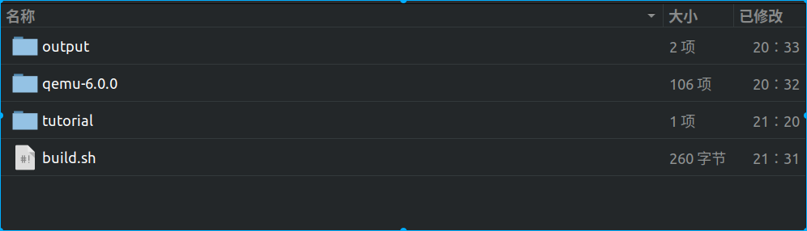

# 基于qemu-riscv从0开始构建嵌入式linux系统ch1. 搭建qemu环境

### 下载qemu源码

开启我们的这个教程第一步自然是下载qemu最新的源码，截止目前qemu的最新发布版本为6.0.0，在这里笔者极力建议使用最新版，因为后面我们可能会需要一些新的组件，使用新版会带来更多的方便。qemu官网为：https://www.qemu.org/，6.0.0源码下载地址：https://download.qemu.org/qemu-6.0.0.tar.xz。（如果使用本教程配套github仓库，可以不需要下载源码）

### 编写简易编译脚本

解压qemu源码，然后编写build.sh用于编译qemu，我们先在不修改源码的情况下进行编译



```shell
SHELL_FOLDER=$(cd "$(dirname "$0")";pwd)

cd qemu-6.0.0
if [ ! -d "$SHELL_FOLDER/output/qemu" ]; then  
./configure --prefix=$SHELL_FOLDER/output/qemu  --target-list=riscv64-softmmu --enable-gtk  --enable-virtfs --disable-gio
fi  
make -j16
make install
cd ..
```

其实qemu编译很容易，在qemu根目录内运行configure配置，然后通过make进行编译安装，这里脚本将其安装在项目目录内，因为我们会后续随时修改qemu源代码另外这里的其他编译选项是后面我们打算使用的组件，因此而添加，初次使用大家可以不必关心。如果编译顺利，将会在当前目录生成output/qemu/bin/qemu-system-riscv64可执行文件。

### 测试运行

执行以下命令，正常情况会顺利输出QEMU emulator version 6.0.0。

```shell
./output/qemu/bin/qemu-system-riscv64 -version
```

到这里本篇顺利完成。这一节是比较容易的，如果大家编译出现问题有报错，可以在评论里回复，因为qemu依赖的包比较多，但如果使用ubuntu18.04版本则可以使用apt轻松安装依赖包。

> 本教程的<br>github仓库：https://github.com/QQxiaoming/quard_star_tutorial<br>gitee仓库：https://gitee.com/QQxiaoming/quard_star_tutorial<br>本节所在tag：ch1

