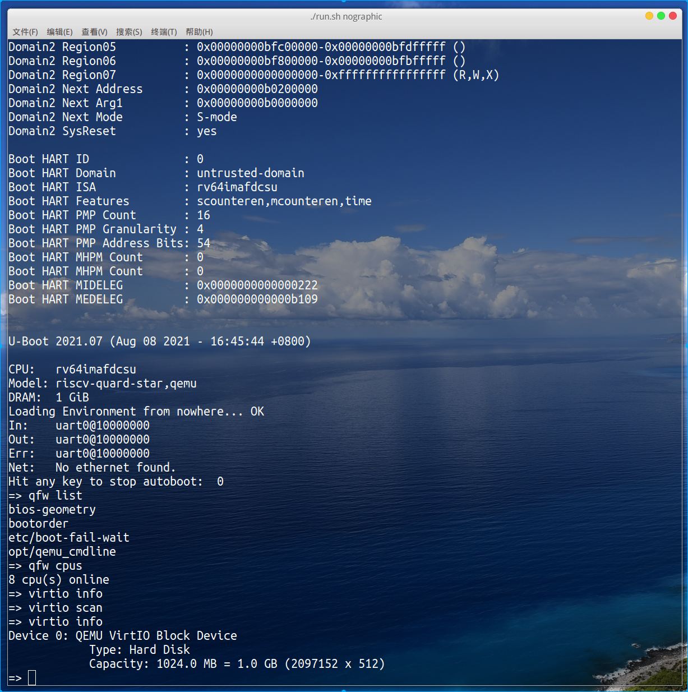

# 基于qemu-riscv从0开始构建嵌入式linux系统ch10. qemu之virtio与fw_cfg

上一节我们已经基本完成了uboot的移植，下一步自然就是移植linux kernel。在真实的嵌入式开发板上，内核往往会存储在文件系统中，当然也不排除一些直接裸存储于在sd卡或flash介质上，因为我们之前的qemu模拟器中没有添加sd卡或硬盘介质，因此本节我们先回过头来丰富一下qemu的资源。在qemu提供了很多虚拟的外设，但是为了使虚拟机性能更好，我们决定使用转为虚拟化打造的virtio技术来提供文件系统块设备的虚拟化，而且virtio在后续还可以直接提供其他设备如网络，GPU，键盘、鼠标等设备虚拟化。另外我们还将添加fw_cfg用于一些参数传递，起到一些辅助作用。

### virtio

virtio是一种I/O半虚拟化解决方案，是一套通用I/O设备虚拟化的程序，是对半虚拟化Hypervisor中的一组通用I/O设备的抽象。关于virtio的原理和介绍我这里不做过多介绍，有很多博客都有介绍，如 https://www.cnblogs.com/super-sos/p/9044154.html 。我比较实在，喜欢直接查找阅读相关的源代码去自己感悟理解这些技术。好了，扯远了，我们回到主题，我们这节直接调研qemu相关的API例化virtio-mmio设备到我们的仿真环境中，这是非常简单的。

- qemu-6.0.0/hw/riscv/quard_star.c添加VIRTIO基地址，这里我们定义在0x10100000开始。

```c
    [QUARD_STAR_VIRTIO] = { 0x10100000,        0x1000 }, //Eight consecutive groups
```

- sysbus_create_simple创建virtio-mmio设备，我们这里创建八组virtio-mmio设备，后面会配置为不同的设备，如块设备，网卡等。注意基地址，中断号配置正确。

```c
    for (i = 0; i < QUARD_STAR_COUNT; i++) {
        sysbus_create_simple("virtio-mmio",
            memmap[QUARD_STAR_VIRTIO].base + i * memmap[QUARD_STAR_VIRTIO].size,
            qdev_get_gpio_in(DEVICE(virtio_plic), QUARD_STAR_IRQ + i));
    }
```

- uboot设备树/soc节点添加virtio_mmio

```
		virtio_mmio@10107000 {
			interrupts = <0x8>;
			interrupt-parent = <0x11>;
			reg = <0x0 0x10107000 0x0 0x1000>;
			compatible = "virtio,mmio";
		};

		virtio_mmio@10106000 {
			interrupts = <0x7>;
			interrupt-parent = <0x11>;
			reg = <0x0 0x10106000 0x0 0x1000>;
			compatible = "virtio,mmio";
		};

		virtio_mmio@10105000 {
			interrupts = <0x6>;
			interrupt-parent = <0x11>;
			reg = <0x0 0x10105000 0x0 0x1000>;
			compatible = "virtio,mmio";
		};

		virtio_mmio@10104000 {
			interrupts = <0x5>;
			interrupt-parent = <0x11>;
			reg = <0x0 0x10104000 0x0 0x1000>;
			compatible = "virtio,mmio";
		};

		virtio_mmio@10103000 {
			interrupts = <0x4>;
			interrupt-parent = <0x11>;
			reg = <0x0 0x10103000 0x0 0x1000>;
			compatible = "virtio,mmio";
		};

		virtio_mmio@10102000 {
			interrupts = <0x3>;
			interrupt-parent = <0x11>;
			reg = <0x0 0x10102000 0x0 0x1000>;
			compatible = "virtio,mmio";
		};

		virtio_mmio@10101000 {
			interrupts = <0x2>;
			interrupt-parent = <0x11>;
			reg = <0x0 0x10101000 0x0 0x1000>;
			compatible = "virtio,mmio";
		};

		virtio_mmio@10100000 {
			interrupts = <0x1>;
			interrupt-parent = <0x11>;
			reg = <0x0 0x10100000 0x0 0x1000>;
			compatible = "virtio,mmio";
		};
```

ok，virtio_mmio设备添加完成。接下来注意打开uboot以及后面linux kernel的virtio相关设备的驱动支持即可。

### fw_cfg

fw_cfg是qemu提供的传递参数给内核的虚拟ip，这里我们也添加下这个ip，后面我们如果想通过qemu启动传递一些参数给虚拟机就会非常方便。

- qemu-6.0.0/hw/riscv/quard_star.c添加基地址，这里我们定义在0x10108000开始，fw_cfg的寄存器个数非常少。

```c
    [QUARD_STAR_FW_CFG] = { 0x10108000,          0x18 },
```

- fw_cfg_init_mem_wide创建fw_cfg设备，使用类似fw_cfg_add_*接口可以内置一些参数到fw_cfg，这里我们吧core的数量内置到fw_cfg中。

```c
    s->fw_cfg = fw_cfg_init_mem_wide(memmap[QUARD_STAR_FW_CFG].base + 8, 
                                     memmap[QUARD_STAR_FW_CFG].base,  8, 
                                     memmap[QUARD_STAR_FW_CFG].base + 16,
                                     &address_space_memory);
    fw_cfg_add_i16(s->fw_cfg, FW_CFG_NB_CPUS, (uint16_t)machine->smp.cpus);
    rom_set_fw(s->fw_cfg);
```

- uboot设备树/节点添加fw-cfg

```
	fw-cfg@10108000 {
		dma-coherent;
		reg = <0x0 0x10108000 0x0 0x18>;
		compatible = "qemu,fw-cfg-mmio";
	};
```

ok，fw-cfg设备添加完成。同样注意打开uboot、kernel的fw-cfg设备的驱动支持，uboot需要打开CMD_QFW功能。

### 测试使用

修改run.sh的启动脚本

```shell
$SHELL_FOLDER/output/qemu/bin/qemu-system-riscv64 \
-M quard-star \
-m 1G \
-smp 8 \
-drive if=pflash,bus=0,unit=0,format=raw,file=$SHELL_FOLDER/output/fw/fw.bin \
-drive file=$SHELL_FOLDER/output/rootfs/rootfs.img,format=raw,id=hd0 \
-device virtio-blk-device,drive=hd0 \
-fw_cfg name="opt/qemu_cmdline",string="qemu_vc="$DEFAULT_V"" \
--serial vc:$DEFAULT_VC --serial vc:$DEFAULT_VC --serial vc:$DEFAULT_VC --monitor vc:$DEFAULT_VC --parallel none

```

这里我们添加了一个virtio-blk-device设备，并加载了rootfs.img文件系统文件，当然我们现在还没有制做根文件系统，这个文件是用dd命令生成的空文件img。-fw_cfg选项可以添加参数，如果想添加多个参数可以多次使用该选项，注意自定义参数必须添加在opt路径下。启动程序看看效果：



如图所示，使用qfw list/qfw cpus/virtio scan/virtio info命令均可以输出正确的信息，可见功能已经正常，后面就可以开始移植内核构建根文件系统加载启动内核了。

到这里本篇内容讲述完成。本节内容比较简单，为内核启动添加虚拟化的硬件基础，万事俱备，下一节我们将向着linux Kernel出发！。

> 本教程的<br>github仓库：https://github.com/QQxiaoming/quard_star_tutorial<br>gitee仓库：https://gitee.com/QQxiaoming/quard_star_tutorial<br>本节所在tag：ch10