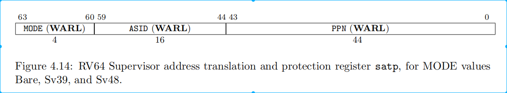

# 基于qemu-riscv从0开始构建嵌入式linux系统ch11-2. 向着linux Kernel出发！——完成启动

### 编写测试init进程

上一节中，我们的内核已经顺利完成了boot，驱动，文件系统均完成了初始化，然后系统将加载第一个用户态的程序以进行之后的流程，从内核打印可以看到内核试图在文件系统以下路径/sbin、/etc、/bin寻找init程序或者/bin/sh作为第一个进程，既然是用户态进程，不妨我们先不着急移植传统的init进程源码，先自己写一些简单的hello world看看。

```c
#include <stdio.h>
#include <unistd.h>
#include <pthread.h>

void* thread0(void *arg)
{
    for(;;)
    {
        printf("thread0:hello world!\n");
        sleep(1);
    }

    return arg;
}

void* thread1(void *arg)
{  
    for(;;)
    {
        printf("thread1:hello world!\n");
        sleep(1);
    }
    
    return arg;
}

int main()
{
    pid_t result;

    result = fork();

    if(result == -1)
    {
        printf("Fork error\n");
    }
    else if (result == 0)
    {
        printf("The returned value is %d\nIn child process!!\nMy PID is %d\n",result,getpid());
    }
    else
    {
        printf("The returned value is %d\nIn father process!!\nMy PID is %d\n",result,getpid());
        for(;;)
        {
            printf("PID%d:hello world!\n",getpid());
            sleep(1);
        }
    }

    pthread_t th;  
    pthread_create( &th, NULL, thread0, NULL);  
    pthread_create( &th, NULL, thread1, NULL);  

    for(;;)
    {
        printf("PID%d:hello world!\n",getpid());
        sleep(1);
    }
}
```

这份代码非常简单，主要是测试了下printf打印输出，以及fork创建进程和pthread创建线程。注意init进程不可用退出，如果一旦return就会在内核代码linux-5.10.42/kernel/exit.c:713:do_exit中触发panic:Attempted to kill init!

编译这份代码，需要链接pthread库以及添加-static进行静态编译。

```shell
$GLIB_ELF_CROSS_PREFIX-gcc main.c -lpthread -static -o init
```

生成init可执行文件，并将其拷贝到目标文件系统/dev/loop70p2的/sbin/init目录内。执行qemu后，输出如下：

```
……
[    1.063594] Run /sbin/init as init process
The returned value is 84
In father process!!
The returned value is 0
In child process!!
My PID is 1
My PID is 84
PID1:hello world!
thread0:hello world!
PID84:hello world!
thread1:hello world!
PID1:hello world!
thread0:hello world!
thread1:hello world!
PID84:hello world!
PID1:hello world!
thread0:hello world!
thread1:hello world!
PID84:hello world!
PID1:hello world!
thread0:hello world!
thread1:hello world!
PID84:hello world!
PID1:hello world!
……
```

上面这份代码是不是有种嵌入式RTOS代码结构的风格。进行到这里，想必大家对linux内核和应用程序应该有了的基本的认识，linux内核向用户暴露了很多系统调用，而GLIB C库帮我们封装了这些系统调用（后面章节我们会剖析glibc中一个系统调用的例子），提供了C标准库，另外还有一些其他的如pthread库封装了POSIX线程标准的API，最终我们的用户程序在main函数中可以使用这些接口来以此使用操作系统来完成一些工作。

但是这样的init进程对于用户使用操作系统是比较麻烦的，相信熟悉linux的用户熟悉shell，即用户与内核进行交互媒介，就像是操作系统的壳子(shell)。因此为了构建上层更复杂的应用，启动shell等init进程通常会做很多用户层的初始化工作，比较常见的就是sysvinit，当然在嵌入式领域存在一个使用量极高的工具集代码————busybox，因此我们将在下一节进行移植，此处先按下不表。

### kernel启动流程

kernel的启动从linux-5.10.42/arch/riscv/kernel/head.S:18:_start开始，依次为_start-->_start_kernel-->start_kernel。

#### early boot阶段

_start_kernel为early boot阶段，主要进行了以下工作：setup_vm（创建页表），relocate（转入虚拟地址运行），setup_trap_vector（设置异常与中断处理程序），soc_early_init（平台级的早期初始化）。这些内容都不算太复杂，唯一值得我们关注的就是页表的创建MMU使能。

setup_vm：定义在linux-5.10.42/arch/riscv/mm/init.c:436中，目的是构造早期页表early_pg_dir和trampoline_pg_dir。pgd->pmd->pte。{TODO:编辑中}


*(图片引用自：https://rcore-os.github.io/rCore-Tutorial-Book-v3/chapter4/3sv39-implementation-1.html)*

relocate：定义在linux-5.10.42/arch/riscv/kernel/head.S:70，CSR_SATP寄存器为配置页表地址的寄存器，首先将函数返回地址ra寄存器修改为虚拟地址，配置trampoline_pg_dir作为页表，可以访问虚拟地址然后对部分通用寄存器修改为虚拟地址，然后配置early_pg_dir作为早期页表使用，指令sfence.vma用于刷新页表地址。CSR_SATP寄存位域如下图：



setup_trap_vector：定义在linux-5.10.42/arch/riscv/kernel/head.S:166，CSR_TVEC寄存器为异常入口地址。

soc_early_init：定义在linux-5.10.42/arch/riscv/kernel/soc.c:14，依次与设备树匹配位于__soc_early_init_table段内of_device_id结构，匹配成功执行对应的early_fn函数。这些针对特定soc的早期初始化可以在驱动代码中使用SOC_EARLY_INIT_DECLARE宏来编写，最终会在此处展开调用。

看过不少arch的汇编代码，riscv绝对是最简单易懂的，可读性非常好。

#### init阶段

start_kernel为early boot阶段，start_kernel函数位于linux-5.10.42/init/main.c:848，从这里开始就是linux内核正式的C代码入口函数了，并且很多代码也和平台无关了，是我们这节重点分析的内容。

{TODO:编辑中}

ok，本节作为学习章节主要是对内核的源码的启动部分做以简单了解，内核中有大量的核心功能代码需要我们在实践中慢慢认知，对于移植了解启动代码部分基本就可以了。到这里本篇内容讲述完，下一节我们将进行busybox的移植，一步步的让我们的系统变成你熟悉的带shell功能最小linux发行版。

> 本教程的<br>github仓库：https://github.com/QQxiaoming/quard_star_tutorial<br>gitee仓库：https://gitee.com/QQxiaoming/quard_star_tutorial<br>本节所在tag：ch11