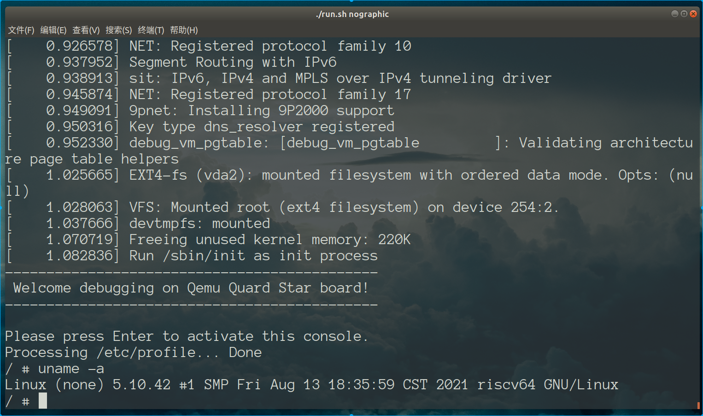

# 基于qemu-riscv从0开始构建嵌入式linux系统ch13. 最小根文件系统完成

### busybox中init进程解析

init进程代码主入口在busybox-1.33.1/init/init.c:1039，我们从上到下粗略分析下流程：

- 创建信号集并且接管一系列系统信号，比如SIGINT、SIGQUIT、SIGPWR、SIGUSR1、SIGTERM、SIGUSR2等等。这些用于接管处理系统关机、重启等事件，因为init进程是不能直接退出的。

- 设置默认的环境变量

```shell
HOME=/
PATH=/sbin:/usr/sbin:/bin:/usr/bin
SHELL=/bin/sh
USER=root
```

- parse_inittab()函数读取文件/etc/inittab，如果未找到正确的配置文件，则通过以下代码配置移植默认触发动作。busybox-1.33.1/init/init.c:679。所以我们需要正确配置该文件才能让系统启动正确。

```c
/* No inittab file - set up some default behavior */
/* Sysinit */
new_init_action(SYSINIT, INIT_SCRIPT, "");
/* Askfirst shell on tty1-4 */
new_init_action(ASKFIRST, bb_default_login_shell, "");
//TODO: VC_1 instead of ""? "" is console -> ctty problems -> angry users
new_init_action(ASKFIRST, bb_default_login_shell, VC_2);
new_init_action(ASKFIRST, bb_default_login_shell, VC_3);
new_init_action(ASKFIRST, bb_default_login_shell, VC_4);
/* Reboot on Ctrl-Alt-Del */
new_init_action(CTRLALTDEL, "reboot", "");
/* Umount all filesystems on halt/reboot */
new_init_action(SHUTDOWN, "umount -a -r", "");
/* Swapoff on halt/reboot */
new_init_action(SHUTDOWN, "swapoff -a", "");
/* Restart init when a QUIT is received */
new_init_action(RESTART, "init", "");
```

- 调用run_actions函数依次传入SYSINIT、WAIT、ONCE、RESPAWN、ASKFIRST，将注册的命令依次执行完成初始化。函数调用链为void run_actions(int action_type)-->pid_t run(const struct init_action *a)-->static void init_exec(const char *command)（fork后）。

- 进入while(1)等待所以子进程退出重新回到run_actions(RESPAWN|ASKFIRST)，相当于退出登录了。

### /etc/inittab编写

ok，了解了init进程做了什么再来编写配置脚本就轻松很多，我们本节编写一个最基础简单的启动配置环境，/etc/inittab内容如下:

```
::sysinit:/etc/init.d/rcS
console::askfirst:-/bin/sh
```

即系统启动时，执行一次/etc/init.d/rcS脚本，然后进入登录界面执行/bin/sh，前面的“-”表示这是个登录shell，会连接stdin到这个tty设备。busybox-1.33.1/init/init.c:470这里可以清楚看到对命令的处理逻辑。

### /etc/init.d/rcS编写

rcS启动脚本我们就简单的执行mount -a和mdev -s两个命令。

```shell
#! /bin/sh
PATH=/sbin:/bin:/usr/sbin:/usr/bin

/bin/mount -a
/sbin/mdev -s
/bin/mount -a

echo "---------------------------------------------"
echo " Welcome debugging on Qemu Quard Star board! "
echo "---------------------------------------------"
```

#### busybox中mount命令解析

mount实现源码位于busybox-1.33.1/util-linux/mount.c:2259:mount_main，mount是用于文件系统挂载的，这里我们仅分析-a参数，其意味着读取/etc/fstab文件进行自动挂载。因此执行mount -a就必须编写对应的/etc/fstab配置文件。

#### busybox中mdev命令解析

mdev实现源码位于busybox-1.33.1/util-linux/mdev.c:1239:mdev_main,mdev -s的目的就是自动创建/dev目录以及相关设备，-s调用了initial_scan函数，阅读源码可以清楚看到，其实现是通过查询/sys/dev创建设备，这里要注意下，如果sysfs没有挂载，mdev是无法正确执行的，因此要先完成mount -a，但是mount里可能会挂载一些文件系统到/dev,因此又需要在mdev -s后再执行另一些文件系统的挂载。当然mdev也有配置文件/etc/mdev.conf，不过这里我们不去编写这个文件一切使用默认值。

### /etc/fstab编写

fstab主要用来描述早期需求挂载的各种虚拟文件系统，proc、sysfs、debugfs都是最常见的，对应用户程序访问内核信息非常关键。其余的我们创建一些ramfs，让这些路径下的内容（不需要掉电保存的信息）为临时内容不去访问硬盘提高效率。

```
<file system>   <mount point>           <type>     <options>    <dump>  <pass>
proc			/proc					proc		defaults    0	     0
none			/tmp					ramfs		defaults    0	     0
sysfs			/sys					sysfs		defaults    0	     0
mdev		    /dev					ramfs		defaults	0	     0
debugfs	        /sys/kernel/debug 	    debugfs	    defaults    0        0
```

### busybox中/bin/sh命令解析

busybox的sh源码位于busybox-1.33.1/shell/ash.c:14385:ash_main。（这个对应关系可以查找busybox-1.33.1/include/applet_tables.h:16和803行的表确定，并非绝对的XX对应XX_main）

这里我们SYSINIT阶段完成指行ASKFIRST就是去执行/bin/sh来打开shell。这里可以看到早期会执行/etc/profile脚本和$HOME/.profile脚本，这就是用户级的登录配置脚本，/etc/profile被应用于所有用户，而$HOME/.profile只对当前登录用户使用。因此我们编写/etc/profile内容如下：

```shell
# /etc/profile: system-wide .profile file for the Bourne shells

echo -n "Processing /etc/profile... "
# no-op
echo "Done"
```

这个文件我们预留在这里，不做任何内容，因为本节我们只想完成一个简单的配置启动linux内核，因此关于多用户管理的相关配置我们这里都没有添加，因此ash启动后将无需账户密码直接使用管理员权限登录到系统。其实关于ash是源自dash的一个分支，dash是ubuntu内置的shell，但其实这些都不是最为广泛使用的bash，后面我们会考虑替换bash为默认的shell，但不影响本节内容。

### 启动qemu

将我们今天编写的相关配置脚本拷贝到文件系统映像中，然后启动qemu。

```shell
cp -r $SHELL_FOLDER/target_root_script/* $SHELL_FOLDER/output/rootfs/rootfs/
mkdir $SHELL_FOLDER/output/rootfs/rootfs/proc
mkdir $SHELL_FOLDER/output/rootfs/rootfs/sys
mkdir $SHELL_FOLDER/output/rootfs/rootfs/dev
mkdir $SHELL_FOLDER/output/rootfs/rootfs/tmp
```

熟悉的界面终于出现。



ok，本节对busybox的用户级别初始化内容进行了深入探究，最终完成了进入shell工作。下一节开始我们需要在回过头来将busybox编译为动态链接库的版本，并借此机会探究linux内核是如何支持动态链接程序的加载执行，为后续我们扩展更多用户态应用程序做好准备。

> 本教程的<br>github仓库：https://github.com/QQxiaoming/quard_star_tutorial<br>gitee仓库：https://gitee.com/QQxiaoming/quard_star_tutorial<br>本节所在tag：ch13