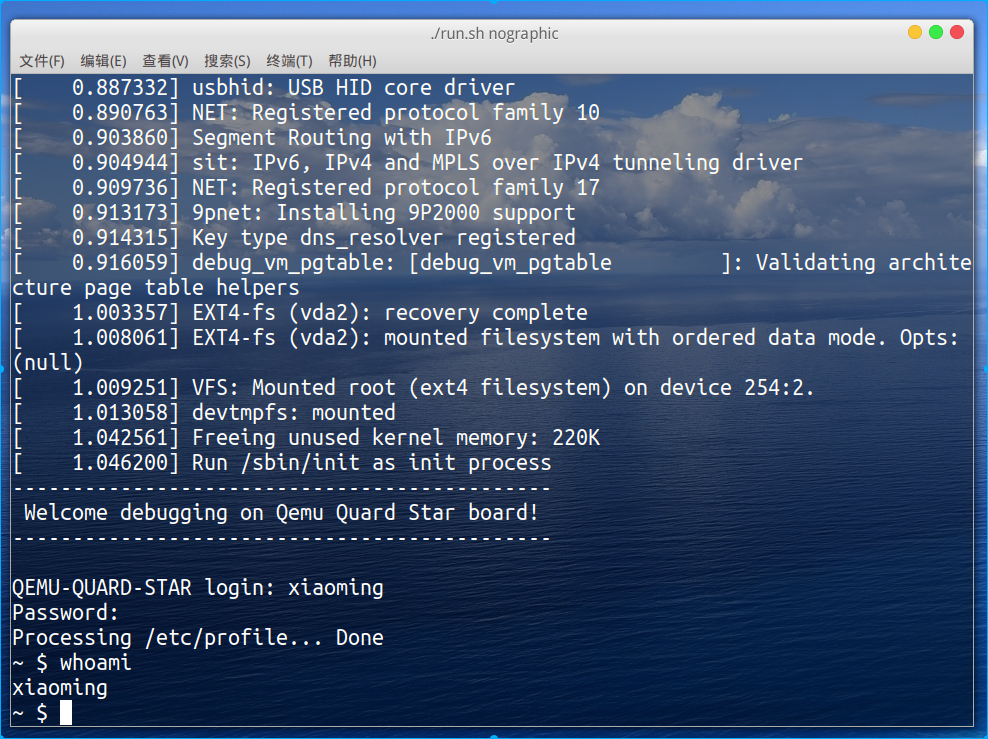

# 基于qemu-riscv从0开始构建嵌入式linux系统ch15. linux多用户管理

### inittab修改

ch13中我们使用了-/bin/sh作为init进程的RESPAWN|ASKFIRST阶段执行，如此一来，系统在启动时无需输入用户名密码将直接使用root权限启动。而本节将配置多用户管理，因此inittab修改为：

```
::sysinit:/etc/init.d/rcS
console::respawn:/sbin/getty 38400 console
console::restart:/sbin/init
console::ctrlaltdel:/sbin/reboot
```

#### getty

为什么要使用getty替换原来的sh才能使用多用户管理呢，那么/sbin/getty就是我们探究的重点了，源码位于busybox-1.33.1/loginutils/getty.c:550:getty_main。getty_main主要进行了一些初始化操作，绑定tty设备到stdin\stdout\stderr等操作，然后调用了static char *get_logname(void)函数，从终端输入获取登录用户输入，然后调用执行login命令，相关代码片段如下：

```c
……
716  logname = get_logname();
……
735  BB_EXECLP(G.login, G.login, "--", logname, (char *)0);
……
```

#### login

login源码位于busybox-1.33.1/loginutils/login.c:313:login_main，注意到以下调用关系链。

```
ask_and_check_password
    --> ask_and_check_password_extended
        --> check_password
            --> get_passwd
                --> getspnam_r
                    --> getXXnam_r
                        --> get_S
                        --> parse_file
```

在get_S会使用配置文件"/etc/passwd"、"/etc/group"、"/etc/shadow"建立db数据库，以下摘抄代码片段：

```c
#ifndef _PATH_PASSWD
#define _PATH_PASSWD  "/etc/passwd"
#endif
#ifndef _PATH_GROUP
#define _PATH_GROUP   "/etc/group"
#endif
#ifndef _PATH_SHADOW
#define _PATH_SHADOW  "/etc/shadow"
#endif

static const struct const_passdb const_pw_db = {
	_PATH_PASSWD, PW_DEF,
	{
		offsetof(struct passwd, pw_name),       /* 0 S */
		offsetof(struct passwd, pw_passwd),     /* 1 s */
		offsetof(struct passwd, pw_uid),        /* 2 I */
		offsetof(struct passwd, pw_gid),        /* 3 I */
		offsetof(struct passwd, pw_gecos),      /* 4 s */
		offsetof(struct passwd, pw_dir),        /* 5 s */
		offsetof(struct passwd, pw_shell)       /* 6 s */
	},
	sizeof(PW_DEF)-1, sizeof(struct passwd)
};
static const struct const_passdb const_gr_db = {
	_PATH_GROUP, GR_DEF,
	{
		offsetof(struct group, gr_name),        /* 0 S */
		offsetof(struct group, gr_passwd),      /* 1 s */
		offsetof(struct group, gr_gid),         /* 2 I */
		offsetof(struct group, gr_mem)          /* 3 m (char **) */
	},
	sizeof(GR_DEF)-1, sizeof(struct group)
};
#if ENABLE_USE_BB_SHADOW
static const struct const_passdb const_sp_db = {
	_PATH_SHADOW, SP_DEF,
	{
		offsetof(struct spwd, sp_namp),         /* 0 S Login name */
		offsetof(struct spwd, sp_pwdp),         /* 1 s Encrypted password */
		offsetof(struct spwd, sp_lstchg),       /* 2 l */
		offsetof(struct spwd, sp_min),          /* 3 l */
		offsetof(struct spwd, sp_max),          /* 4 l */
		offsetof(struct spwd, sp_warn),         /* 5 l */
		offsetof(struct spwd, sp_inact),        /* 6 l */
		offsetof(struct spwd, sp_expire),       /* 7 l */
		offsetof(struct spwd, sp_flag)          /* 8 r Reserved */
	},
	sizeof(SP_DEF)-1, sizeof(struct spwd)
};
#endif

static struct statics *get_S(void)
{
	if (!ptr_to_statics) {
		ptr_to_statics = xzalloc(sizeof(S));
		memcpy(&S.db[0], &const_pw_db, sizeof(const_pw_db));
		memcpy(&S.db[1], &const_gr_db, sizeof(const_gr_db));
#if ENABLE_USE_BB_SHADOW
		memcpy(&S.db[2], &const_sp_db, sizeof(const_sp_db));
#endif
#if ENABLE_FEATURE_CLEAN_UP
		atexit(free_static);
#endif
	}
	return ptr_to_statics;
}
```

代码阅读到这里就能发现其实是一套libpwdgrp的机制来支持用户、用户组权限的管理、密码管理等机制，阅读busybox-1.33.1/docs/BusyBox.txt:4323这里可以看到busybox使用配置CONFIG_USE_BB_PWD_GRP选项后会使用上述机制读取这三个配置文件，否则会使用libc中的NSS库。这三个文件的内容格式还是比较容易理解的，就是每一行描述一条用户参数，使用:分割不同的属性，而:的顺序正如上面代码struct const_passdb结构的off里的描述的那样。这里建议大家可以通过搜索引擎查找对这三个配置文件格式解释，并结合我这里贴出的源码一起阅读就理解的很清晰了。

### 编写配置文件

这里我们创建一些常规的用户和用户组，注意是系统管理员为root用户和而xiaoming用户是我们模拟普通用户。shadow的第二项Encrypted password是具有一定格式的采用不同的加密算法的，像是md5加密是可能被破解得到明文的，因此/etc/shadow一般需要配置为只有管理员root可以读取，而且加密算法最好使用sha-512。

#### /etc/passwd

```
root:x:0:0:root:/home/root:/bin/sh
daemon:x:1:1:daemon:/usr/sbin:/bin/sh
bin:x:2:2:bin:/bin:/bin/sh
sys:x:3:3:sys:/dev:/bin/sh
nobody:x:65534:65534:nobody:/nonexistent:/bin/sh
xiaoming:x:1000:1000:Linux User,,,:/home/xiaoming:/bin/sh
```

#### /etc/group

```
root:x:0:
daemon:x:1:
bin:x:2:
sys:x:3:
sudo:x:27:xiaoming
users:x:100:
nogroup:x:65534:
xiaoming:x:1000:
```

#### /etc/shadow

```
root:8f3SuzAlYA9zc:18802:0:99999:7:::
daemon:*:16092:0:99999:7:::
bin:*:16092:0:99999:7:::
sys:*:16092:0:99999:7:::
nobody:*:16092:0:99999:7:::
xiaoming:8KRJzPtwP/eRQ:18802:0:99999:7:::
```

#### /etc/busybox.conf

配置完成，最后这里关于权限管理部分我们再配置一个/etc/busybox.conf，内容如下:

```conf
[SUID]
su = ssx 0.0 # run with euid=0/egid=0
id = ssx 0.0 # run with euid=0/egid=0
halt = ssx 0.0 # run with euid=0/egid=0
reboot = ssx 0.0 # run with euid=0/egid=0
shutdown = ssx 0.0 # run with euid=0/egid=0
passwd = --- 0.0 # disabled for all user except for root
```

/etc/busybox.conf的解析在busybox启动，busybox-1.33.1/libbb/appletlib.c中：main-->parse_config_file进行解析。



本节为我们的系统添加多用户管理，现在我们登录时可以输入用户名密码进行登录了。教程到这个阶段系统性的配置接近尾声，后续我们会对linux里杂七杂八的子系统做一下实验研究，相关性会比较零散。

> 本教程的<br>github仓库：https://github.com/QQxiaoming/quard_star_tutorial<br>gitee仓库：https://gitee.com/QQxiaoming/quard_star_tutorial<br>本节所在tag：ch15