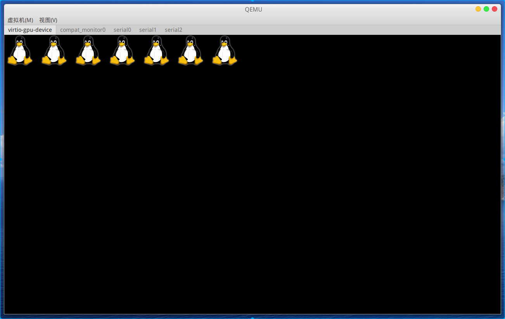
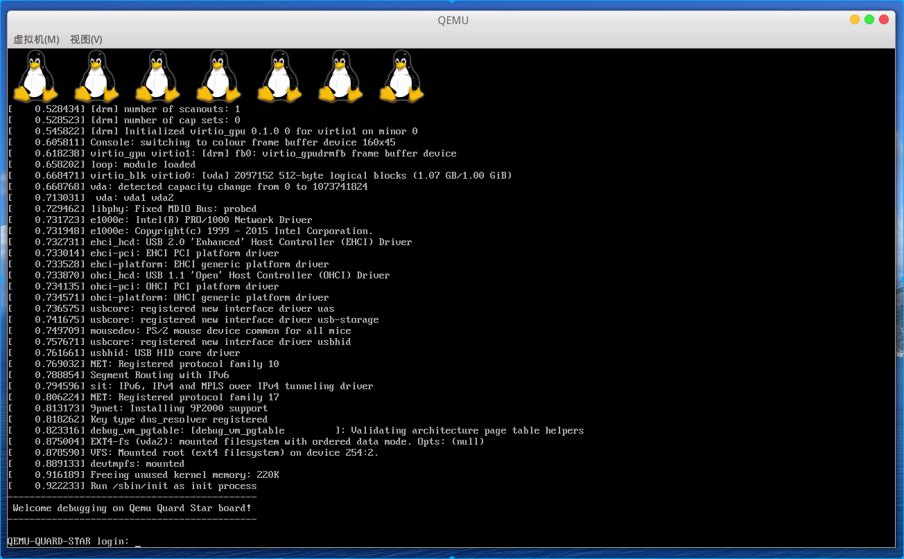

# 基于qemu-riscv从0开始构建嵌入式linux系统ch16. Framebuffer显示设备

### virtio-gpu-device

本节我们给qemu添加一块虚拟的显示设备，方便后面研究一些GUI的应用。由于之前我们向系统添加了8组virtio-mmio设备，并且挂载了virtio-blk-device作为文件系统存储设备，这次我们再添加virtio-gpu-device设备：

```shell
$SHELL_FOLDER/output/qemu/bin/qemu-system-riscv64 \
-M quard-star \
-m 1G \
-smp 8 \
-drive if=pflash,bus=0,unit=0,format=raw,file=$SHELL_FOLDER/output/fw/fw.bin \
-drive file=$SHELL_FOLDER/output/rootfs/rootfs.img,format=raw,id=hd0 \
-device virtio-blk-device,drive=hd0 \
-device virtio-gpu-device,id=video0,xres=1280,yres=720 \
-fw_cfg name="opt/qemu_cmdline",string="qemu_vc="$DEFAULT_V"" \
$GRAPHIC_PARAM
```

#### 调试驱动

现在比较新的linux版本驱动是DRM架构的，在我们使用的默认配置中CONFIG_DRM=y、CONFIG_DRM_RADEON=y、CONFIG_DRM_VIRTIO_GPU=y均已打开，因此按理说我们本节想实现的功能应该很轻松，但是不然，我们启动qemu仿真出现了以下内核恐慌：

```
[    0.537704] [drm] radeon kernel modesetting enabled.
[    0.541383] Unable to handle kernel paging request at virtual address 0000000000009f18
[    0.542261] Oops [#1]
[    0.542535] Modules linked in:
[    0.543072] CPU: 0 PID: 1 Comm: swapper/0 Not tainted 5.10.42 #1
[    0.543804] epc: ffffffe000676cbc ra : ffffffe000676036 sp : ffffffe001287b50
[    0.544375]  gp : ffffffe0010e28e8 tp : ffffffe001288000 t0 : ffffffe001c42c28
[    0.545040]  t1 : 0000000000000000 t2 : 00000000000001e2 s0 : ffffffe001287b80
[    0.545658]  s1 : ffffffe001bd2000 a0 : 0000000000000000 a1 : ffffffe000b75499
[    0.546411]  a2 : 0000000000000000 a3 : ffffffe001bd2014 a4 : 0000000000000001
[    0.547270]  a5 : ffffffe00067601a a6 : 0000000000100000 a7 : ffffffffffffffff
[    0.548110]  s2 : ffffffffffffffed s3 : 000000000000a000 s4 : 0000000000000000
[    0.548987]  s5 : ffffffe0010a7708 s6 : ffffffe0010e4588 s7 : ffffffe0010e4570
[    0.549839]  s8 : ffffffe000c2e4e8 s9 : 0000000000000008 s10: ffffffe000002178
[    0.550688]  s11: 0000000000000000 t3 : 77f99455c0469400 t4 : 0000000000000001
[    0.551568]  t5 : 00000000000001e4 t6 : ffffffe001c42c30
[    0.552090] status: 0000000000000120 badaddr: 0000000000009f18 cause: 000000000000000d
[    0.553390] ---[ end trace 3e03d6344377952d ]---
[    0.554022] Kernel panic - not syncing: Attempted to kill init! exitcode=0x0000000b
[    0.554748] SMP: stopping secondary CPUs
[    0.555699] ---[ end Kernel panic - not syncing: Attempted to kill init! exitcode=0x0000000b ]---
```

为此我这里进行了一些debug，直接错误出现在linux-5.10.42/drivers/gpu/drm/virtio/virtgpu_kms.c:242行此处vgdev为空指针，直接访问会出错。为什么会是空指针呢，原来是因为110行处初始化时检查VIRTIO_F_VERSION_1不通过，因此驱动并没有正常被加载，而后release时出现空指针（显然这个驱动不是很健壮，不过空指针问题在最新linux内核主线上已经修复了）。明确了这个问题我们就要去qemu源码里查找一下为什么不支持这个VIRTIO_F_VERSION_1这个feature，经过查找终于发现在qemu-6.0.0/hw/virtio/virtio-mmio.c:712处，只有定义了proxy->legacy为false时才能添加这个feature，而722行给出默认配置为true，因此我们在运行qemu选项添加-global virtio-mmio.force-legacy=false选项后，终于一切正常了。这里我们参考一下这篇[qemu开发邮件](https://www.mail-archive.com/search?l=qemu-devel@nongnu.org&q=subject:%22Re%5C%3A+%5C%5BQemu%5C-devel%5C%5D+%5C%5BPATCH+v3%5C%5D+virtio%5C-mmio%5C%3A+implement+modern+%5C%28v2%5C%29%2C+personality+%5C%28virtio%5C-1%5C%29%22&o=newest&f=1)不难发现，force-legacy定义为false才是更新版本的定义，但可能是考虑兼容性的问题qemu默认还是给出了true才用传统的virtio行为。解决了这个问题，我们重新添加内核参数配置，以及内核定义一个我们的quard_star_defconfigs文件，添加显示linux启动logo的配置，再次启动qemu，ok！以下为上文部分描述中代码片段：

```c
……
110 if (!virtio_has_feature(dev_to_virtio(dev->dev), VIRTIO_F_VERSION_1))
111		return -ENODEV;
……
242 virtio_gpu_modeset_fini(vgdev);
……
```

```c
……
712 if (!proxy->legacy) {
713     virtio_add_feature(&vdev->host_features, VIRTIO_F_VERSION_1);
714 }
……
722 DEFINE_PROP_BOOL("force-legacy", VirtIOMMIOProxy, legacy, true),
……
```

解决了该问题后，内核终于正常启动，但我们的虚拟显示窗口上没有任何画面，我们做一个简单测试，就是开启CONFIG_LOGO这个配置。

#### 编写kernel的config文件

添加文件linux-5.10.42/arch/riscv/configs/quard_star_defconfig作为我们后面使用的config文件，内容如下，与之前使用的config文件唯一的区别就是增加了CONFIG_LOGO=y这个选项，用来测试我们的Framebuffer设备驱动是否工作正常。

```
CONFIG_SYSVIPC=y
CONFIG_POSIX_MQUEUE=y
CONFIG_NO_HZ_IDLE=y
CONFIG_HIGH_RES_TIMERS=y
CONFIG_IKCONFIG=y
CONFIG_IKCONFIG_PROC=y
CONFIG_CGROUPS=y
CONFIG_CGROUP_SCHED=y
CONFIG_CFS_BANDWIDTH=y
CONFIG_CGROUP_BPF=y
CONFIG_NAMESPACES=y
CONFIG_USER_NS=y
CONFIG_CHECKPOINT_RESTORE=y
CONFIG_BLK_DEV_INITRD=y
CONFIG_EXPERT=y
CONFIG_BPF_SYSCALL=y
CONFIG_SOC_SIFIVE=y
CONFIG_SOC_VIRT=y
CONFIG_SMP=y
CONFIG_JUMP_LABEL=y
CONFIG_MODULES=y
CONFIG_MODULE_UNLOAD=y
CONFIG_NET=y
CONFIG_PACKET=y
CONFIG_UNIX=y
CONFIG_INET=y
CONFIG_IP_MULTICAST=y
CONFIG_IP_ADVANCED_ROUTER=y
CONFIG_IP_PNP=y
CONFIG_IP_PNP_DHCP=y
CONFIG_IP_PNP_BOOTP=y
CONFIG_IP_PNP_RARP=y
CONFIG_NETLINK_DIAG=y
CONFIG_NET_9P=y
CONFIG_NET_9P_VIRTIO=y
CONFIG_PCI=y
CONFIG_PCIEPORTBUS=y
CONFIG_PCI_HOST_GENERIC=y
CONFIG_PCIE_XILINX=y
CONFIG_DEVTMPFS=y
CONFIG_DEVTMPFS_MOUNT=y
CONFIG_BLK_DEV_LOOP=y
CONFIG_VIRTIO_BLK=y
CONFIG_BLK_DEV_SD=y
CONFIG_BLK_DEV_SR=y
CONFIG_SCSI_VIRTIO=y
CONFIG_ATA=y
CONFIG_SATA_AHCI=y
CONFIG_SATA_AHCI_PLATFORM=y
CONFIG_NETDEVICES=y
CONFIG_VIRTIO_NET=y
CONFIG_MACB=y
CONFIG_E1000E=y
CONFIG_R8169=y
CONFIG_MICROSEMI_PHY=y
CONFIG_INPUT_MOUSEDEV=y
CONFIG_SERIAL_8250=y
CONFIG_SERIAL_8250_CONSOLE=y
CONFIG_SERIAL_OF_PLATFORM=y
CONFIG_SERIAL_EARLYCON_RISCV_SBI=y
CONFIG_HVC_RISCV_SBI=y
CONFIG_VIRTIO_CONSOLE=y
CONFIG_HW_RANDOM=y
CONFIG_HW_RANDOM_VIRTIO=y
CONFIG_SPI=y
CONFIG_SPI_SIFIVE=y
CONFIG_GPIOLIB=y
CONFIG_GPIO_SIFIVE=y
# CONFIG_PTP_1588_CLOCK is not set
CONFIG_POWER_RESET=y
CONFIG_DRM=y
CONFIG_DRM_RADEON=y
CONFIG_DRM_VIRTIO_GPU=y
CONFIG_FRAMEBUFFER_CONSOLE=y
CONFIG_LOGO=y
CONFIG_USB=y
CONFIG_USB_XHCI_HCD=y
CONFIG_USB_XHCI_PLATFORM=y
CONFIG_USB_EHCI_HCD=y
CONFIG_USB_EHCI_HCD_PLATFORM=y
CONFIG_USB_OHCI_HCD=y
CONFIG_USB_OHCI_HCD_PLATFORM=y
CONFIG_USB_STORAGE=y
CONFIG_USB_UAS=y
CONFIG_MMC=y
CONFIG_MMC_SPI=y
CONFIG_RTC_CLASS=y
CONFIG_VIRTIO_PCI=y
CONFIG_VIRTIO_BALLOON=y
CONFIG_VIRTIO_INPUT=y
CONFIG_VIRTIO_MMIO=y
CONFIG_RPMSG_CHAR=y
CONFIG_RPMSG_VIRTIO=y
CONFIG_EXT4_FS=y
CONFIG_EXT4_FS_POSIX_ACL=y
CONFIG_AUTOFS4_FS=y
CONFIG_MSDOS_FS=y
CONFIG_VFAT_FS=y
CONFIG_TMPFS=y
CONFIG_TMPFS_POSIX_ACL=y
CONFIG_NFS_FS=y
CONFIG_NFS_V4=y
CONFIG_NFS_V4_1=y
CONFIG_NFS_V4_2=y
CONFIG_ROOT_NFS=y
CONFIG_9P_FS=y
CONFIG_CRYPTO_USER_API_HASH=y
CONFIG_CRYPTO_DEV_VIRTIO=y
CONFIG_PRINTK_TIME=y
CONFIG_DEBUG_FS=y
CONFIG_DEBUG_PAGEALLOC=y
CONFIG_SCHED_STACK_END_CHECK=y
CONFIG_DEBUG_VM=y
CONFIG_DEBUG_VM_PGFLAGS=y
CONFIG_DEBUG_MEMORY_INIT=y
CONFIG_DEBUG_PER_CPU_MAPS=y
CONFIG_SOFTLOCKUP_DETECTOR=y
CONFIG_WQ_WATCHDOG=y
CONFIG_DEBUG_TIMEKEEPING=y
CONFIG_DEBUG_RT_MUTEXES=y
CONFIG_DEBUG_SPINLOCK=y
CONFIG_DEBUG_MUTEXES=y
CONFIG_DEBUG_RWSEMS=y
CONFIG_DEBUG_ATOMIC_SLEEP=y
CONFIG_STACKTRACE=y
CONFIG_DEBUG_LIST=y
CONFIG_DEBUG_PLIST=y
CONFIG_DEBUG_SG=y
# CONFIG_RCU_TRACE is not set
CONFIG_RCU_EQS_DEBUG=y
CONFIG_DEBUG_BLOCK_EXT_DEVT=y
# CONFIG_FTRACE is not set
# CONFIG_RUNTIME_TESTING_MENU is not set
CONFIG_MEMTEST=y
# CONFIG_SYSFS_SYSCALL is not set
CONFIG_EFI=y
```

### 启动qemu

qemu启用带窗口的配置启动

```shell
./run.sh graphic 1280x720
```

得到以下输出图形，虚拟显示器上显示了7个小企鹅，代表着设备有7个cpu core。



查看设备/dev目录里有一个fb0设备，以及/dev/dri/card0、/dev/dri/renderD128两个设备。这些设备都是与图形相关的物理设备，fb0是兼容早期的Framebuffer显示设备，操作fb0的方法非常简单，我们可以将原始的rgb565格式的数据直接cat raw > /dev/fb0，这时候将显示出对应的图形。而/dev/dri设备是更为先进的近年来发展图形驱动，这个我们在后面研究linux用户图形协议栈中做详细介绍。

将dts中启动参数改为"root=/dev/vda2 rw console=tty0"这样启动默认终端将从显示设备中输出，如图:



不过目前还没加入键盘鼠标，因此不建议这样使用，而且真实的嵌入式设备往往也会选择从串口输出，而显示器LCD往往会移植一些用户图形界面。

> 本教程的<br>github仓库：https://github.com/QQxiaoming/quard_star_tutorial<br>gitee仓库：https://gitee.com/QQxiaoming/quard_star_tutorial<br>本节所在tag：ch16