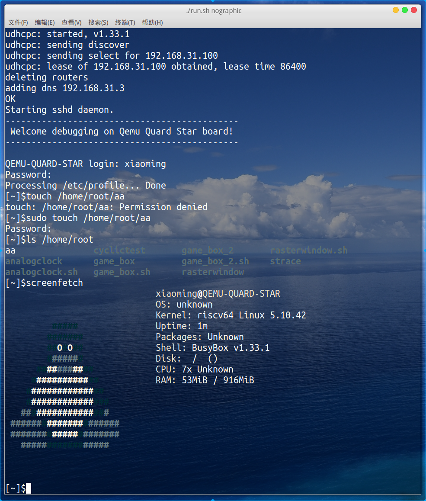

# 基于qemu-riscv从0开始构建嵌入式linux系统ch19. 交叉编译sudo

### sudo

[sudo](https://www.sudo.ws/)源码可以在sudo网站上下载：https://www.sudo.ws/download.html。sudo可以说在linux系统上用户使用率还是比较高的命令，安装sudo之后我们可以在管理员用户上使用系统，仅在需要提权时使用sudo，而平时不使用，可以防止系统遭到破坏。


### 交叉编译sudo

编译sudo，首先在host系统交叉编译

```shell
./configure --host=riscv CXX=$CROSS_PREFIX-g++ CC=$CROSS_PREFIX-gcc 
make -j16
```

进入目标系统机中挂载sudo目录。执行以下命令

```shell
make install-binaries
```

添加/etc/sudoers内容如下：

```shell
#                                                                         
# This file MUST be edited with the 'visudo' command as root.             
#                                                                         
# See the sudoers man page for the details on how to write a sudoers file.
#                                                                         
 
##                                                                        
# Override built-in defaults                                              
##                                                                        
Defaults                syslog=auth,runcwd=~                              
Defaults>root           !set_logname                                      
Defaults:FULLTIMERS     !lecture,runchroot=*               
Defaults:millert        !authenticate                      
Defaults@SERVERS        log_year, logfile=/var/log/sudo.log
Defaults!PAGERS         noexec                             
                                                           
# Host alias specification                                 
                                                           
# User alias specification                                 
                                                           
# Cmnd alias specification    
                              
# User privilege specification                       
root    ALL=(ALL:ALL) ALL                                                    
                                                                             
# Members of the admin group may gain root privileges                        
%admin ALL=(ALL) ALL                                                         
                                                                             
# Allow members of group sudo to execute any command                         
%sudo   ALL=(ALL:ALL) ALL  
```

### 测试使用

sudo配置完成，测试使用sudo前，我们再安装个screenFetch，实际上这个是shell脚本，直接从：https://github.com/KittyKatt/screenFetch，下载源码到目标系统中，添加可执行权限就可以使用了。下图展示了xiaoming用户使用sudo提权。




> 本教程的<br>github仓库：https://github.com/QQxiaoming/quard_star_tutorial<br>gitee仓库：https://gitee.com/QQxiaoming/quard_star_tutorial<br>本节所在tag：ch19