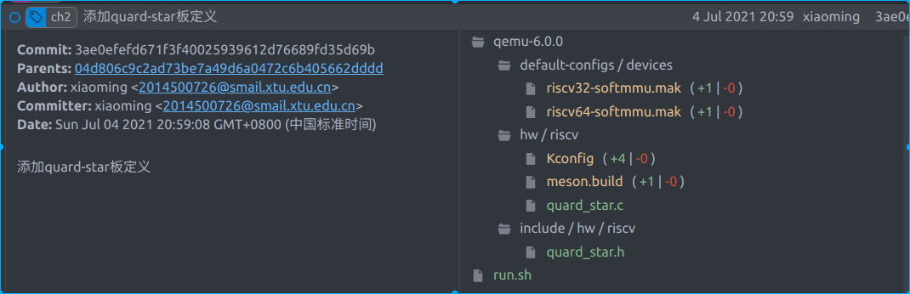

# 基于qemu-riscv从0开始构建嵌入式linux系统ch2. 添加qemu仿真板——Quard-Star板

### 增加源文件

首先看下图，预览本节教程要添加的源代码，内容不多，主要是增加一个quard_star.c和.h文件用来定义我们的虚拟板卡，然后将其加入qemu编译体系内。



### 源码解析

路径qemu-6.0.0/hw/riscv/quard_star.c：（由于对应代码已上传github，我们这里仅对关键代码做以解析）

注册板卡到系统内，并定义名称。

```c
static const TypeInfo quard_star_machine_typeinfo = {
    .name       = MACHINE_TYPE_NAME("quard-star"),
    .parent     = TYPE_MACHINE,
    .class_init = quard_star_machine_class_init,
    .instance_init = quard_star_machine_instance_init,
    .instance_size = sizeof(RISCVVirtState),
};

static void quard_star_machine_init_register_types(void)
{
    type_register_static(&quard_star_machine_typeinfo);
}

type_init(quard_star_machine_init_register_types)
```

quard_star_machine_class_init，注册板卡资源初始化函数以及最大支持的smp核心数

```c
    mc->init = quard_star_machine_init;
    mc->max_cpus = QUARD_STAR_CPUS_MAX;
```

构造虚拟cpu，在qemu中各个cpu核心为线程模拟的，相当于创建子线程。

```c
soc_name = g_strdup_printf("soc%d", i);
object_initialize_child(OBJECT(machine), soc_name, &s->soc[i],
                        TYPE_RISCV_HART_ARRAY);
g_free(soc_name);
object_property_set_str(OBJECT(&s->soc[i]), "cpu-type",
                        machine->cpu_type, &error_abort);
object_property_set_int(OBJECT(&s->soc[i]), "hartid-base",
                        base_hartid, &error_abort);
object_property_set_int(OBJECT(&s->soc[i]), "num-harts",
                        hart_count, &error_abort);
sysbus_realize(SYS_BUS_DEVICE(&s->soc[i]), &error_abort);
```

定义内存相关资源，这里定义一个cpu内部的一片maskrom，一片sram，和一片ddr内存，maskrom用于cpu启动时固定执行其内部的代码，sram为早期启动代码时数据存放空间，ddr一般在真实板卡上是需要对应控制器初始化后才能使用，但在qemu模拟时直接将其配置为了可以使用的内存了，但我们追求真实，不在早期启动时使用这片内存空间。

```c
static const MemMapEntry virt_memmap[] = {
    [QUARD_STAR_MROM]  = {        0x0,        0x8000 },
    [QUARD_STAR_SRAM]  = {     0x8000,        0x8000 },
    [QUARD_STAR_UART0] = { 0x10000000,         0x100 },
    [QUARD_STAR_DRAM]  = { 0x80000000,           0x0 },
};

memory_region_init_ram(main_mem, NULL, "riscv_quard_star_board.dram",
                           machine->ram_size, &error_fatal);
memory_region_add_subregion(system_memory,memmap[QUARD_STAR_DRAM].base,main_mem);

memory_region_init_ram(sram_mem, NULL, "riscv_quard_star_board.sram",
                           memmap[QUARD_STAR_SRAM].size, &error_fatal);
memory_region_add_subregion(system_memory,memmap[QUARD_STAR_SRAM].base, sram_mem);

memory_region_init_rom(mask_rom, NULL, "riscv_quard_star_board.mrom",
                           memmap[QUARD_STAR_MROM].size, &error_fatal);
memory_region_add_subregion(system_memory,memmap[QUARD_STAR_MROM].base,  mask_rom);

```

加载maskrom的固件到mrom区域，这段代码是使用汇编代码编写编译器生成的二进制指令数据，功能如注释描述，主要功能将cpu hart id值加载到a0寄存器，设备树文件基地址加载到a1寄存器，然后跳转到下级代码的运行地址（在这里我们定义为0x0地址，如此形成了循环，这个在后面我们是会修改的），这里riscv中的abi规范规定a0寄存器为参数0，a1寄存器为参数1，其本质相当于函数调用，并将cpu id和下级设备树基地址传入下级代码。

```c
quard_star_setup_rom_reset_vec(machine, &s->soc[0], memmap[QUARD_STAR_MROM].base,
                              virt_memmap[QUARD_STAR_MROM].base,
                              virt_memmap[QUARD_STAR_MROM].size,
                              0x0, 0x0);
```

```c
    uint32_t reset_vec[10] = {
        0x00000297,                  /* 1:  auipc  t0, %pcrel_hi(fw_dyn) */
        0x02828613,                  /*     addi   a2, t0, %pcrel_lo(1b) */
        0xf1402573,                  /*     csrr   a0, mhartid  */
        0,
        0,
        0x00028067,                  /*     jr     t0 */
        start_addr,                  /* start: .dword */
        start_addr_hi32,
        fdt_load_addr,               /* fdt_laddr: .dword */
        0x00000000,
    };
    if (riscv_is_32bit(harts)) {
        reset_vec[3] = 0x0202a583;   /*     lw     a1, 32(t0) */
        reset_vec[4] = 0x0182a283;   /*     lw     t0, 24(t0) */
    } else {
        reset_vec[3] = 0x0202b583;   /*     ld     a1, 32(t0) */
        reset_vec[4] = 0x0182b283;   /*     ld     t0, 24(t0) */
    }
```

### 编译运行

为了方便运行，我们再创建个run.sh脚本用于运行quard-star板

```shell
SHELL_FOLDER=$(cd "$(dirname "$0")";pwd)

$SHELL_FOLDER/output/qemu/bin/qemu-system-riscv64 \
-M quard-star \
-m 1G \
-smp 8 \
-nographic --parallel none
```

执行后，输出如下，因为我们的代码会陷入循环，且没有串口打印等信息，所以只能看到qemu仿真器的终端，我们在仿真器终端输入info registers命令是可以看到cpu的一些相关寄存器值是正常的。在仿真终端输入q即可退出仿真。

```
QEMU 6.0.0 monitor - type 'help' for more information
(qemu) 
```

到这里本篇顺利完成。这一节主要是一下qemu的API接口的使用，还是比较容易理解，我们添加到板卡的资源还很少，只有cpu和内存相关，下一节我们将添加中断控制，串口，flash到板卡内部。


> 本教程的<br>github仓库：https://github.com/QQxiaoming/quard_star_tutorial<br>gitee仓库：https://gitee.com/QQxiaoming/quard_star_tutorial<br>本节所在tag：ch2