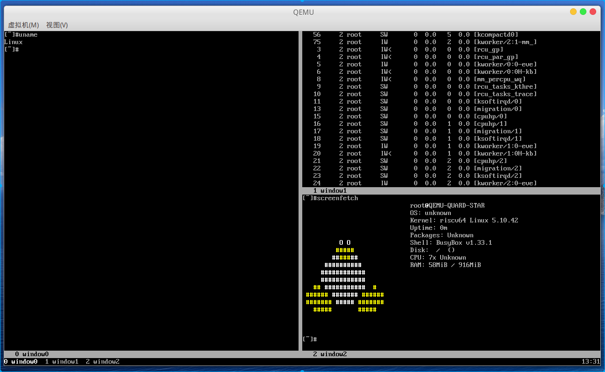

# 基于qemu-riscv从0开始构建嵌入式linux系统ch20. 交叉编译screen、tree、cu

### screen

[screen](https://www.gnu.org/software/screen/)源码可以在gnu网站上下载：https://ftp.gnu.org/gnu/screen/。screen是个人非常喜欢的终端管理工具，在没有图形界面的系统中，使用screen可以实现多终端窗口管理以及酷炫的窗口分割等功能，同时也体积较小适合嵌入式环境。

#### screen编译

编译screen，首先在host系统交叉编译

```shell
./configure --host=riscv64-linux-gnu CCFLAGS=-I$SHELL_FOLDER/output/usr/include LDFLAGS=-L$SHELL_FOLDER/output/usr/lib CXX=$CROSS_PREFIX-g++ CC=$CROSS_PREFIX-gcc 
make -j16
```

进入目标系统机中挂载screen目录。执行make install即完成，注意此时一定要部署好了bash和ncurses。

#### screen配置

为了能更好的使用screen，给大家推荐一套screen配置，编辑/etc/screenrc文件内容如下：

```
#
# Example of a user's .screenrc file
#

# This is how one can set a reattach password:
# password ODSJQf.4IJN7E    # "1234"

# no annoying audible bell, please
vbell on

# detach on hangup
autodetach on

# don't display the copyright page
startup_message off

# emulate .logout message
pow_detach_msg "Screen session of \$LOGNAME \$:cr:\$:nl:ended."

# advertise hardstatus support to $TERMCAP
# termcapinfo  * '' 'hs:ts=\E_:fs=\E\\:ds=\E_\E\\'

# make the shell in every window a login shell
#shell -$SHELL

# autoaka testing
# shellaka '> |tcsh'
# shellaka '$ |sh'

# set every new windows hardstatus line to somenthing descriptive
# defhstatus "screen: ^En (^Et)"

defscrollback 1000

# don't kill window after the process died
# zombie "^["

# enable support for the "alternate screen" capability in all windows
# altscreen on

################
#
# xterm tweaks
#

#xterm understands both im/ic and doesn't have a status line.
#Note: Do not specify im and ic in the real termcap/info file as
#some programs (e.g. vi) will not work anymore.
termcap  xterm hs@:cs=\E[%i%d;%dr:im=\E[4h:ei=\E[4l
terminfo xterm hs@:cs=\E[%i%p1%d;%p2%dr:im=\E[4h:ei=\E[4l

#80/132 column switching must be enabled for ^AW to work
#change init sequence to not switch width
termcapinfo  xterm Z0=\E[?3h:Z1=\E[?3l:is=\E[r\E[m\E[2J\E[H\E[?7h\E[?1;4;6l

# Make the output buffer large for (fast) xterms.
#termcapinfo xterm* OL=10000
termcapinfo xterm* OL=100

# tell screen that xterm can switch to dark background and has function
# keys.
termcapinfo xterm 'VR=\E[?5h:VN=\E[?5l'
termcapinfo xterm 'k1=\E[11~:k2=\E[12~:k3=\E[13~:k4=\E[14~'
termcapinfo xterm 'kh=\EOH:kI=\E[2~:kD=\E[3~:kH=\EOF:kP=\E[5~:kN=\E[6~'

# special xterm hardstatus: use the window title.
termcapinfo xterm 'hs:ts=\E]2;:fs=\007:ds=\E]2;screen\007'

#terminfo xterm 'vb=\E[?5h$<200/>\E[?5l'
termcapinfo xterm 'vi=\E[?25l:ve=\E[34h\E[?25h:vs=\E[34l'

# emulate part of the 'K' charset
termcapinfo   xterm 'XC=K%,%\E(B,[\304,\\\\\326,]\334,{\344,|\366,}\374,~\337'

# xterm-52 tweaks:
# - uses background color for delete operations
termcapinfo xterm* be

################
#
# wyse terminals
#

#wyse-75-42 must have flow control (xo = "terminal uses xon/xoff")
#essential to have it here, as this is a slow terminal.
termcapinfo wy75-42 xo:hs@

# New termcap sequences for cursor application mode.
termcapinfo wy* CS=\E[?1h:CE=\E[?1l:vi=\E[?25l:ve=\E[?25h:VR=\E[?5h:VN=\E[?5l:cb=\E[1K:CD=\E[1J

################
#
# other terminals
#

# make hp700 termcap/info better
termcapinfo  hp700 'Z0=\E[?3h:Z1=\E[?3l:hs:ts=\E[62"p\E[0$~\E[2$~\E[1$}:fs=\E[0}\E[61"p:ds=\E[62"p\E[1$~\E[61"p:ic@'

# Extend the vt100 desciption by some sequences.
termcap  vt100* ms:AL=\E[%dL:DL=\E[%dM:UP=\E[%dA:DO=\E[%dB:LE=\E[%dD:RI=\E[%dC
terminfo vt100* ms:AL=\E[%p1%dL:DL=\E[%p1%dM:UP=\E[%p1%dA:DO=\E[%p1%dB:LE=\E[%p1%dD:RI=\E[%p1%dC
termcapinfo linux C8
# old rxvt versions also need this
# termcapinfo rxvt C8


################
#
# keybindings
#

#remove some stupid / dangerous key bindings
bind k
bind ^k
bind .
bind ^\
bind \\
bind ^h
bind h
#make them better
bind 'K' kill
bind 'I' login on
bind 'O' login off
bind '}' history

# Yet another hack:
# Prepend/append register [/] to the paste if ^a^] is pressed.
# This lets me have autoindent mode in vi.
register [ "\033:se noai\015a"
register ] "\033:se ai\015a"
bind ^] paste [.]

################
#
# default windows
#

# screen -t local 0
# screen -t mail 1 mutt
# screen -t 40 2 rlogin server

# caption always "%3n %t%? @%u%?%? [%h]%?%=%c"
# hardstatus alwaysignore
# hardstatus alwayslastline "%Lw"

# bind = resize =
# bind + resize +1
# bind - resize -1
# bind _ resize max
#
# defnonblock 1
# blankerprg rain -d 100
# idle 30 blanker
```

另外可选编辑~/.screenrc文件内容（个人喜好配置在启动screen时创建三个终端窗口）如下：

```
# basic settings... self explainatory
deflogin on
autodetach on
startup_message off

# the dash makes it a login shell
defshell bash
activity ""
bell_msg ""
vbell off
vbell_msg ""
defscrollback 2048
nonblock on
defutf8 on
defbce on
defflow off
msgwait 1
altscreen on

# only Shift+k to kill - prevent accidents
bind k
bind ^k
bind K kill

escape \\\

term screen-256color
terminfo rxvt-unicode ti@:te@:
 
hardstatus alwayslastline "%{=}%-w%{+b w}%n %t%{-b w}%+w %=%c"
 
#let pgup/pgdn scroll under urxvt (see .Xdefaults)
bindkey "^[[5;2~" eval "copy" "stuff ^u"
bindkey -m "^[[5;2~" stuff ^u
bindkey -m "^[[6;2~" stuff ^d

screen -t window0 bash
screen -t window1 bash
select window0
split -v
focus right
select window1
screen -t window2 bash
split
focus down
select window2
focus up
select window1
focus left
```

最后要正确的显示screen必须要将终端的字符长款正确配置，命令如下：

```shell
stty rows $ROWS cols $COLS
```

那么终端的长宽如何确定呢，因为我们使用qemu指定终端大小，因此我这里使用qemu的fw_cfg将参数传入内核，如果你有别的更好的办法也可以告诉我，如果你是实际板卡也可以根据具体情况配置参数。如下命令加入.bashrc的脚本，就能正确从我们的qemu启动脚本中解析型如“qemu_vc=:vn:$COLSx$ROWS:”的参数到目标机器了。

```shell
QEMU_VPARAM="$(cat /sys/firmware/qemu_fw_cfg/by_name/opt/qemu_cmdline/raw | sed 's/\(.*\)qemu_vc=:\(.*\):\(.*\)/\2/g')"
ROWS="$(echo $QEMU_VPARAM | sed 's/\(.*\)vn:\(.*\)x\(.*\)/\2/g')"
COLS="$(echo $QEMU_VPARAM | sed 's/\(.*\)vn:\(.*\)x\(.*\)/\3/g')"
stty rows $ROWS cols $COLS
```

这里稍微注意下访问/sys/firmware/qemu_fw_cfg需要内核打开CONFIG_FW_CFG_SYSFS选项，并且修改linux-5.10.42/drivers/firmware/qemu_fw_cfg.c支持RISCV如下代码片段，其实内核这里倒不如从设备书中获取这个三个offset就不用这么一堆宏了。fw_cfg我们之前的章节ch10已经讲解了，这里就是个典型应用。

```c
# elif defined(CONFIG_RISCV)
#  define FW_CFG_CTRL_OFF 0x08
#  define FW_CFG_DATA_OFF 0x00
#  define FW_CFG_DMA_OFF 0x10
# else
```

看看screen使用的效果。



关于screen在我更新编译器后还发生了无法使用的问题，因此debug了很久screen，这件事我会在之后编译器节中详细记录描述。

### cu

[cu](https://man.openbsd.org/cu.1)这个工具是简易串口终端工具，代码量很少，适合嵌入式环境简单使用，相对于minicom可能用的人很少，这个项目源自BSD项目，我这里建议大家使用我在修改过的版本，我的github主页上有，优化了一些功能。cu依赖[libevent](https://libevent.org/)库，这个库也是很多工具依赖的库，所以先交叉编译libevent。

##### libevent编译

源码下载地址：https://libevent.org/。编译libevent，首先在host系统交叉编译

```shell
./configure --host=riscv64-linux-gnu --disable-openssl --disable-static --prefix=$SHELL_FOLDER/output CXX=$CROSS_PREFIX-g++ CC=$CROSS_PREFIX-gcc 
make -j16
make install
```

我们仅编译了动态库，拷贝安装到目标系统。

##### cu编译

cu是个及其简单的串口终端工具，适合嵌入式使用，但是cu在linux环境下移植不完全，我这里使用我在github找到的开源代码且自己做了些易用性的修改分叉仓库：https://github.com/QQxiaoming/cu。编译cu，首先在host系统交叉编译

```shell
make prefix=$SHELL_FOLDER/output LIBEVENTDIR=$SHELL_FOLDER/output CC=$CROSS_PREFIX-gcc -j16
make prefix=$SHELL_FOLDER/output LIBEVENTDIR=$SHELL_FOLDER/output CC=$CROSS_PREFIX-gcc install
```

动态链接了libevent了，需要上一步安装了动态库到目标系统，进入目标系统拷贝输出文件cu到/usr/bin目录就即可。

### tree

[tree](https://www.linuxfromscratch.org/blfs/view/cvs/general/tree.html)是个人经常使用的工具，这里也安装到我们的系统内。源码下载地址:http://mama.indstate.edu/users/ice/tree/src/。

#### tree编译

编译tree，首先在host系统交叉编译

```shell
make prefix=$SHELL_FOLDER/output CC=$CROSS_PREFIX-gcc -j16
make prefix=$SHELL_FOLDER/output CC=$CROSS_PREFIX-gcc install
```

tree没有任何运行时依赖，进入目标系统拷贝输出文件tree到/usr/bin目录就即可。

### 系统时区配置

最后我们将系统的UTC时区替换为CST(China Standard Time)时区，拷贝主机上的时区信息文件目录/usr/share/zoneinfo到目标机文件系统相同的路径下。执行以下示例命令来选择你需要的时区。

```shell
ln -s  /usr/share/zoneinfo/Asia/Shanghai /etc/localtime
```

> 本教程的<br>github仓库：https://github.com/QQxiaoming/quard_star_tutorial<br>gitee仓库：https://gitee.com/QQxiaoming/quard_star_tutorial<br>本节所在tag：ch20