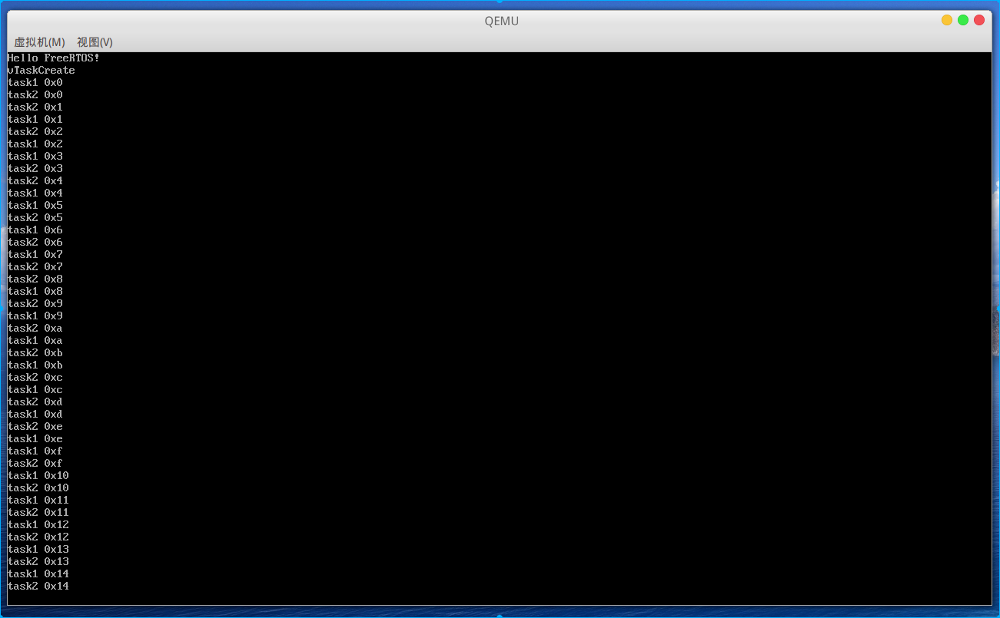

# 基于qemu-riscv从0开始构建嵌入式linux系统ch21. 实时操作系统FreeRTOS移植RISCV-S模式

### FreeRTOS

FreeRTOS在嵌入式行业内是非常出名了，这么多节过去了，我们不能忘记除了7个core上运行的linux系统外，我们还有个trusted_domain，今天我们就移植一个实时操作系统FreeRTOS到这个域中。注意这里的FreeRTOS运行在S模式上而非完全的裸机环境M模式上，而截止笔者撰写本文官方还没给出S模式的移植port文件，我也没搜索到相关内容，那我们就自己动手。

### 下载源码

FreeRTOS[官网](https://www.freertos.org/)可以下载最新lts版本的代码，这里我们下载到V10.4.3版本。将代码拷贝到trusted_domain/FreeRTOS-Kernel目录，删除portable下大部分文件，仅保留portable/MemMang/heap_4.c文件。

### 编写RISCV-S模式port层

创建portable/GCC/RISC-V目录，然后创建port.c、portASM.S、portmacro.h文件

#### port.c

port.c文件主要实现RTOS的tick初始化，这里直接调用sbi请求下一次tick到来时间戳，相比M模式下需要自己配置寄存器简单不少。

```c
/* Scheduler includes. */
#include "FreeRTOS.h"
#include "task.h"
#include "portmacro.h"
#include "riscv_asm.h"
#include "sbi.h"
#include "ns16550.h"

/* Standard includes. */
#include "string.h"

/* Let the user override the pre-loading of the initial LR with the address of
prvTaskExitError() in case it messes up unwinding of the stack in the
debugger. */
#ifdef configTASK_RETURN_ADDRESS
	#define portTASK_RETURN_ADDRESS	configTASK_RETURN_ADDRESS
#else
	#define portTASK_RETURN_ADDRESS	prvTaskExitError
#endif

/* The stack used by interrupt service routines.  Set configISR_STACK_SIZE_WORDS
to use a statically allocated array as the interrupt stack.  Alternative leave
configISR_STACK_SIZE_WORDS undefined and update the linker script so that a
linker variable names __freertos_irq_stack_top has the same value as the top
of the stack used by main.  Using the linker script method will repurpose the
stack that was used by main before the scheduler was started for use as the
interrupt stack after the scheduler has started. */
#ifdef configISR_STACK_SIZE_WORDS
	static __attribute__ ((aligned(16))) StackType_t xISRStack[ configISR_STACK_SIZE_WORDS ] = { 0 };
	const StackType_t xISRStackTop = ( StackType_t ) &( xISRStack[ configISR_STACK_SIZE_WORDS & ~portBYTE_ALIGNMENT_MASK ] );

	/* Don't use 0xa5 as the stack fill bytes as that is used by the kernerl for
	the task stacks, and so will legitimately appear in many positions within
	the ISR stack. */
	#define portISR_STACK_FILL_BYTE	0xee
#else
	extern const uint32_t __freertos_irq_stack_top[];
	const StackType_t xISRStackTop = ( StackType_t ) __freertos_irq_stack_top;
#endif

/*
 * Setup the timer to generate the tick interrupts.  The implementation in this
 * file is weak to allow application writers to change the timer used to
 * generate the tick interrupt.
 */
void vPortSetupTimerInterrupt( void ) __attribute__(( weak ));

/*-----------------------------------------------------------*/

/* Tick时间间隔 */
const size_t uxTimerIncrementsForOneTick = ( size_t ) ( ( configCPU_CLOCK_HZ ) / ( configTICK_RATE_HZ ) ); /* Assumes increment won't go over 32-bits. */

/* Set configCHECK_FOR_STACK_OVERFLOW to 3 to add ISR stack checking to task
stack checking.  A problem in the ISR stack will trigger an assert, not call the
stack overflow hook function (because the stack overflow hook is specific to a
task stack, not the ISR stack). */
#if defined( configISR_STACK_SIZE_WORDS ) && ( configCHECK_FOR_STACK_OVERFLOW > 2 )
	#warning This path not tested, or even compiled yet.

	static const uint8_t ucExpectedStackBytes[] = {
									portISR_STACK_FILL_BYTE, portISR_STACK_FILL_BYTE, portISR_STACK_FILL_BYTE, portISR_STACK_FILL_BYTE,		\
									portISR_STACK_FILL_BYTE, portISR_STACK_FILL_BYTE, portISR_STACK_FILL_BYTE, portISR_STACK_FILL_BYTE,		\
									portISR_STACK_FILL_BYTE, portISR_STACK_FILL_BYTE, portISR_STACK_FILL_BYTE, portISR_STACK_FILL_BYTE,		\
									portISR_STACK_FILL_BYTE, portISR_STACK_FILL_BYTE, portISR_STACK_FILL_BYTE, portISR_STACK_FILL_BYTE,		\
									portISR_STACK_FILL_BYTE, portISR_STACK_FILL_BYTE, portISR_STACK_FILL_BYTE, portISR_STACK_FILL_BYTE };	\

	#define portCHECK_ISR_STACK() configASSERT( ( memcmp( ( void * ) xISRStack, ( void * ) ucExpectedStackBytes, sizeof( ucExpectedStackBytes ) ) == 0 ) )
#else
	/* Define the function away. */
	#define portCHECK_ISR_STACK()
#endif /* configCHECK_FOR_STACK_OVERFLOW > 2 */

/*-----------------------------------------------------------*/

static uint64_t get_ticks()
{
    static volatile uint64_t time_elapsed = 0;
    __asm__ __volatile__(
        "rdtime %0"
        : "=r"(time_elapsed));
    return time_elapsed;
}

/*-----------------------------------------------------------*/

void vPortSetupTimerInterrupt( void )
{
	/* 通过sbi设置下次tick中断 */
	sbi_set_timer(get_ticks() + uxTimerIncrementsForOneTick);
}

/*-----------------------------------------------------------*/

void vPortClearIpiInterrupt( void )
{
	/* 通过sbi清除软中断，在软中断服务函数中调用 */
	extern void sbi_clear_ipi(void);
	sbi_clear_ipi();
}

/*-----------------------------------------------------------*/

BaseType_t xPortStartScheduler( void )
{
extern void xPortStartFirstTask( void );

	#if( configASSERT_DEFINED == 1 )
	{
		volatile uint32_t stvec = 0;

		/* Check the least significant two bits of mtvec are 00 - indicating
		single vector mode. */
		__asm volatile( "csrr %0, stvec" : "=r"( stvec ) );
		configASSERT( ( stvec & 0x03UL ) == 0 );

		/* Check alignment of the interrupt stack - which is the same as the
		stack that was being used by main() prior to the scheduler being
		started. */
		configASSERT( ( xISRStackTop & portBYTE_ALIGNMENT_MASK ) == 0 );

		#ifdef configISR_STACK_SIZE_WORDS
		{
			memset( ( void * ) xISRStack, portISR_STACK_FILL_BYTE, sizeof( xISRStack ) );
		}
		#endif	 /* configISR_STACK_SIZE_WORDS */
	}
	#endif /* configASSERT_DEFINED */

	/* 通过sbi设置Timer为滴答时钟 */
	vPortSetupTimerInterrupt();

    /* 使能SIE中S模式Timer中断和Soft中断，注意此处使能并不会立即响应
	xPortStartFirstTask中将打开全局使能 */
    csr_set(CSR_SIE, SIP_STIP);
    csr_set(CSR_SIE, SIP_SSIP);

	xPortStartFirstTask();

	/* Should not get here as after calling xPortStartFirstTask() only tasks
	should be executing. */
	return pdFAIL;
}

/*-----------------------------------------------------------*/

void prvTaskExitError( void )
{
	/* A function that implements a task must not exit or attempt to return to
	its caller as there is nothing to return to.  If a task wants to exit it
	should instead call vTaskDelete( NULL ).

	Artificially force an assert() to be triggered if configASSERT() is
	defined, then stop here so application writers can catch the error. */
	configASSERT( ulPortInterruptNesting == ~0UL );
	portDISABLE_INTERRUPTS();
	for( ;; );
}

/*-----------------------------------------------------------*/

void vPortEndScheduler( void )
{
	/* Not implemented. */
	for( ;; );
}
```

#### portASM.S

portASM用于处理中断和异常，所有的异常和中断入口均从freertos_risc_v_trap_handler进入。进行相关的压栈操作后检查scause寄存器，根据寄存器相关bit可以区分异常，timer中断，ipi中断和其他外部中断。在ipi中断中我们来处理一次任务上下文调度，而在timer中断调用xTaskIncrementTick增加tick。

```assembly
#include "riscv_encoding.h"

#if __riscv_xlen == 64
	#define portWORD_SIZE 8
	#define store_x sd
	#define load_x ld
#elif __riscv_xlen == 32
	#define portWORD_SIZE 4
	#define store_x sw
	#define load_x lw
#else
	#error Assembler did not define __riscv_xlen
#endif

/* Only the standard core registers are stored by default. */
#if __riscv_flen == 64
	#define portCONTEXT_SIZE ( 62 * portWORD_SIZE )
	#define store_fx fsd
	#define load_fx fld
#elif __riscv_xlen == 32
	#define portCONTEXT_SIZE ( 62 * portWORD_SIZE )
	#define store_fx fsw
	#define load_fx flw
#else
	#define portCONTEXT_SIZE ( 30 * portWORD_SIZE )
#endif

.global xPortStartFirstTask
.global freertos_risc_v_trap_handler
.global pxPortInitialiseStack
.extern pxCurrentTCB
.extern ulPortTrapHandler
.extern vTaskSwitchContext
.extern xTaskIncrementTick
.extern Timer_IRQHandler
.extern pullMachineTimerCompareRegister
.extern pullNextTime
.extern uxTimerIncrementsForOneTick /* size_t type so 32-bit on 32-bit core and 64-bits on 64-bit core. */
.extern xISRStackTop
.extern prvTaskExitError

/*-----------------------------------------------------------*/

.align 8
.func
freertos_risc_v_trap_handler:
	addi sp, sp, -portCONTEXT_SIZE
	store_x x1, 1 * portWORD_SIZE( sp )
	store_x x5, 2 * portWORD_SIZE( sp )
	store_x x6, 3 * portWORD_SIZE( sp )
	store_x x7, 4 * portWORD_SIZE( sp )
	store_x x8, 5 * portWORD_SIZE( sp )
	store_x x9, 6 * portWORD_SIZE( sp )
	store_x x10, 7 * portWORD_SIZE( sp )
	store_x x11, 8 * portWORD_SIZE( sp )
	store_x x12, 9 * portWORD_SIZE( sp )
	store_x x13, 10 * portWORD_SIZE( sp )
	store_x x14, 11 * portWORD_SIZE( sp )
	store_x x15, 12 * portWORD_SIZE( sp )
	store_x x16, 13 * portWORD_SIZE( sp )
	store_x x17, 14 * portWORD_SIZE( sp )
	store_x x18, 15 * portWORD_SIZE( sp )
	store_x x19, 16 * portWORD_SIZE( sp )
	store_x x20, 17 * portWORD_SIZE( sp )
	store_x x21, 18 * portWORD_SIZE( sp )
	store_x x22, 19 * portWORD_SIZE( sp )
	store_x x23, 20 * portWORD_SIZE( sp )
	store_x x24, 21 * portWORD_SIZE( sp )
	store_x x25, 22 * portWORD_SIZE( sp )
	store_x x26, 23 * portWORD_SIZE( sp )
	store_x x27, 24 * portWORD_SIZE( sp )
	store_x x28, 25 * portWORD_SIZE( sp )
	store_x x29, 26 * portWORD_SIZE( sp )
	store_x x30, 27 * portWORD_SIZE( sp )
	store_x x31, 28 * portWORD_SIZE( sp )

	csrr t0, sstatus					/* Required for SPIE bit. */
	store_x t0, 29 * portWORD_SIZE( sp )

#ifdef __riscv_flen
	csrr t2, sstatus
	li t0, SSTATUS_FS
	and t1,t2,t0
	bne t1,t0,1f

	store_fx f0, 30 * portWORD_SIZE( sp )
	store_fx f1, 31 * portWORD_SIZE( sp )
	store_fx f2, 32 * portWORD_SIZE( sp )
	store_fx f3, 33 * portWORD_SIZE( sp )
	store_fx f4, 34 * portWORD_SIZE( sp )
	store_fx f5, 35 * portWORD_SIZE( sp )
	store_fx f6, 36 * portWORD_SIZE( sp )
	store_fx f7, 37 * portWORD_SIZE( sp )
	store_fx f8, 38 * portWORD_SIZE( sp )
	store_fx f9, 39 * portWORD_SIZE( sp )
	store_fx f10, 40 * portWORD_SIZE( sp )
	store_fx f11, 41 * portWORD_SIZE( sp )
	store_fx f12, 42 * portWORD_SIZE( sp )
	store_fx f13, 43 * portWORD_SIZE( sp )
	store_fx f14, 44 * portWORD_SIZE( sp )
	store_fx f15, 45 * portWORD_SIZE( sp )
	store_fx f16, 46 * portWORD_SIZE( sp )
	store_fx f17, 47 * portWORD_SIZE( sp )
	store_fx f18, 48 * portWORD_SIZE( sp )
	store_fx f19, 49 * portWORD_SIZE( sp )
	store_fx f20, 50 * portWORD_SIZE( sp )
	store_fx f21, 51 * portWORD_SIZE( sp )
	store_fx f22, 52 * portWORD_SIZE( sp )
	store_fx f23, 53 * portWORD_SIZE( sp )
	store_fx f24, 54 * portWORD_SIZE( sp )
	store_fx f25, 55 * portWORD_SIZE( sp )
	store_fx f26, 56 * portWORD_SIZE( sp )
	store_fx f27, 57 * portWORD_SIZE( sp )
	store_fx f28, 58 * portWORD_SIZE( sp )
	store_fx f29, 59 * portWORD_SIZE( sp )
	store_fx f30, 60 * portWORD_SIZE( sp )
	store_fx f31, 61 * portWORD_SIZE( sp )
1:	
	li t0, (0x1 << 14)
	csrs sstatus,t0
	li t0, (0x1 << 13)
	csrc sstatus,t0   
#endif

	csrr t0, sepc
	store_x t0, 0 * portWORD_SIZE( sp )

	load_x  t0, pxCurrentTCB			/* Load pxCurrentTCB. */
	store_x  sp, 0( t0 )				/* Write sp to first TCB member. */

	csrr a0, scause
	csrr a1, sepc

test_if_asynchronous:
	srli a2, a0, __riscv_xlen - 1		/* MSB of mcause is 1 if handing an asynchronous interrupt - shift to LSB to clear other bits. */
	beq a2, x0, handle_synchronous		/* Branch past interrupt handing if not asynchronous. */
	store_x a1, 0( sp )					/* Asynch so save unmodified exception return address. */

handle_asynchronous:

test_if_ipi:
	addi t0, x0, 1

	slli t0, t0, __riscv_xlen - 1   /* LSB is already set, shift into MSB.  Shift 31 on 32-bit or 63 on 64-bit cores. */
	addi t1, t0, 1					/* 0x8000[]0001 == Supervisor ipi interrupt. */
	bne a0, t1, test_if_mtimer

	load_x sp, xISRStackTop			/* Switch to ISR stack before function call. */
	jal vPortClearIpiInterrupt
	jal vTaskSwitchContext
	j processed_source

test_if_mtimer:						/* If there is a CLINT then the mtimer is used to generate the tick interrupt. */
	addi t1, t1, 4					/* 0x80000001 + 4 = 0x80000005 == Supervisor timer interrupt. */
	bne a0, t1, test_if_external_interrupt

	load_x sp, xISRStackTop			/* Switch to ISR stack before function call. */
	jal vPortSetupTimerInterrupt
	jal xTaskIncrementTick
	beqz a0, processed_source		/* Don't switch context if incrementing tick didn't unblock a task. */
	jal vTaskSwitchContext
	j processed_source

test_if_external_interrupt:			/* If there is a CLINT and the mtimer interrupt is not pending then check to see if an external interrupt is pending. */
	addi t1, t1, 4					/* 0x80000005 + 4 = 0x80000009 == Supervisor external interrupt. */
	bne a0, t1, processed_trap   	/* Something as yet unhandled. */

	load_x sp, xISRStackTop			/* Switch to ISR stack before function call. */
	jal handle_interrupt	        /* Jump to the interrupt handler if there is no CLINT or if there is a CLINT and it has been determined that an external interrupt is pending. */
	j processed_source

handle_synchronous:
	addi a1, a1, 4					/* Synchronous so updated exception return address to the instruction after the instruction that generated the exeption. */
	store_x a1, 0( sp )				/* Save updated exception return address. */

processed_trap:
	csrr a0, scause
	csrr a1, sepc
	csrr a2, stval
	mv   a4, sp
	load_x sp, xISRStackTop			/* Switch to ISR stack before function call. */
	jal handle_trap	                /* Jump to the interrupt handler if there is no CLINT or if there is a CLINT and it has been determined that an external interrupt is pending. */
	j processed_source

processed_source:
	load_x  t1, pxCurrentTCB		/* Load pxCurrentTCB. */
	load_x  sp, 0( t1 )				/* Read sp from first TCB member. */

	/* Load sret with the address of the next instruction in the task to run next. */
	load_x t0, 0 * portWORD_SIZE( sp )
	csrw sepc, t0

#ifdef __riscv_flen
	csrr t2, sstatus
#endif

	/* Load mstatus with the interrupt enable bits used by the task. */
	load_x  t0, 29 * portWORD_SIZE( sp )
	csrw sstatus, t0				/* Required for MPIE bit. */

#ifdef __riscv_flen
	li t0, SSTATUS_FS
	and t1,t2,t0
	bne t1,t0,1f

	load_fx f0, 30 * portWORD_SIZE( sp )
	load_fx f1, 31 * portWORD_SIZE( sp )
	load_fx f2, 32 * portWORD_SIZE( sp )
	load_fx f3, 33 * portWORD_SIZE( sp )
	load_fx f4, 34 * portWORD_SIZE( sp )
	load_fx f5, 35 * portWORD_SIZE( sp )
	load_fx f6, 36 * portWORD_SIZE( sp )
	load_fx f7, 37 * portWORD_SIZE( sp )
	load_fx f8, 38 * portWORD_SIZE( sp )
	load_fx f9, 39 * portWORD_SIZE( sp )
	load_fx f10, 40 * portWORD_SIZE( sp )
	load_fx f11, 41 * portWORD_SIZE( sp )
	load_fx f12, 42 * portWORD_SIZE( sp )
	load_fx f13, 43 * portWORD_SIZE( sp )
	load_fx f14, 44 * portWORD_SIZE( sp )
	load_fx f15, 45 * portWORD_SIZE( sp )
	load_fx f16, 46 * portWORD_SIZE( sp )
	load_fx f17, 47 * portWORD_SIZE( sp )
	load_fx f18, 48 * portWORD_SIZE( sp )
	load_fx f19, 49 * portWORD_SIZE( sp )
	load_fx f20, 50 * portWORD_SIZE( sp )
	load_fx f21, 51 * portWORD_SIZE( sp )
	load_fx f22, 52 * portWORD_SIZE( sp )
	load_fx f23, 53 * portWORD_SIZE( sp )
	load_fx f24, 54 * portWORD_SIZE( sp )
	load_fx f25, 55 * portWORD_SIZE( sp )
	load_fx f26, 56 * portWORD_SIZE( sp )
	load_fx f27, 57 * portWORD_SIZE( sp )
	load_fx f28, 58 * portWORD_SIZE( sp )
	load_fx f29, 59 * portWORD_SIZE( sp )
	load_fx f30, 60 * portWORD_SIZE( sp )
	load_fx f31, 61 * portWORD_SIZE( sp )
1:	
#endif

	load_x  x1, 1 * portWORD_SIZE( sp )
	load_x  x5, 2 * portWORD_SIZE( sp )		/* t0 */
	load_x  x6, 3 * portWORD_SIZE( sp )		/* t1 */
	load_x  x7, 4 * portWORD_SIZE( sp )		/* t2 */
	load_x  x8, 5 * portWORD_SIZE( sp )		/* s0/fp */
	load_x  x9, 6 * portWORD_SIZE( sp )		/* s1 */
	load_x  x10, 7 * portWORD_SIZE( sp )	/* a0 */
	load_x  x11, 8 * portWORD_SIZE( sp )	/* a1 */
	load_x  x12, 9 * portWORD_SIZE( sp )	/* a2 */
	load_x  x13, 10 * portWORD_SIZE( sp )	/* a3 */
	load_x  x14, 11 * portWORD_SIZE( sp )	/* a4 */
	load_x  x15, 12 * portWORD_SIZE( sp )	/* a5 */
	load_x  x16, 13 * portWORD_SIZE( sp )	/* a6 */
	load_x  x17, 14 * portWORD_SIZE( sp )	/* a7 */
	load_x  x18, 15 * portWORD_SIZE( sp )	/* s2 */
	load_x  x19, 16 * portWORD_SIZE( sp )	/* s3 */
	load_x  x20, 17 * portWORD_SIZE( sp )	/* s4 */
	load_x  x21, 18 * portWORD_SIZE( sp )	/* s5 */
	load_x  x22, 19 * portWORD_SIZE( sp )	/* s6 */
	load_x  x23, 20 * portWORD_SIZE( sp )	/* s7 */
	load_x  x24, 21 * portWORD_SIZE( sp )	/* s8 */
	load_x  x25, 22 * portWORD_SIZE( sp )	/* s9 */
	load_x  x26, 23 * portWORD_SIZE( sp )	/* s10 */
	load_x  x27, 24 * portWORD_SIZE( sp )	/* s11 */
	load_x  x28, 25 * portWORD_SIZE( sp )	/* t3 */
	load_x  x29, 26 * portWORD_SIZE( sp )	/* t4 */
	load_x  x30, 27 * portWORD_SIZE( sp )	/* t5 */
	load_x  x31, 28 * portWORD_SIZE( sp )	/* t6 */
	addi sp, sp, portCONTEXT_SIZE

	sret
	.endfunc
/*-----------------------------------------------------------*/

.align 8
.weak handle_trap
.func
handle_trap:
	j handle_trap
	.endfunc
/*-----------------------------------------------------------*/

.align 8
.weak handle_interrupt
.func
handle_interrupt:
	j handle_interrupt
	ret
	.endfunc
/*-----------------------------------------------------------*/

.align 8
.func
xPortStartFirstTask:
	/* If there is a clint then interrupts can branch directly to the FreeRTOS
	trap handler.  Otherwise the interrupt controller will need to be configured
	outside of this file. */
	la t0, freertos_risc_v_trap_handler
	csrw stvec, t0

	load_x  sp, pxCurrentTCB			/* Load pxCurrentTCB. */
	load_x  sp, 0( sp )				 	/* Read sp from first TCB member. */

	load_x  x1, 0( sp ) /* Note for starting the scheduler the exception return address is used as the function return address. */

#ifdef __riscv_flen
	load_fx f0, 30 * portWORD_SIZE( sp )
	load_fx f1, 31 * portWORD_SIZE( sp )
	load_fx f2, 32 * portWORD_SIZE( sp )
	load_fx f3, 33 * portWORD_SIZE( sp )
	load_fx f4, 34 * portWORD_SIZE( sp )
	load_fx f5, 35 * portWORD_SIZE( sp )
	load_fx f6, 36 * portWORD_SIZE( sp )
	load_fx f7, 37 * portWORD_SIZE( sp )
	load_fx f8, 38 * portWORD_SIZE( sp )
	load_fx f9, 39 * portWORD_SIZE( sp )
	load_fx f10, 40 * portWORD_SIZE( sp )
	load_fx f11, 41 * portWORD_SIZE( sp )
	load_fx f12, 42 * portWORD_SIZE( sp )
	load_fx f13, 43 * portWORD_SIZE( sp )
	load_fx f14, 44 * portWORD_SIZE( sp )
	load_fx f15, 45 * portWORD_SIZE( sp )
	load_fx f16, 46 * portWORD_SIZE( sp )
	load_fx f17, 47 * portWORD_SIZE( sp )
	load_fx f18, 48 * portWORD_SIZE( sp )
	load_fx f19, 49 * portWORD_SIZE( sp )
	load_fx f20, 50 * portWORD_SIZE( sp )
	load_fx f21, 51 * portWORD_SIZE( sp )
	load_fx f22, 52 * portWORD_SIZE( sp )
	load_fx f23, 53 * portWORD_SIZE( sp )
	load_fx f24, 54 * portWORD_SIZE( sp )
	load_fx f25, 55 * portWORD_SIZE( sp )
	load_fx f26, 56 * portWORD_SIZE( sp )
	load_fx f27, 57 * portWORD_SIZE( sp )
	load_fx f28, 58 * portWORD_SIZE( sp )
	load_fx f29, 59 * portWORD_SIZE( sp )
	load_fx f30, 60 * portWORD_SIZE( sp )
	load_fx f31, 61 * portWORD_SIZE( sp )
#endif

	load_x  x6, 3 * portWORD_SIZE( sp )		/* t1 */
	load_x  x7, 4 * portWORD_SIZE( sp )		/* t2 */
	load_x  x8, 5 * portWORD_SIZE( sp )		/* s0/fp */
	load_x  x9, 6 * portWORD_SIZE( sp )		/* s1 */
	load_x  x10, 7 * portWORD_SIZE( sp )	/* a0 */
	load_x  x11, 8 * portWORD_SIZE( sp )	/* a1 */
	load_x  x12, 9 * portWORD_SIZE( sp )	/* a2 */
	load_x  x13, 10 * portWORD_SIZE( sp )	/* a3 */
	load_x  x14, 11 * portWORD_SIZE( sp )	/* a4 */
	load_x  x15, 12 * portWORD_SIZE( sp )	/* a5 */
	load_x  x16, 13 * portWORD_SIZE( sp )	/* a6 */
	load_x  x17, 14 * portWORD_SIZE( sp )	/* a7 */
	load_x  x18, 15 * portWORD_SIZE( sp )	/* s2 */
	load_x  x19, 16 * portWORD_SIZE( sp )	/* s3 */
	load_x  x20, 17 * portWORD_SIZE( sp )	/* s4 */
	load_x  x21, 18 * portWORD_SIZE( sp )	/* s5 */
	load_x  x22, 19 * portWORD_SIZE( sp )	/* s6 */
	load_x  x23, 20 * portWORD_SIZE( sp )	/* s7 */
	load_x  x24, 21 * portWORD_SIZE( sp )	/* s8 */
	load_x  x25, 22 * portWORD_SIZE( sp )	/* s9 */
	load_x  x26, 23 * portWORD_SIZE( sp )	/* s10 */
	load_x  x27, 24 * portWORD_SIZE( sp )	/* s11 */
	load_x  x28, 25 * portWORD_SIZE( sp )	/* t3 */
	load_x  x29, 26 * portWORD_SIZE( sp )	/* t4 */
	load_x  x30, 27 * portWORD_SIZE( sp )	/* t5 */
	load_x  x31, 28 * portWORD_SIZE( sp )	/* t6 */

	load_x  x5, 29 * portWORD_SIZE( sp )	/* Initial mstatus into x5 (t0) */
	ori x5, x5, 0x2					    	/* Set SIE bit so the first task starts with interrupts enabled - required as returns with ret not eret. */
	csrrw  x0, sstatus, x5					/* Interrupts enabled from here! */
	load_x  x5, 2 * portWORD_SIZE( sp )		/* Initial x5 (t0) value. */

	addi	sp, sp, portCONTEXT_SIZE
	ret
	.endfunc
/*-----------------------------------------------------------*/

/*
 * Unlike other ports pxPortInitialiseStack() is written in assembly code as it
 * needs access to the portasmADDITIONAL_CONTEXT_SIZE constant.  The prototype
 * for the function is as per the other ports:
 * StackType_t *pxPortInitialiseStack( StackType_t *pxTopOfStack, TaskFunction_t pxCode, void *pvParameters );
 *
 * As per the standard RISC-V ABI pxTopcOfStack is passed in in a0, pxCode in
 * a1, and pvParameters in a2.  The new top of stack is passed out in a0.
 *
 * RISC-V maps registers to ABI names as follows (X1 to X31 integer registers
 * for the 'I' profile, X1 to X15 for the 'E' profile, currently I assumed).
 *
 * Register		ABI Name	Description						Saver
 * x0			zero		Hard-wired zero					-
 * x1			ra			Return address					Caller
 * x2			sp			Stack pointer					Callee
 * x3			gp			Global pointer					-
 * x4			tp			Thread pointer					-
 * x5-7			t0-2		Temporaries						Caller
 * x8			s0/fp		Saved register/Frame pointer	Callee
 * x9			s1			Saved register					Callee
 * x10-11		a0-1		Function Arguments/return values Caller
 * x12-17		a2-7		Function arguments				Caller
 * x18-27		s2-11		Saved registers					Callee
 * x28-31		t3-6		Temporaries						Caller
 *
 * The RISC-V context is saved t FreeRTOS tasks in the following stack frame,
 * where the global and thread pointers are currently assumed to be constant so
 * are not saved:
 *
 * mstatus
 * x31
 * x30
 * x29
 * x28
 * x27
 * x26
 * x25
 * x24
 * x23
 * x22
 * x21
 * x20
 * x19
 * x18
 * x17
 * x16
 * x15
 * x14
 * x13
 * x12
 * x11
 * pvParameters
 * x9
 * x8
 * x7
 * x6
 * x5
 * portTASK_RETURN_ADDRESS
 * [chip specific registers go here]
 * pxCode
 */
.align 8
.func
pxPortInitialiseStack:
	csrr t0, sstatus					/* Obtain current sstatus value. */
	la t1, sstatus_init
	lw t2, 0(t1)
	or t0, t0, t2
#ifdef __riscv_flen
	lw t2, 4(t1)
	and t0, t0, t2
#endif
	andi t0, t0, ~0x2					/* Ensure interrupts are disabled when the stack is restored within an ISR.  Required when a task is created after the schedulre has been started, otherwise interrupts would be disabled anyway. */
	addi t1, x0, 0x120					/* Generate the value 0x120, which are the SPIE and SPP bits to set in mstatus. */
	or t0, t0, t1						/* Set SPIE and SPP bits in sstatus value. */

#ifdef __riscv_flen
	addi a0, a0, -(32 * portWORD_SIZE)	/* Space for registers x11-x31. */
#endif
	addi a0, a0, -portWORD_SIZE
	store_x t0, 0(a0)					/* sstatus onto the stack. */
	addi a0, a0, -(22 * portWORD_SIZE)	/* Space for registers x11-x31. */
	store_x a2, 0(a0)					/* Task parameters (pvParameters parameter) goes into register X10/a0 on the stack. */
	addi a0, a0, -(6 * portWORD_SIZE)	/* Space for registers x5-x9. */
	la t0, prvTaskExitError
	store_x t0, 0(a0)					/* Return address onto the stack, could be portTASK_RETURN_ADDRESS */

	addi a0, a0, -portWORD_SIZE
	store_x a1, 0(a0)					/* mret value (pxCode parameter) onto the stack. */
	ret
sstatus_init:
	.word (~SSTATUS_FS)
#ifdef __riscv_flen
	.word (0x1 << 13)
#endif
	.endfunc
/*-----------------------------------------------------------*/
```

#### portmacro.h

portmacro.h定义一些移植宏，以及最重要的portYIEL调用send_ipi。

```c

#ifndef PORTMACRO_H
#define PORTMACRO_H

#ifdef __cplusplus
extern "C" {
#endif

#include "quard_star.h"

/* Type definitions. */
#if __riscv_xlen == 64
	#define portSTACK_TYPE			uint64_t
	#define portBASE_TYPE			int64_t
	#define portUBASE_TYPE			uint64_t
	#define portMAX_DELAY 			( TickType_t ) 0xffffffffffffffffUL
	#define portPOINTER_SIZE_TYPE 	uint64_t
#elif __riscv_xlen == 32
	#define portSTACK_TYPE	uint32_t
	#define portBASE_TYPE	int32_t
	#define portUBASE_TYPE	uint32_t
	#define portMAX_DELAY ( TickType_t ) 0xffffffffUL
#else
	#error Assembler did not define __riscv_xlen
#endif


typedef portSTACK_TYPE StackType_t;
typedef portBASE_TYPE BaseType_t;
typedef portUBASE_TYPE UBaseType_t;
typedef portUBASE_TYPE TickType_t;

/* Legacy type definitions. */
#define portCHAR		char
#define portFLOAT		float
#define portDOUBLE		double
#define portLONG		long
#define portSHORT		short

/* 32-bit tick type on a 32-bit architecture, so reads of the tick count do
not need to be guarded with a critical section. */
#define portTICK_TYPE_IS_ATOMIC 1
/*-----------------------------------------------------------*/

/* Architecture specifics. */
#define portSTACK_GROWTH			( -1 )
#define portTICK_PERIOD_MS			( ( TickType_t ) 1000 / configTICK_RATE_HZ )
#ifdef __riscv64
	#error This is the RV32 port that has not yet been adapted for 64.
	#define portBYTE_ALIGNMENT			16
#else
	#define portBYTE_ALIGNMENT			16
#endif
/*-----------------------------------------------------------*/


/* Scheduler utilities. */
extern void vTaskSwitchContext( void );
/* 通过sbi触发自己核心的软中断 */
extern void sbi_send_ipi(const unsigned long *hart_mask);
#define portYIELD() sbi_send_ipi((const unsigned long *)(0x1<<PRIM_HART))
#define portEND_SWITCHING_ISR( xSwitchRequired ) if( xSwitchRequired ) vTaskSwitchContext()
#define portYIELD_FROM_ISR( x ) portEND_SWITCHING_ISR( x )
/*-----------------------------------------------------------*/


/* Critical section management. */
#define portCRITICAL_NESTING_IN_TCB					1
extern void vTaskEnterCritical( void );
extern void vTaskExitCritical( void );

#define portSET_INTERRUPT_MASK_FROM_ISR() 0
#define portCLEAR_INTERRUPT_MASK_FROM_ISR( uxSavedStatusValue ) ( void ) uxSavedStatusValue
/* S模式下SIE全局中断控制 */
#define portDISABLE_INTERRUPTS()	__asm volatile( "csrc sstatus, 2" )
#define portENABLE_INTERRUPTS()		__asm volatile( "csrs sstatus, 2" )
#define portENTER_CRITICAL()	vTaskEnterCritical()
#define portEXIT_CRITICAL()		vTaskExitCritical()

/*-----------------------------------------------------------*/

/* Architecture specific optimisations. */
#ifndef configUSE_PORT_OPTIMISED_TASK_SELECTION
	#define configUSE_PORT_OPTIMISED_TASK_SELECTION 1
#endif

#if( configUSE_PORT_OPTIMISED_TASK_SELECTION == 1 )

	/* Check the configuration. */
	#if( configMAX_PRIORITIES > 32 )
		#error configUSE_PORT_OPTIMISED_TASK_SELECTION can only be set to 1 when configMAX_PRIORITIES is less than or equal to 32.  It is very rare that a system requires more than 10 to 15 difference priorities as tasks that share a priority will time slice.
	#endif

	/* Store/clear the ready priorities in a bit map. */
	#define portRECORD_READY_PRIORITY( uxPriority, uxReadyPriorities ) ( uxReadyPriorities ) |= ( 1UL << ( uxPriority ) )
	#define portRESET_READY_PRIORITY( uxPriority, uxReadyPriorities ) ( uxReadyPriorities ) &= ~( 1UL << ( uxPriority ) )

	/*-----------------------------------------------------------*/
	static inline uint32_t ucPortCountLeadingZeros(uint32_t x)
	{
		uint32_t numZeros;
		if (!x)
			return (sizeof(int) * 8);
		numZeros = 0;
		while (!(x & 0x80000000)) {
			numZeros++;
			x <<= 1;
		} 
		return numZeros;
	}
        #define portGET_HIGHEST_PRIORITY( uxTopPriority, uxReadyPriorities )    uxTopPriority = ( 31UL - ( uint32_t ) ucPortCountLeadingZeros( ( uxReadyPriorities ) ) )
#endif /* configUSE_PORT_OPTIMISED_TASK_SELECTION */


/*-----------------------------------------------------------*/

/* Task function macros as described on the FreeRTOS.org WEB site.  These are
not necessary for to use this port.  They are defined so the common demo files
(which build with all the ports) will build. */
#define portTASK_FUNCTION_PROTO( vFunction, pvParameters ) void vFunction( void *pvParameters )
#define portTASK_FUNCTION( vFunction, pvParameters ) void vFunction( void *pvParameters )

/*-----------------------------------------------------------*/

#define portNOP() __asm volatile 	( " nop " )

#define portINLINE	__inline

#ifndef portFORCE_INLINE
	#define portFORCE_INLINE inline __attribute__(( always_inline))
#endif

#define portMEMORY_BARRIER() __asm volatile( "" ::: "memory" )
/*-----------------------------------------------------------*/

#ifdef __cplusplus
}
#endif

#endif /* PORTMACRO_H */
```

### 编写测试代码

最后，编写RTOS的配置config文件和测试主函数。

#### FreeRTOSConfig.h

主要配置系统tick时钟和栈大小以及需要启用的ipc组件。

```c

#ifndef FREERTOS_CONFIG_H
#define FREERTOS_CONFIG_H

#define configMTIME_BASE_ADDRESS		( CLINT_ADDR + CLINT_MTIME )
#define configMTIMECMP_BASE_ADDRESS		( CLINT_ADDR + CLINT_MTIMECMP )

#define configUSE_PREEMPTION			1
#define configUSE_IDLE_HOOK				0
#define configUSE_TICK_HOOK				0
#define configCPU_CLOCK_HZ				( 10000000 )
#define configTICK_RATE_HZ				( ( TickType_t ) 1000 )
#define configMAX_PRIORITIES			( 7 )
#define configMINIMAL_STACK_SIZE		( ( unsigned short ) 512 )
#define configTOTAL_HEAP_SIZE			( ( size_t ) 64500 )
#define configMAX_TASK_NAME_LEN			( 16 )
#define configUSE_16_BIT_TICKS			0
#define configIDLE_SHOULD_YIELD			0
#define configUSE_MUTEXES				1
#define configQUEUE_REGISTRY_SIZE		8
#define configCHECK_FOR_STACK_OVERFLOW	0
#define configUSE_RECURSIVE_MUTEXES		1
#define configUSE_MALLOC_FAILED_HOOK	0
#define configUSE_APPLICATION_TASK_TAG	0
#define configUSE_COUNTING_SEMAPHORES	1
#define configUSE_PORT_OPTIMISED_TASK_SELECTION 1

/* Co-routine definitions. */
#define configUSE_CO_ROUTINES 			0
#define configMAX_CO_ROUTINE_PRIORITIES ( 2 )

/* Software timer definitions. */
#define configUSE_TIMERS				1
#define configTIMER_TASK_PRIORITY		( configMAX_PRIORITIES - 1 )
#define configTIMER_QUEUE_LENGTH		6
#define configTIMER_TASK_STACK_DEPTH	( 110 )

/* Run time and task stats gathering related definitions. */
#define configGENERATE_RUN_TIME_STATS           0
#define configUSE_TRACE_FACILITY                1
#define configUSE_STATS_FORMATTING_FUNCTIONS    1

/* RISC-V definitions. */
#define configISR_STACK_SIZE_WORDS		2048

/* Task priorities.  Allow these to be overridden. */
#ifndef uartPRIMARY_PRIORITY
	#define uartPRIMARY_PRIORITY		( configMAX_PRIORITIES - 3 )
#endif

/* Set the following definitions to 1 to include the API function, or zero
to exclude the API function. */
#define INCLUDE_vTaskPrioritySet			1
#define INCLUDE_uxTaskPriorityGet			1
#define INCLUDE_vTaskDelete					1
#define INCLUDE_vTaskCleanUpResources		1
#define INCLUDE_vTaskSuspend				1
#define INCLUDE_vTaskDelayUntil				1
#define INCLUDE_vTaskDelay					1
#define INCLUDE_eTaskGetState				1
#define INCLUDE_xTimerPendFunctionCall		1
#define INCLUDE_xTaskAbortDelay				1
#define INCLUDE_xTaskGetHandle				1
#define INCLUDE_xSemaphoreGetMutexHolder	1

#endif /* FREERTOS_CONFIG_H */
```
#### main.c

测试代码创建两个任务。

```c
#include <FreeRTOS.h>
#include <task.h>
#include "debug_log.h"
#include "sbi.h"
#include "riscv_asm.h"

static void task1(void *p_arg)
{ 
    int time = 0;
    for(;;)
    {
        debug_log("task1 0x%x\n",time++);
        vTaskDelay(pdMS_TO_TICKS(1000));
    }
}

static void task2(void *p_arg)
{ 
    int time = 0;
    for(;;)
    {
        debug_log("task2 0x%x\n",time++);
        vTaskDelay(pdMS_TO_TICKS(1000));
    }
}

static void vTaskCreate(void *p_arg)
{ 
	debug_log("vTaskCreate\n");

    xTaskCreate(task1,"task1",2048,NULL,4,NULL);
    xTaskCreate(task2,"task2",2048,NULL,4,NULL);

    vTaskDelete(NULL);
}

int main(void)
{
	debug_log("Hello FreeRTOS!\n");
    
    debug_log_init();
    
    xTaskCreate(vTaskCreate,"task creat",256,NULL,4,NULL);

	vTaskStartScheduler();
	return 0;
}
```

#### startup.S

启动文件配置栈指针，加载data段，初始化bss段，初始化newlibc库（当前没有代newlib的编译器可以跳过这个步骤），跳转main

```assembly
#include "riscv_encoding.h"
#include "quard_star.h"

	.section .init
	.globl _start
	.type _start,@function
_start:
	.cfi_startproc
	.cfi_undefined ra
.option push
.option norelax
	la  gp, __global_pointer$
.option pop

	// Continue primary hart
	li   a1, PRIM_HART
	bne  a0, a1, secondary

  	csrw sie, 0
  	csrw sip, 0
	/* set to disable FPU */
	li t0, SSTATUS_FS
	csrc sstatus, t0
#ifdef __riscv_flen
	/* set to init FPU */
	li t0, (0x1 << 13)
	csrs sstatus, t0
#endif
	li t0, SSTATUS_SUM // SUM in sstatus
	csrs sstatus, t0

	// Primary hart
	la sp, _sp
	csrw sscratch, sp

	// Load data section
	la a0, _data_lma
	la a1, _data
	la a2, _edata
	bgeu a1, a2, 2f
1:
	LOAD t0, (a0)
	STOR t0, (a1)
	addi a0, a0, REGSIZE
	addi a1, a1, REGSIZE
	bltu a1, a2, 1b
2:

	// Clear bss section
	la a0, __bss_start
	la a1, __bss_end
	bgeu a0, a1, 2f
1:
	STOR zero, (a0)
	addi a0, a0, REGSIZE
	bltu a0, a1, 1b
2:

	/* Call global constructors */
	la a0, __libc_fini_array
	call atexit
	call __libc_init_array
	
	// argc, argv, envp is 0
	li  a0, 0
	li  a1, 0
	li  a2, 0
	jal main
1:
	wfi
	j 1b

ecall_err:
	wfi
	j ecall_err
	
secondary:
	// TODO: Multicore is not supported
	wfi
	j secondary
	.cfi_endproc
```

#### link.lds

链接脚本要进行大量修改，合理规划data段的lma和vma地址，且定义符号方便启动文件初始化data段和bss段。

```
OUTPUT_ARCH( "riscv" )
ENTRY( _start )

__stack_size = 0x4000;

MEMORY
{
	/* Fake ROM area */
	rom (rxa) : ORIGIN = 0xBF800000, LENGTH = 1M
	ram (wxa) : ORIGIN = 0xBF900000, LENGTH = 6M
}

SECTIONS
{
    __stack_size = DEFINED(__stack_size) ? __stack_size : 2K;

    .init :
    {
        KEEP (*(SORT_NONE(.init)))
    } >rom AT>rom 

    .ilalign :
    {
        . = ALIGN(8);
        PROVIDE( _ilm_lma = . );
    } >rom AT>rom 

    .ialign :
    {
        PROVIDE( _ilm = . );
    } >rom AT>rom 

    .text :
    {
        *(.rodata .rodata.*)  
        *(.text.unlikely .text.unlikely.*)
        *(.text.startup .text.startup.*)
        *(.text .text.*)
        *(.gnu.linkonce.t.*)
    } >rom AT>rom 

    .fini :
    {
        KEEP (*(SORT_NONE(.fini)))
    } >rom AT>rom 

    . = ALIGN(8);

    PROVIDE (__etext = .);
    PROVIDE (_etext = .);
    PROVIDE (etext = .);
    PROVIDE( _eilm = . );

    .preinit_array :
    {
        PROVIDE_HIDDEN (__preinit_array_start = .);
        KEEP (*(.preinit_array))
        PROVIDE_HIDDEN (__preinit_array_end = .);
    } >rom AT>rom 

    .init_array :
    {
        PROVIDE_HIDDEN (__init_array_start = .);
        KEEP (*(SORT_BY_INIT_PRIORITY(.init_array.*) SORT_BY_INIT_PRIORITY(.ctors.*)))
        KEEP (*(.init_array EXCLUDE_FILE (*crtbegin.o *crtbegin?.o *crtend.o *crtend?.o ) .ctors))
        PROVIDE_HIDDEN (__init_array_end = .);
    } >rom AT>rom 

    .fini_array :
    {
        PROVIDE_HIDDEN (__fini_array_start = .);
        KEEP (*(SORT_BY_INIT_PRIORITY(.fini_array.*) SORT_BY_INIT_PRIORITY(.dtors.*)))
        KEEP (*(.fini_array EXCLUDE_FILE (*crtbegin.o *crtbegin?.o *crtend.o *crtend?.o ) .dtors))
        PROVIDE_HIDDEN (__fini_array_end = .);
    } >rom AT>rom 

    .ctors :
    {
        /* gcc uses crtbegin.o to find the start of
        the constructors, so we make sure it is
        first.  Because this is a wildcard, it
        doesn't matter if the user does not
        actually link against crtbegin.o; the
        linker won't look for a file to match a
        wildcard.  The wildcard also means that it
        doesn't matter which directory crtbegin.o
        is in.  */
        KEEP (*crtbegin.o(.ctors))
        KEEP (*crtbegin?.o(.ctors))
        /* We don't want to include the .ctor section from
        the crtend.o file until after the sorted ctors.
        The .ctor section from the crtend file contains the
        end of ctors marker and it must be last */
        KEEP (*(EXCLUDE_FILE (*crtend.o *crtend?.o ) .ctors))
        KEEP (*(SORT(.ctors.*)))
        KEEP (*(.ctors))
    } >rom AT>rom 

    .dtors :
    {
        KEEP (*crtbegin.o(.dtors))
        KEEP (*crtbegin?.o(.dtors))
        KEEP (*(EXCLUDE_FILE (*crtend.o *crtend?.o ) .dtors))
        KEEP (*(SORT(.dtors.*)))
        KEEP (*(.dtors))
    } >rom AT>rom 

    . = ALIGN(8);
    PROVIDE( _eilm = . );

    .lalign :
    {
        . = ALIGN(8);
        PROVIDE( _data_lma = . );
    } >rom AT>rom 

    .dalign :
    {
        . = ALIGN(8);
        PROVIDE( _data = . );
    } >ram AT>rom 
    
    .data :
    {
        *(.rdata) 
    
        *(.gnu.linkonce.r.*)
        *(.data .data.*)
        *(.gnu.linkonce.d.*)
        . = ALIGN(8);
        PROVIDE( __global_pointer$ = . + 0x800); 
        *(.sdata .sdata.*)
        *(.gnu.linkonce.s.*)
        . = ALIGN(8);
        *(.srodata.cst16)
        *(.srodata.cst8)
        *(.srodata.cst4)
        *(.srodata.cst2)
        *(.srodata .srodata.*)
        . = ALIGN(8);
    } >ram AT>rom 

    . = ALIGN(8);
    PROVIDE( _edata = . );
    PROVIDE( edata = . );

    PROVIDE( _fbss = . );
    PROVIDE( __bss_start = . );

    .bss :
    {
        *(.sbss*)
        *(.gnu.linkonce.sb.*)
        *(.bss .bss.*)
        *(.gnu.linkonce.b.*)
        *(COMMON)
        . = ALIGN(8);
        PROVIDE( __bss_end = . );
    } >ram AT>ram 

    . = ALIGN(8);
    PROVIDE( _end = . );
    PROVIDE( end = . );
    PROVIDE( heap_start = . );

    .stack ORIGIN(ram) + LENGTH(ram) - __stack_size :
    {
        PROVIDE( heap_end = . ); 
        . = ALIGN(16);
        . = __stack_size;  
        . = ALIGN(16);
        PROVIDE( _sp = . ); 
    } >ram AT>ram 
}
```

### makefile文件

注意我们目前使用的编译器自带了glib的C库，这是在linux系统上使用的，因此其中大部分c函数无法使用，我们本节不会使用任何标准C函数，后面我们改用newlib的C库才能比较好的在freertos的环境中使用。最后编译器务必使用-mcmodel=medany选项，才能允许程序运行在0x80000000之后的高地址，否则就只能打开mmu将程序映射到低地址去。这也是我们不能使用这个版本的glibc，因为glibc一般都使用-mcmodel=medlow来编译。

```Makefile
##########################################################################################################################
# trusted_domain GCC compiler Makefile
##########################################################################################################################

# ------------------------------------------------
# Generic Makefile (based on gcc)
# ------------------------------------------------

######################################
# target
######################################
TARGET = trusted_fw
######################################
# building variables
######################################
# debug build?
DEBUG = 1
# optimization
OPT = -Og


PROJECTBASE = $(PWD)
override PROJECTBASE    := $(abspath $(PROJECTBASE))
TOP_DIR = $(PROJECTBASE)


#######################################
# binaries
#######################################
CROSS_COMPILE = riscv-
CC        = $(CROSS_COMPILE)gcc
AS        = $(CROSS_COMPILE)gcc -x assembler-with-cpp
OBJCOPY   = $(CROSS_COMPILE)objcopy
OBJDUMP   = $(CROSS_COMPILE)objdump
AR        = $(CROSS_COMPILE)ar
SZ        = $(CROSS_COMPILE)size
LD        = $(CROSS_COMPILE)ld
HEX       = $(OBJCOPY) -O ihex
BIN       = $(OBJCOPY) -O binary -S
GDB       = $(CROSS_COMPILE)gdb

#######################################
# paths
#######################################
# firmware library path
PERIFLIB_PATH =

# Build path
BUILD_DIR = build
OBJ_DIR = $(BUILD_DIR)/obj

######################################
# source
######################################
# C sources
C_SOURCES =  \
		${wildcard $(TOP_DIR)/FreeRTOS-Kernel/*.c} \
		${wildcard $(TOP_DIR)/FreeRTOS-Kernel/portable/GCC/RISC-V/*.c} \
		${wildcard $(TOP_DIR)/FreeRTOS-Kernel/portable/MemMang/heap_4.c} \
		${wildcard $(TOP_DIR)/driver/*.c} \
		${wildcard $(TOP_DIR)/stubs/*.c} \
		${wildcard $(TOP_DIR)/riscv/*.c} \
		${wildcard $(TOP_DIR)/*.c}

# ASM sources
ASM_SOURCES =  \
		${wildcard $(TOP_DIR)/*.S} \
		${wildcard $(TOP_DIR)/FreeRTOS-Kernel/portable/GCC/RISC-V/*.S}

######################################
# firmware library
######################################
PERIFLIB_SOURCES =


#######################################
# CFLAGS
#######################################
MCU = -march=rv64imafdc -mabi=lp64d -mcmodel=medany -msmall-data-limit=8 -fmessage-length=0 -fsigned-char

# macros for gcc
# AS defines
AS_DEFS = 

# C defines
C_DEFS = 

# AS includes
AS_INCLUDES = \
		-I $(TOP_DIR)/riscv \
		-I $(TOP_DIR)/driver

# C includes
C_INCLUDES = \
		-I $(TOP_DIR)/FreeRTOS-Kernel/include \
		-I $(TOP_DIR)/FreeRTOS-Kernel/portable/GCC/RISC-V \
		-I $(TOP_DIR)/riscv \
		-I $(TOP_DIR)/stubs \
		-I $(TOP_DIR)/driver \
		-I $(TOP_DIR)


# compile gcc flags
ASFLAGS = $(MCU) $(AS_DEFS) $(AS_INCLUDES) $(OPT) -Wall -fdata-sections -ffunction-sections

CFLAGS = $(MCU) $(C_DEFS) $(C_INCLUDES) $(OPT) -Wall -fdata-sections -ffunction-sections

ifeq ($(DEBUG), 1)
CFLAGS += -g -gdwarf-2
endif

# Generate dependency information
CFLAGS += -MMD -MP -MF"$(@:%.o=%.d)" -MT"$(@:%.o=%.d)"

#######################################
# LDFLAGS
#######################################
# link script
LD_FILE = link.lds
LDSCRIPT = $(PROJECTBASE)/$(LD_FILE)

# libraries
LIBS = -lm 
LIBDIR =
LDFLAGS = $(MCU) -nostartfiles -T$(LDSCRIPT) $(LIBDIR) $(LIBS) -Wl,-Map=$(BUILD_DIR)/$(TARGET).map -Wl,--gc-sections

# default action: build all
all: $(BUILD_DIR)/$(TARGET).elf $(BUILD_DIR)/$(TARGET).hex $(BUILD_DIR)/$(TARGET).bin $(BUILD_DIR)/$(TARGET).lst


#######################################
# build the application
#######################################
# list of objects
OBJECTS = $(addprefix $(OBJ_DIR)/,$(notdir $(C_SOURCES:.c=.o)))
vpath %.c $(sort $(dir $(C_SOURCES)))
# list of ASM program objects
OBJECTS += $(addprefix $(OBJ_DIR)/,$(notdir $(ASM_SOURCES:.S=.o)))
vpath %.S $(sort $(dir $(ASM_SOURCES)))

$(OBJ_DIR)/%.o: %.c Makefile | $(OBJ_DIR)
	@echo CC $(notdir $@)
	@$(CC) -c $(CFLAGS) -Wa,-a,-ad,-alms=$(OBJ_DIR)/$(notdir $(<:.c=.lst)) $< -o $@

$(OBJ_DIR)/%.o: %.S Makefile | $(OBJ_DIR)
	@echo AS $(notdir $@)
	@$(AS) -c $(ASFLAGS) $< -o $@

$(BUILD_DIR)/$(TARGET).elf: $(OBJECTS) $(LDSCRIPT) Makefile 
	@echo LD $(notdir $@)
	@$(CC) $(OBJECTS) $(LDFLAGS) -o $@

$(BUILD_DIR)/%.hex: $(BUILD_DIR)/%.elf | $(BUILD_DIR)
	@echo OBJCOPY $(notdir $@)
	@$(HEX) $< $@

$(BUILD_DIR)/%.bin: $(BUILD_DIR)/%.elf | $(BUILD_DIR)
	@echo OBJCOPY $(notdir $@)
	@$(BIN) $< $@

$(BUILD_DIR)/%.lst: $(BUILD_DIR)/%.elf | $(BUILD_DIR)
	@echo OBJDUMP $(notdir $@)
	@$(OBJDUMP) --source --demangle --disassemble --reloc --wide $< > $@
	@$(SZ) --format=berkeley $<

$(BUILD_DIR):
	mkdir $@

ifeq ($(OBJ_DIR), $(wildcard $(OBJ_DIR)))
else
$(OBJ_DIR):$(BUILD_DIR)
	mkdir $@
endif

#######################################
# clean up
#######################################
clean:
	-rm -fR $(BUILD_DIR)

#######################################
# use gdb debug
#######################################
debug:
	$(GDB) -x $(BUILD_DIR)/../gdb.sh

#######################################
# dependencies
#######################################
#-include $(shell mkdir .dep 2>/dev/null) $(wildcard .dep/*)

# *** EOF ***
```

ok，到这里移植差不多完成了，来编译运行看看效果吧。



> 本教程的<br>github仓库：https://github.com/QQxiaoming/quard_star_tutorial<br>gitee仓库：https://gitee.com/QQxiaoming/quard_star_tutorial<br>本节所在tag：ch21