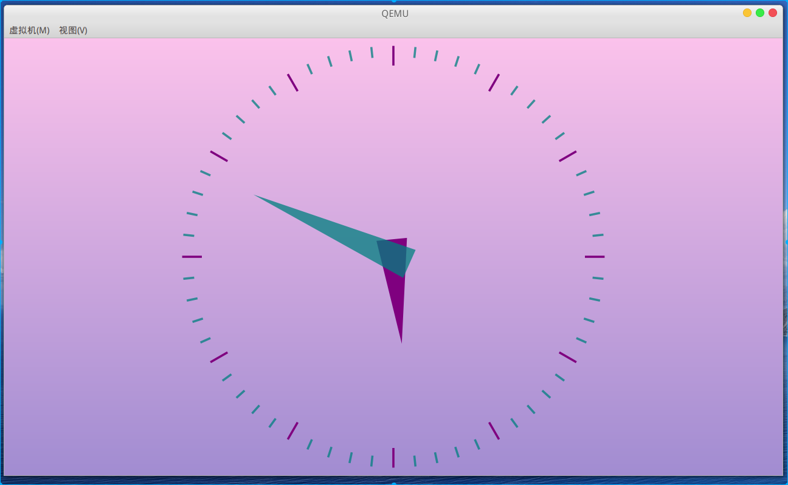

# 基于qemu-riscv从0开始构建嵌入式linux系统ch23. linux FB应用——Qt库移植

### Qt

应该是做嵌入式开发和做linux应用开发的朋友都很熟悉的东西，[Qt](https://www.qt.io/)是一套C++的开发库，主要被应用与GUI开发中，既然我们之前已经成功启用了qemu虚拟的显示设备驱动，那么肯定要尝试移植Qt过来看看效果了。

#### 关于linux图形协议栈

其实本节秒送基于linux FB是不严谨的，目前的Qt均已使用/dev/dri/card*的设备了，只不过这种直接操作裸设备的不使用GPU以及其上的用户图形协议栈的方式和传统的FB驱动差异不大，因此本节标题就这么描述了。关于图形协议栈给大家推荐bootlin上的一个基础课程[《Understanding the Linux graphics stack》](https://bootlin.com/doc/training/graphics/)。


#### 下载源码

这里建议使用[qt5.12.12](http://mirrors.sohu.com/qt-all/archive/qt/5.12/5.12.12/single/qt-everywhere-src-5.12.12.tar.xz)版本，[qt5.15.2](https://download.qt.io/official_releases/qt/5.15/5.15.2/single/)，本人测试在qt5.15.2版本中无opengl环境下编译存在问题，[Qt bugreports](https://bugreports.qt.io/browse/QTBUG-88017)上已经有描述该问题了。（2023.06更新:最新qt5.15.10版本已经没有问题了，而且解决了笔者在qt5.12版本遇到的加载qt插件错误的json解析问题，建议更新到qt5.15.10）。

关于嵌入式linux环境Qt的移植建议阅读这篇官网文档：https://doc.qt.io/archives/qt-5.13/embedded-linux.html。

#### Qt编译

添加编译配置文件qt-everywhere-src-5.12.12/qtbase/mkspecs/linux-riscv64-gnu-g++/qmake.conf，内容如下：

```
#
# qmake configuration for building with riscv64-unknown-linux-gnu-g++
#

MAKEFILE_GENERATOR      = UNIX
CONFIG                 += incremental
QMAKE_INCREMENTAL_STYLE = sublib

include(../common/linux.conf)
include(../common/gcc-base-unix.conf)
include(../common/g++-unix.conf)

# modifications to g++.conf
QMAKE_CC                = riscv64-unknown-linux-gnu-gcc
QMAKE_CXX               = riscv64-unknown-linux-gnu-g++
QMAKE_LINK              = riscv64-unknown-linux-gnu-g++ 
QMAKE_LINK_SHLIB        = riscv64-unknown-linux-gnu-g++
QMAKE_LIBS              = -latomic

# modifications to linux.conf
QMAKE_AR                = riscv64-unknown-linux-gnu-ar cqs
QMAKE_OBJCOPY           = riscv64-unknown-linux-gnu-objcopy
QMAKE_NM                = riscv64-unknown-linux-gnu-nm -P
QMAKE_STRIP             = riscv64-unknown-linux-gnu-strip
load(qt_config)
```

添加编译配置文件qt-everywhere-src-5.12.12/qtbase/mkspecs/linux-riscv64-gnu-g++/qplatformdefs.h，内容如下：

```c
/****************************************************************************
**
** Copyright (C) 2017 The Qt Company Ltd.
** Contact: https://www.qt.io/licensing/
**
** This file is part of the qmake spec of the Qt Toolkit.
**
** $QT_BEGIN_LICENSE:LGPL$
** Commercial License Usage
** Licensees holding valid commercial Qt licenses may use this file in
** accordance with the commercial license agreement provided with the
** Software or, alternatively, in accordance with the terms contained in
** a written agreement between you and The Qt Company. For licensing terms
** and conditions see https://www.qt.io/terms-conditions. For further
** information use the contact form at https://www.qt.io/contact-us.
**
** GNU Lesser General Public License Usage
** Alternatively, this file may be used under the terms of the GNU Lesser
** General Public License version 3 as published by the Free Software
** Foundation and appearing in the file LICENSE.LGPL3 included in the
** packaging of this file. Please review the following information to
** ensure the GNU Lesser General Public License version 3 requirements
** will be met: https://www.gnu.org/licenses/lgpl-3.0.html.
**
** GNU General Public License Usage
** Alternatively, this file may be used under the terms of the GNU
** General Public License version 2.0 or (at your option) the GNU General
** Public license version 3 or any later version approved by the KDE Free
** Qt Foundation. The licenses are as published by the Free Software
** Foundation and appearing in the file LICENSE.GPL2 and LICENSE.GPL3
** included in the packaging of this file. Please review the following
** information to ensure the GNU General Public License requirements will
** be met: https://www.gnu.org/licenses/gpl-2.0.html and
** https://www.gnu.org/licenses/gpl-3.0.html.
**
** $QT_END_LICENSE$
**
****************************************************************************/

#include "../linux-g++/qplatformdefs.h"
```

修改源码中一个缺失的头文件包含，位于qt-everywhere-src-5.12.12/qtdeclarative/src/qmldebug/qqmlprofilerevent_p.h:52行，添加如下内容：

```c
#include <limits>
```

执行以下命令进行编译

```shell
# 编译qt
export PATH=$PATH:$CROSS_COMPILE_DIR/bin
./configure \
    -opensource \
    -confirm-license \
    -release \
    -optimize-size \
    -strip \
    -ltcg \
    -silent \
    -qpa linuxfb \
    -no-opengl \
    -skip webengine \
    -nomake tools \
    -nomake tests \
    -nomake examples \
    -xplatform linux-riscv64-gnu-g++ \
    -prefix /opt/Qt-5.12.12 \
    -extprefix $SHELL_FOLDER/host_output
make -j16
make install
```

#### Qt配置

建议Qt库部署到/opt/下，Qt应用运行时需要一些环境变量以加载qt插件。以下是一个示例配置，qt插件的使用应以满足需求即可，太多的插件消耗大量系统内存。

```shell
#export QT_DEBUG_PLUGINS=1                                  # 调试加载LOG
export QT_HOME=/opt/Qt-5.12.12                              # Qt库路径
export QT_QPA_FB_DRM=1                                      # 启用FB_DRM
export QT_QPA_GENERIC_PLUGINS=evdevkeyboard                 # 启用键盘插件
export QT_QPA_GENERIC_PLUGINS=evdevmouse                    # 启用鼠标插件
export QT_QPA_EVDEV_MOUSE_PARAMETERS=/dev/input/event0      # 鼠标设备
export QT_QPA_EVDEV_KEYBOARD_PARAMETERS=/dev/input/event1   # 键盘设备
export QT_QPA_FONTDIR=$QT_HOME/lib/fonts                    # 字体路径
export QT_PLUGIN_PATH=$QT_HOME/plugins                      # 插件路径
export QT_QPA_PLATFORM=linuxfb:fb=/dev/fb0                  # fb设备
export LD_LIBRARY_PATH="$LD_LIBRARY_PATH:$QT_HOME/lib"      # 库路径
```

如果Qt程序执行不正常，可以配置export QT_DEBUG_PLUGINS=1查看插件加载调试信息。

### 测试用例

#### analogclock

在qt_example目录下有一个时钟了例子，我们拷贝rasterwindow和analogclock目录，编写一个编译脚本，使用qemu工具生成makefile后生成可执行程序拷贝到目标机中。

```shell
SHELL_FOLDER=$(cd "$(dirname "$0")";pwd)
PROCESSORS=`cat /proc/cpuinfo |grep "processor"|wc -l`
CROSS_COMPILE_DIR=/opt/gcc-riscv64-unknown-linux-gnu
CROSS_PREFIX=$CROSS_COMPILE_DIR/bin/riscv64-unknown-linux-gnu
CROSS_QT_TOOLS_DIR=$SHELL_FOLDER/../../target_root_app/host_output
export PATH=$PATH:$CROSS_COMPILE_DIR/bin

cd $SHELL_FOLDER/analogclock
$CROSS_QT_TOOLS_DIR/bin/qmake -makefile
make -j$PROCESSORS
```

编写执行脚本

```
export QT_HOME=/opt/Qt-5.12.12
export QT_QPA_FB_DRM=1
export QT_PLUGIN_PATH=$QT_HOME/plugins
./analogclock
```



#### gamebox

gamebox是什么？这正是今年年初我移植了nes、md的游戏模拟器到qt框架下的一个项目，为的就是快速的部署到跨平台设备上，刚好这次我们就用这个项目的代码直接编译来运行在现在的系统里看看效果如何。项目代码开源地址：https://github.com/QQxiaoming/game_box。

由于我们的gamebox需要鼠标和键盘支持，因此在内核增加CONFIG_INPUT_EVDEV选项以方便qt应用使用/dev/input/event*设备来获取鼠标和键盘输入事件。并添加如下virtio设备。

```
-device virtio-mouse-device,id=input0 
-device virtio-keyboard-device,id=input1 
```

直接qmake生成makefile很顺利就完成了编译。运行效果如下:


> 本教程的<br>github仓库：https://github.com/QQxiaoming/quard_star_tutorial<br>gitee仓库：https://gitee.com/QQxiaoming/quard_star_tutorial<br>本节所在tag：ch23