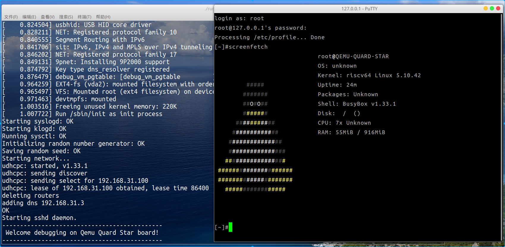

# 基于qemu-riscv从0开始构建嵌入式linux系统ch25. sshd服务配置

### openssh

很多在网络环境使用的嵌入式开发板后期产品开发稳定后一般都不会在使用串口登录终端，而是使用ssh连接，这就需要系统启动时添加启动sshd服务，在嵌入式linux上使用较多的就是openssh，提供了sshc和sshd的工具。交叉编译方式如下：

#### zlib编译

[zlib](https://zlib.net/)库被很多工具依赖，交叉编译如下，完成后根据需求拷贝输出到目标系统内。

```shell
export CC=$CROSS_PREFIX-gcc 
./configure --prefix=$SHELL_FOLDER/output
make -j16
make install
```

#### openssh编译

[openssh](https://www.openssh.com/)工具提供了ssh客户端和服务端的功能，对于嵌入式开发非常有用，便于远程调试开发。交叉编译配置如下：

```shell
./configure --host=riscv64-linux-gnu --with-openssl=$SHELL_FOLDER/output --with-zlib=$SHELL_FOLDER/output CXX=$CROSS_PREFIX-g++ CC=$CROSS_PREFIX-gcc 
make -j16
```

进入目标系统机/etc/passwd文件内添加一行

```
sshd:x:74:74:Privilege-separated SSH:/var/empty/sshd:/sbin/nologin
```

挂载openssh目录。执行以下命令（安装需要strip，需要交叉编译生成目标机的本地gcc工具链，其比较麻烦，我之前手动改脚本编译出了一个，如果你没有strip可以在编译配置时传入--disable-strip省去这个步骤）：

```shell
make install
```

### openssh配置

openssh的配置网上博客很多，这篇就不错，建议参考 https://www.cnblogs.com/schips/p/12309228.html 完成配置。当然很多路径要根据实际情况来配置，我这里给出我最终的配置。

- /usr/local/etc/sshd_config

```
#	$OpenBSD: sshd_config,v 1.103 2018/04/09 20:41:22 tj Exp $

# This is the sshd server system-wide configuration file.  See
# sshd_config(5) for more information.

# This sshd was compiled with PATH=/usr/bin:/bin:/usr/sbin:/sbin

# The strategy used for options in the default sshd_config shipped with
# OpenSSH is to specify options with their default value where
# possible, but leave them commented.  Uncommented options override the
# default value.

#Port 22
#AddressFamily any
#ListenAddress 0.0.0.0
#ListenAddress ::

HostKey /usr/local/etc/ssh_host_rsa_key
HostKey /usr/local/etc/ssh_host_ecdsa_key
HostKey /usr/local/etc/ssh_host_ed25519_key

# Ciphers and keying
#RekeyLimit default none

# Logging
#SyslogFacility AUTH
#LogLevel INFO

# Authentication:

#LoginGraceTime 2m
#PermitRootLogin prohibit-password
PermitRootLogin yes
#StrictModes yes
#MaxAuthTries 6
#MaxSessions 10

#PubkeyAuthentication yes

# The default is to check both .ssh/authorized_keys and .ssh/authorized_keys2
# but this is overridden so installations will only check .ssh/authorized_keys
AuthorizedKeysFile	.ssh/authorized_keys

#AuthorizedPrincipalsFile none

#AuthorizedKeysCommand none
#AuthorizedKeysCommandUser nobody

# For this to work you will also need host keys in /home/qqm/Downloads/quard_star_tutorial/target_root_app/output/etc/ssh_known_hosts
#HostbasedAuthentication no
# Change to yes if you don't trust ~/.ssh/known_hosts for
# HostbasedAuthentication
#IgnoreUserKnownHosts no
# Don't read the user's ~/.rhosts and ~/.shosts files
#IgnoreRhosts yes

# To disable tunneled clear text passwords, change to no here!
#PasswordAuthentication yes
#PermitEmptyPasswords no

# Change to no to disable s/key passwords
#ChallengeResponseAuthentication yes

# Kerberos options
#KerberosAuthentication no
#KerberosOrLocalPasswd yes
#KerberosTicketCleanup yes
#KerberosGetAFSToken no

# GSSAPI options
#GSSAPIAuthentication no
#GSSAPICleanupCredentials yes

# Set this to 'yes' to enable PAM authentication, account processing,
# and session processing. If this is enabled, PAM authentication will
# be allowed through the ChallengeResponseAuthentication and
# PasswordAuthentication.  Depending on your PAM configuration,
# PAM authentication via ChallengeResponseAuthentication may bypass
# the setting of "PermitRootLogin without-password".
# If you just want the PAM account and session checks to run without
# PAM authentication, then enable this but set PasswordAuthentication
# and ChallengeResponseAuthentication to 'no'.
#UsePAM no

#AllowAgentForwarding yes
#AllowTcpForwarding yes
#GatewayPorts no
#X11Forwarding no
#X11DisplayOffset 10
#X11UseLocalhost yes
#PermitTTY yes
#PrintMotd yes
#PrintLastLog yes
#TCPKeepAlive yes
#PermitUserEnvironment no
#Compression delayed
#ClientAliveInterval 0
#ClientAliveCountMax 3
UseDNS no
#PidFile /var/run/sshd.pid
#MaxStartups 10:30:100
#PermitTunnel no
#ChrootDirectory none
#VersionAddendum none

# no default banner path
#Banner none

# override default of no subsystems
Subsystem	sftp	/usr/local/libexec/sftp-server

# Example of overriding settings on a per-user basis
#Match User anoncvs
#	X11Forwarding no
#	AllowTcpForwarding no
#	PermitTTY no
#	ForceCommand cvs server
```

- /etc/init.d/S90sshd.sh

```shell
#! /bin/bash
sshd=/usr/local/sbin/sshd
test -x "$sshd" || exit 0
case "$1" in
  start)
    echo -n "Starting sshd daemon"
    start-stop-daemon --start --quiet --exec $sshd  -b
    echo "."
    ;;
  stop)
    echo -n "Stopping sshd"
    start-stop-daemon --stop --quiet --exec $sshd
    echo "."
    ;;
  restart)
    echo -n "Stopping sshd"
    start-stop-daemon --stop --quiet --exec $sshd
    echo "."
    echo -n "Waiting for sshd to die off"
    for i in 1 2 3 ;
    do
        sleep 1
        echo -n "."
    done
    echo ""
    echo -n "Starting sshd daemon"
    start-stop-daemon --start --quiet --exec $sshd -b
    echo "."
    ;;
  *)
    echo "Usage: /etc/init.d/S90sshd.sh {start|stop|restart}"
    exit 1
esac
exit 0
```

ok，现在启动qemu就可以看到如下log。

```
Starting sshd daemon.
```

此时使用主机的putty或者ssh连接到localhost:3522即可（这是qemu的启动参数指定的端口转发目标机的22端口到主机3522端口）。另外sshd
还提供sftp的子服务，可以进行文件的交互。



> 本教程的<br>github仓库：https://github.com/QQxiaoming/quard_star_tutorial<br>gitee仓库：https://gitee.com/QQxiaoming/quard_star_tutorial<br>本节所在tag：ch25