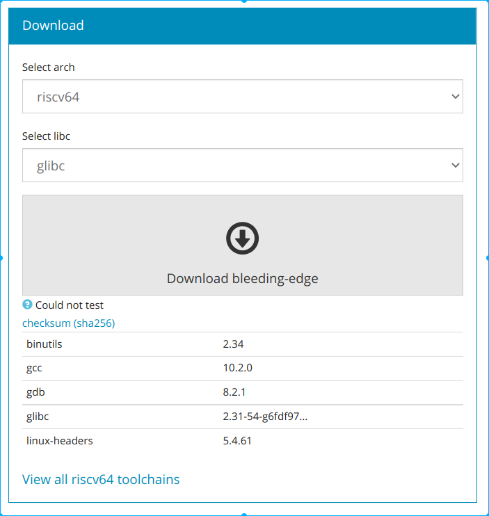
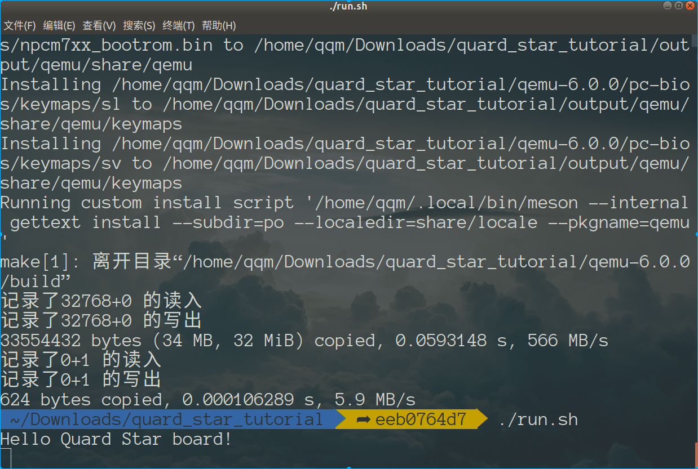

# 基于qemu-riscv从0开始构建嵌入式linux系统ch4. 制作测试固件验证串口打印

### 安装交叉编译器

为了测试串口的使用，我们首先需要安装目标平台的交叉编译工具链，才能开始编写代码并生成固件仿真运行。交叉编译器我建议先使用bootlin上提供的riscv交叉编译工具链，链接如下：https://toolchains.bootlin.com/。下载如下版本的编译器：



将其解压安装在你的任意目录，不过你可以像我一样，把他安装在/opt路径下，这样编译器的前缀为

```shell
CROSS_PREFIX=/opt/riscv64--glibc--bleeding-edge-2020.08-1/bin/riscv64-linux-
```

### 编写测试lowlevelboot代码

新建lowlevelboot目录，创建汇编文件startup.s和boot.lds文件。

- startup.s就是位于flash中的启动的第一条代码，记得上一节我们在qemu中设置的maskrom中的代码会将程序引导到pflash的零地址也就是物理地址0x20000000地址处，我们的lowlevelboot程序自然从这里开始进行。代码如下（我会给出详细注释）：

```assembly
	.section .text             //定义数据段名为.text
	.globl _start              //定义全局符号_start
	.type _start,@function     //_start为函数

_start:                        //函数入口
    csrr    a0, mhartid        //csr是riscv专有的内核私有寄存器，独立编地在12位地址
                               //mhartid寄存是定义了内核的hart id，这里读取到a0寄存器里
    li		t0,	0x0            //li是伪指令，加载立即数0到t0
	beq		a0, t0, _core0     //比较a0和t0,相等则跳转到_core0地址处，否则向下执行
_loop:                         //定义一个_loop符号
	j		_loop              //跳转到_loop，此处形成循环，用意为如果当前cpu core不为
                               //hart 0则循环等待，为hart 0则继续向下执行
_core0:                        //定义一个core0才能执行到此处
	li		t0,	0x100          //t0 = 0x100
	slli	t0,	t0, 20         //t0左移20位 t0 = 0x10000000
	li		t1,	'H'            //t1 = 'H' 字符的ASCII码值写入t1
	sb		t1, 0(t0)          //s是store写入的意思，b是byte，这里指的是写入t1
                               //的值到t0指向的地址，即为写入0x10000000这个寄存器
                               //这个寄存器正是uart0的发送data寄存器，此时串口会输出"H"
	li		t1,	'e'            //接下来都是重复内容
	sb		t1, 0(t0)
	li		t1,	'l'
	sb		t1, 0(t0)
	li		t1,	'l'
	sb		t1, 0(t0)
	li		t1,	'o'
	sb		t1, 0(t0)
	li		t1,	' '
	sb		t1, 0(t0)
	li		t1,	'Q'
	sb		t1, 0(t0)
	li		t1,	'u'
	sb		t1, 0(t0)
	li		t1,	'a'
	sb		t1, 0(t0)
	li		t1,	'r'
	sb		t1, 0(t0)
	li		t1,	'd'
	sb		t1, 0(t0)
	li		t1,	' '
	sb		t1, 0(t0)
	li		t1,	'S'
	sb		t1, 0(t0)
	li		t1,	't'
	sb		t1, 0(t0)
	li		t1,	'a'
	sb		t1, 0(t0)
	li		t1,	'r'
	sb		t1, 0(t0)
	li		t1,	' '
	sb		t1, 0(t0)
	li		t1,	'b'
	sb		t1, 0(t0)
	li		t1,	'o'
	sb		t1, 0(t0)
	li		t1,	'a'
	sb		t1, 0(t0)
	li		t1,	'r'
	sb		t1, 0(t0)
	li		t1,	'd'
	sb		t1, 0(t0)
	li		t1,	'!'
	sb		t1, 0(t0)
	li		t1,	'\n'
	sb		t1, 0(t0)          //到这里就会输出"Hello Quard Star board!"  
	j		_loop              //完成后进入loop

    .end                       //汇编文件结束符号
```

- boot.lds文件为链接脚本，用来告诉编译我们的代码需要放在什么地址上加载和运行，内容如下(同样给出详细注释)：

```
OUTPUT_ARCH( "riscv" )  /*输出可执行文件平台*/

ENTRY( _start )         /*程序入口函数*/

MEMORY                  /*定义内存域*/
{ 
    /*定义名为flash的内存域属性以及起始地址，大小等*/
	flash (rxai!w) : ORIGIN = 0x20000000, LENGTH = 512k 
}

SECTIONS                /*定义段域*/
{
  .text :               /*.text段域*/
  {
    KEEP(*(.text))      /*将所有.text段链接在此域内，keep是保持防止优化，即无论如何都保留此段*/
  } >flash              /*段域的地址(LMA和VMA相同)位于名为flash内存域*/
}
```

### 编译运行lowlevelboot代码

- 编译代码，我们想build.sh中加入编译命令

```shell
CROSS_PREFIX=/opt/riscv64--glibc--bleeding-edge-2020.08-1/bin/riscv64-linux
if [ ! -d "$SHELL_FOLDER/output/lowlevelboot" ]; then  
mkdir $SHELL_FOLDER/output/lowlevelboot
fi  
cd lowlevelboot
# 编译汇编文件startup.s到obj文件
$CROSS_PREFIX-gcc -x assembler-with-cpp -c startup.s -o $SHELL_FOLDER/output/lowlevelboot/startup.o
# 使用链接脚本链接obj文件生成elf可执行文件
$CROSS_PREFIX-gcc -nostartfiles -T./boot.lds -Wl,-Map=$SHELL_FOLDER/output/lowlevelboot/lowlevel_fw.map -Wl,--gc-sections $SHELL_FOLDER/output/lowlevelboot/startup.o -o $SHELL_FOLDER/output/lowlevelboot/lowlevel_fw.elf
# 使用gnu工具生成原始的程序bin文件
$CROSS_PREFIX-objcopy -O binary -S $SHELL_FOLDER/output/lowlevelboot/lowlevel_fw.elf $SHELL_FOLDER/output/lowlevelboot/lowlevel_fw.bin
# 使用gnu工具生成反汇编文件，方便调试分析（当然我们这个代码太简单，不是很需要）
$CROSS_PREFIX-objdump --source --demangle --disassemble --reloc --wide $SHELL_FOLDER/output/lowlevelboot/lowlevel_fw.elf > $SHELL_FOLDER/output/lowlevelboot/lowlevel_fw.lst
```

- 制作固件，我们的pflash为32M，因此flash固件比较为32M，我们生成一个32文件，空余位置暂时先填充0，这样就得到了fw.bin固件

```shell
cd $SHELL_FOLDER/output/lowlevelboot
rm -rf fw.bin
dd of=fw.bin bs=1k count=32k if=/dev/zero
dd of=fw.bin bs=1k conv=notrunc seek=0 if=lowlevel_fw.bin
```

- 加载固件运行qemu仿真，只有向之前run.sh脚本添加-drive if=pflash的参数就可以将固件配置到模拟器的固件加载位置，根据之前qemu内的路径就可以加载执行固件内的代码。

```shell
$SHELL_FOLDER/output/qemu/bin/qemu-system-riscv64 \
-M quard-star \
-m 1G \
-smp 8 \
-drive if=pflash,bus=0,unit=0,format=raw,file=$SHELL_FOLDER/output/lowlevelboot/fw.bin \
-nographic --parallel none
```



如果你看到了上面的打印输出，那么恭喜你，你之前的qemu添加的外设工作正确，且本节中的固件也都一切正常，到这里本篇顺利完成。这一节主要进行了固件代码demo编写。下一篇就要开始制作一个加载固件将程序的第一级loader程序加载到ddr内执行，但在此之前我们需要熟悉IC Boot设计中常见的流程，了解BL0，BL1，BL2等等，以及RISCV提出的OPENSBI规范。

> 本教程的<br>github仓库：https://github.com/QQxiaoming/quard_star_tutorial<br>gitee仓库：https://gitee.com/QQxiaoming/quard_star_tutorial<br>本节所在tag：ch4