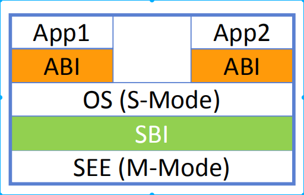
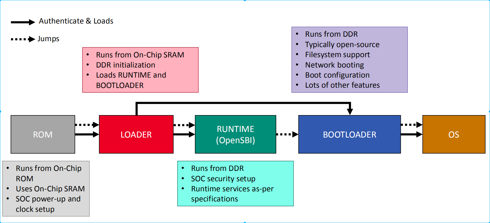

# 基于qemu-riscv从0开始构建嵌入式linux系统ch5-1. 什么是多级BootLoader与opensbi(上)

### 多级BootLoader

随着嵌入式的发展，如今的嵌入式IC也基本上转向了SOC的方式，因而其IC内部不仅仅是一颗cpu核，可能包含各种各样的其他IP，因而相关的上层软件也需要针对性的划分不同的功能域，操作域，安全域等上层应用。为了能支持复杂而碎片化的应用需求，SOC的Boot阶段延伸出了数级的BootLoader，为行文简单，我们把第一级BootLoader称作BL0，下一级则为BL1、BL2……等。

### opensbi

我们使用的RISCV架构进行的此次开发学习，那么RISCV为了能统一设计思路，提出了标准的SBI规范，SBI即为 （RISC-V Supervisor Binary Interface），SBI作为直接运行在系统M模式（机器模式）下的程序，向上层OS提供了统一的系统调用环境，SBI程序拥有最高的权限，可以访问所有的硬件资源，同时其控制PMP等硬件级的权限管理单元，将系统划分为多个域(domain)以供上层不同的安全等级的多操作系统使用并不会造成数据侵入破坏。如下图所示，SBI位于S模式和M模式之间。

[图片引用自：《OpenSBI Deep Dive.pdf》](https://archive.fosdem.org/2019/schedule/event/riscvsbi/attachments/slides/3058/export/events/attachments/riscvsbi/slides/3058/FOSDEM_RISCV_SBI_Atish.pdf)

而RISCV官方在给出SBI标准规范的同时，也开发了一套开源代码opensbi，代码仓库位于github上。我们这里也就不需要自己编写符合SBI规范的固件代码，只需要移植opensbi即可，截止笔者撰文最新的版本为V0.9版本，那么我们就将这个版本代码加入我们的开发环境，并添加相关的paltform。

### 目标启动流程设计

看到这里我们先不急编写代码，我们先要设计我们的多级BL结构，其实在RISCV的文档中有一张图给出了以及常见的多级BL结构，如下：

[图片引用自：《OpenSBI Deep Dive.pdf》](https://archive.fosdem.org/2019/schedule/event/riscvsbi/attachments/slides/3058/export/events/attachments/riscvsbi/slides/3058/FOSDEM_RISCV_SBI_Atish.pdf)

正如上图所示，opensbi提供上层系统运行时的系统调用，而当前版本opensbi开发者倾向于不要让ic设计尚加入太多的板级支持代码，因此opensbi本身也需要加载一份设备树文件，opensbi通过解析设备树文件了解soc内部的硬件结构，进而使用标准的驱动代码对其进行配置使用，可以看到opensbi如此设计是不想走向arm嵌入式的老路，毕竟现在的soc内部资源充足了，规范规则可以提供良好的维护性。

如果你还不了解设备树文件是如何编写生成的，这个我们将在后面为大家介绍，毕竟后面的u-boot、kernel都要使用设备树文件来配置驱动。

那么我们最终可以确定我们的系统从之前的maskrom(BL0)启动，然后跳转到位于pflash的首地址执行lowlevelboot(BL1)程序，BL1进行内存ddr初始化，然后将pflash上的opensbi(BL2)程序和所需的设备树资源文件加载到ddr上并跳转执行。清楚了流程就确定了现在下一步的目标是重新编写lowlevelboot程序和移植opensbi。

到这里本篇上半部分讲述完成。本节内容较少，主要以理论为主，希望能将系统boot流程分解清楚，磨刀不误砍柴工嘛，然后下一节我们开始实际操作编写相关的BL代码，其会涉及到规划内存地址，是需要通盘考虑整个BL的流程，因此可见本节内容的重要性。

> 本教程的 github仓库：https://github.com/QQxiaoming/quard_star_tutorial gitee仓库：https://gitee.com/QQxiaoming/quard_star_tutorial 本节所在tag：ch5