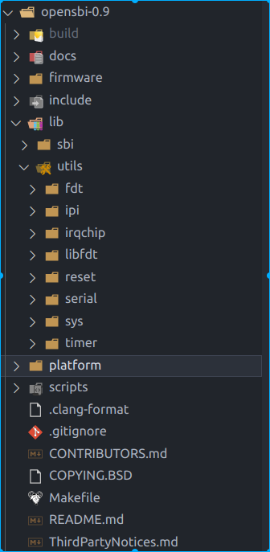
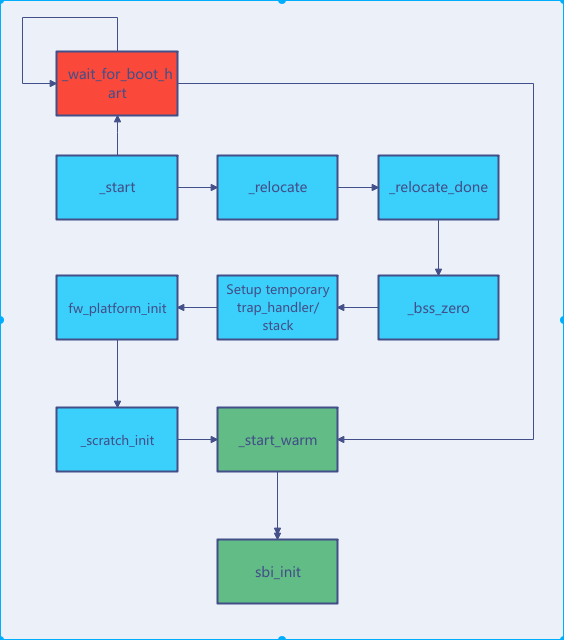

#  基于qemu-riscv从0开始构建嵌入式linux系统ch5-2. 什么是多级BootLoader与opensbi(下)

### opensbi源码结构

目前opensbi的源码结构是比较简单清晰的，除了sbi目录内是核心文件，utils主要是用于设备树解析libfdt以及其他的驱动文件，当然这里的驱动都是使用设备树（设备树是从linux内核中广泛使用的一种设备描述文件，可以简化驱动代码的编写并提高驱动代码的复用率移植性，因此逐渐扩展到各个嵌入式平台级代码项目中，本节先不讲解设备树文件本身，下一节将对其进行讲解）的方式的驱动。剩下的就是platform目录，用来定义属于板卡特有的代码。



我们来大概梳理一下opensbi的代码流程：

首先opensbi生成的固件有三类，我们在这里只使用fw_jump，因此这里仅分析该流程。

- opensbi-0.9/firmware/fw_base.ldS定义了fw_jump固件的链接脚本，当然此链接脚本是要经过c预处理宏展开后而使用的，但是不影响我们阅读。FW_TEXT_START定义了固件运行的的起始地址，然后依次放置text段，ro段，data段，bss段，bss段后将被用作栈空间，这个链接脚本非常简单，几乎熟悉嵌入式裸机开发的朋友都能理解，这里不在赘述，注意就是data没有LMA，也就是说opensbi要运行在ddr内而不能在flash内xip运行，当然你自己修改链接脚本自然可以做到。
- opensbi-0.9/firmware/fw_base.S汇编文件正是opensbi的启动所在，.entry段\_start符号即为链接脚本中第一个代码段，上级loader程序加载完成后自然跳转到该地址指令执行。首先启动代码进行判断非boot核心跳转\_wait_for_boot_hart等待，boot核心先进行一次代码\_relocate，可以发现如果opensbi如果不在自己的链接地址内运行，则会实现自身代码的拷贝到目标ram上运行，因此可以以类似spl的方式从flash中启动。当然我们因为已经使用了自己编写的loader程序，这段\_relocate不会执行，之后的流程是.bss段的清零和SP指针的初始化。接下来就是调用fw_platform_init函数，注意此时传入参数a0——hart id，a1——fdt地址，a2，a3，a4均为上级loader程序的传入参数，这个函数由platform来实现如果不使用则该函数由弱定义空函数来代替，platform函数具体内容我们后面实现时再来看，此处暂时跳过。接下来就是_scratch_init函数，scratch你可以认为就是另一个sp指针的东西，定义了一片内存用来存放一些数据，同栈一样，先进后出。_scratch_init其实是按顺序写入了sbi下一级程序的地址参数等信息，由工程内的预定于宏指定，其实这里对我们作用不大，因为我们使用设备树文件提供给opensbi来解析得到下一级启动地址等信息。在向下就是\_fdt_reloc，和代码reloc类似，对fdt进行，我们的设计不会执行到这个，最后来到了\_start_warm，此时boot核心将标志释放，其余等待在\_wait_for_boot_hart的核心也将要跳转到\_start_warm。\_start_warm针对每一个核心复位寄存器建立自己的栈空间，配置trap异常等完成后调用sbi_init离开汇编代码的世界，后面代码将使用容易理解的c代码进行编写了。到此启动文件也就分析完成，先给出一个简单的流程图。

	

- opensbi-0.9/lib/sbi/sbi_init.c是sbi核心代码的开始，sbi_init函数主要分为冷启动和热启动，无论那种，主要功能均为对设备树进行解析，初始化相关硬件设备，比较重要的如irq，tlb，ipi，ecall，domain，PMP，timer，console，总之建立系统调用，配置硬件权限，定义系统mmio以及内存区域的划分domain，就是sbi要做的事情，完成后，所有domain从其boot核心启动到下级程序sbi的任务就完成了。本文就不在这里具体展开说明了，如果你对其中某些部分很感兴趣可以自行了解（当然因为我们打算使用domain的功能，因此后文中会有一节单独的博客章节来讲述domain）。而我们要做的就是去编写我们使用的硬件需要的设备树fdt文件，以及编写domain节点相关描述，这样sbi初始化就可以直接帮我们完成这些硬件操作，当然，如果你使用的设备没有相关驱动，你可能就需要仿照现有的sbi驱动去编写代码完成设备树解析配置。

### platform添加

sbi使用设备树大大减少了platform部分代码的开发，更多的是留给这片代码一些hook函数以方便不同的板级特殊的配置代码插入在sbi的init的流程中，如下可以很清晰的看到我们需要配置相关数据结构，以及hook函数集。可以看到由于我们使用的硬件ip的驱动都已经加入到sbi源码中，因此大部分函数均使用fdt解析设备树即可完成，那么我们就不需要编写独立的配置代码了。

```c

const struct sbi_platform_operations platform_ops = {
	.early_init		= quard_star_early_init,
	.final_init		= quard_star_final_init,
	.early_exit		= quard_star_early_exit,
	.final_exit		= quard_star_final_exit,
	.domains_init		= quard_star_domains_init,
	.console_putc		= fdt_serial_putc,
	.console_getc		= fdt_serial_getc,
	.console_init		= fdt_serial_init,
	.irqchip_init		= fdt_irqchip_init,
	.irqchip_exit		= fdt_irqchip_exit,
	.ipi_send		= fdt_ipi_send,
	.ipi_clear		= fdt_ipi_clear,
	.ipi_init		= fdt_ipi_init,
	.ipi_exit		= fdt_ipi_exit,
	.get_tlbr_flush_limit	= quard_star_tlbr_flush_limit,
	.timer_value		= fdt_timer_value,
	.timer_event_stop	= fdt_timer_event_stop,
	.timer_event_start	= fdt_timer_event_start,
	.timer_init		= fdt_timer_init,
	.timer_exit		= fdt_timer_exit,
	.system_reset_check	= quard_star_system_reset_check,
	.system_reset		= quard_star_system_reset,
};

struct sbi_platform platform = {
	.opensbi_version	= OPENSBI_VERSION,
	.platform_version	= SBI_PLATFORM_VERSION(0x0, 0x01),
	.name			= "Quard-Star",
	.features		= SBI_PLATFORM_DEFAULT_FEATURES,
	.hart_count		= SBI_HARTMASK_MAX_BITS,
	.hart_index2id		= quard_star_hart_index2id,
	.hart_stack_size	= SBI_PLATFORM_DEFAULT_HART_STACK_SIZE,
	.platform_ops_addr	= (unsigned long)&platform_ops
};
```

这里我就只强调下如下两个函数，fw_platform_init主要是通过fdt读取一些配置到platform结构中以灵活的通过设备树传入硬件信息，也是为了让platform代码适配vender厂商的一大类的板卡。final_init只是调用了fdt库的一些函数，但是十分重要，他针对平台初始化完成后将设备树做以修订为platform执行完毕后的状态信息，反应的设备真实的配置，是传入fdt与platform代码共同作用后的真正的设备信息。

```c
unsigned long fw_platform_init(unsigned long arg0, unsigned long arg1,
				unsigned long arg2, unsigned long arg3,
				unsigned long arg4)
{
	const char *model;
	void *fdt = (void *)arg1;
	u32 hartid, hart_count = 0;
	int rc, root_offset, cpus_offset, cpu_offset, len;

	root_offset = fdt_path_offset(fdt, "/");
	if (root_offset < 0)
		goto fail;

	model = fdt_getprop(fdt, root_offset, "model", &len);
	if (model)
		sbi_strncpy(platform.name, model, sizeof(platform.name));

	cpus_offset = fdt_path_offset(fdt, "/cpus");
	if (cpus_offset < 0)
		goto fail;

	fdt_for_each_subnode(cpu_offset, fdt, cpus_offset) {
		rc = fdt_parse_hart_id(fdt, cpu_offset, &hartid);
		if (rc)
			continue;

		if (SBI_HARTMASK_MAX_BITS <= hartid)
			continue;

		quard_star_hart_index2id[hart_count++] = hartid;
	}

	platform.hart_count = hart_count;

	/* Return original FDT pointer */
	return arg1;

fail:
	while (1)
		wfi();
}

static int quard_star_final_init(bool cold_boot)
{
	void *fdt;

	if (!cold_boot)
		return 0;

	fdt = sbi_scratch_thishart_arg1_ptr();

	fdt_cpu_fixup(fdt);
	fdt_fixups(fdt);
	fdt_domain_fixup(fdt);

	return 0;
}

```

paltform代码也没什么难点，文件就一个，加入objects.mk中platform-objs-y += platform.o。即可加入编译。config.mk配置我们需要的FW_JUMP和参数FW_TEXT_START为ddr首地址。FW_JUMP_ADDR地址我们不使用，只是编译要求定义填0即可。

```shell
FW_JUMP=y
FW_TEXT_START=0x80000000
FW_JUMP_ADDR=0x0
```

### 固件打包合成

将使用make设置PLATFORM=quard_star即可完成编译，生成的fw_jump.bin使用dd命令加入到我们pflash固件的2K偏移区域，就将固件和lowlevel_fw打包到一起了。

```shell
# 编译opensbi
if [ ! -d "$SHELL_FOLDER/output/opensbi" ]; then  
mkdir $SHELL_FOLDER/output/opensbi
fi  
cd $SHELL_FOLDER/opensbi-0.9
make CROSS_COMPILE=$CROSS_PREFIX- PLATFORM=quard_star
cp -r $SHELL_FOLDER/opensbi-0.9/build/platform/quard_star/firmware/*.bin $SHELL_FOLDER/output/opensbi/

# 合成firmware固件
if [ ! -d "$SHELL_FOLDER/output/fw" ]; then  
mkdir $SHELL_FOLDER/output/fw
fi  
cd $SHELL_FOLDER/output/fw
rm -rf fw.bin
dd of=fw.bin bs=1k count=32k if=/dev/zero
dd of=fw.bin bs=1k conv=notrunc seek=0 if=$SHELL_FOLDER/output/lowlevelboot/lowlevel_fw.bin
dd of=fw.bin bs=1k conv=notrunc seek=2K if=$SHELL_FOLDER/output/opensbi/fw_jump.bin
```

到这里本篇下半部分讲述完成。本节内容较以讲解代码为主，最终完成了opensbi的移植工作，打包了固件，但是相应的lowlevel_fw.bin还没修改，且设备树文件dts还没有编写，因此此时直接运行代码将不会进入到opensbi程序，那么下一节我们将带大家学习熟悉设备树文件，编写dts文件并真正进入到opensbi的世界。

> 本教程的<br>github仓库：https://github.com/QQxiaoming/quard_star_tutorial<br>gitee仓库：https://gitee.com/QQxiaoming/quard_star_tutorial<br>本节所在tag：ch5