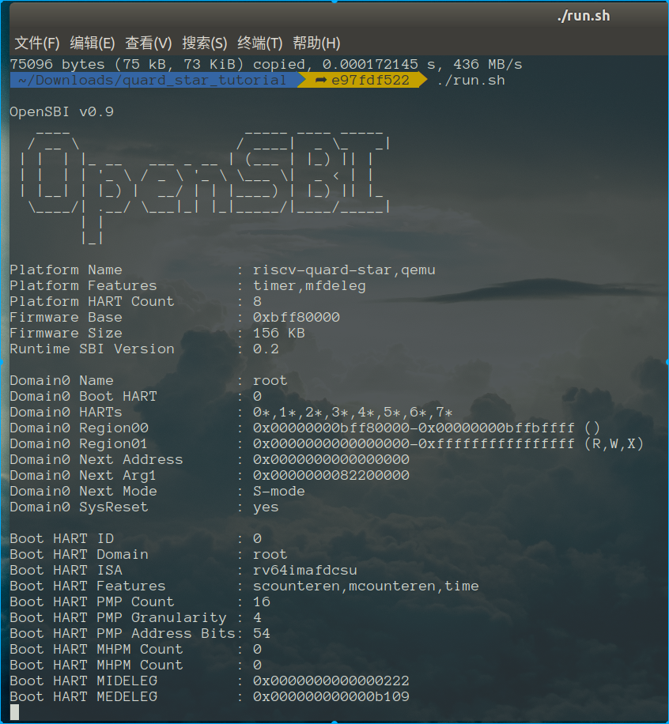

# 基于qemu-riscv从0开始构建嵌入式linux系统ch6. 设备树文件与opensbi加载运行

### 什么是设备树文件

上一篇中我们反复提到了设备树文件，那么究竟设备树文件是什么样的？有什么用？该如何编写使用呢？

扁平设备树(Flattened Device Tree)简称FDT，是源于linux内核powerpc架构下对驱动的抽象分装技术，早年间linux内核中充斥者大量的mach-XXX的驱动代码，这对于当时的内核维护团队来说很是不满，而FDT的引入使得驱动的编写架构清晰，受到的大家的追捧，进而引入到所有的架构中，且近年来逐渐被其他开源项目引入，诸如U-Boot、opensbi等都直接使用fdt作为驱动框架以解耦硬件具体配置。

说了这么多fdt如何使用，其实步骤很容易，首先编写后缀为dts/dtsi的设备树源文件，然后使用dtc工具将其编译为dtb文件，交给内核启动时加载解析即可。设备树源文件dts内容是以节点的形式描述设备内存在的硬件，是对硬件拓扑结构的一种平面描述，其规则非常简单，并且每个节点通常带有compatible属性字符串用来在驱动初始化时枚举设备探测匹配使用，如果驱动和设备树中的节点完成了匹配，则会根据节点信息中的内容初始化驱动，注册到内核中。

### 编写设备树文件

那么我们实战来编写一个用于opensbi的最简单设备树文件，来描述一下我们quard-star板级的内容：

```
/dts-v1/;

/* 定义根节点 */
/ {
	#address-cells = <0x2>;  /* 节点中的reg的地址宽度为64位 */
	#size-cells = <0x2>;     /* 节点中的reg的大小宽度为64位 */
	compatible = "riscv-quard-star"; /* 节点的名称 */
	model = "riscv-quard-star,qemu"; /* 指定设备的制造商和型号 */

    /* 定义chosen子节点，用于传递输入参数 */   
	chosen {
		stdout-path = "/soc/uart0@10000000";  /* 定义系统标准输出stdout使用节点/soc/uart0@10000000 */
	};

    /* 定义memory子节点，用于定义系统主内存 */   
	memory@80000000 {
		device_type = "memory";    /* 设备类型 */
		reg = <0x0 0x80000000 0x0 0x40000000>;  /* 地址和大小定义，注意是64位的 */
	};

    /* 定义cpus子节点，用于定义系统核心信息 */   
	cpus {
		#address-cells = <0x1>; /* 节点中的reg的地址宽度为32位 */
		#size-cells = <0x0>;    /* 节点中的reg没有大小*/
		timebase-frequency = <0x989680>; /*自定义的属性*/

		cpu0: cpu@0 {             /* 定义cpu0子节点 */   
			phandle = <0xf>;      /* 其他具体的属性在驱动代码内针对使用 */
			device_type = "cpu";
			reg = <0x0>;
			status = "okay";      /* status属性用来表示启用该设备 */   
			compatible = "riscv";
			riscv,isa = "rv64imafdcsu";
			mmu-type = "riscv,sv48";

			interrupt-controller { /* 定义中断控制器子节点 */   
				#interrupt-cells = <0x1>;
				interrupt-controller;
				compatible = "riscv,cpu-intc";
				phandle = <0x10>;
			};
		};

		cpu1: cpu@1 {
			phandle = <0xd>;
			device_type = "cpu";
			reg = <0x1>;
			status = "okay";
			compatible = "riscv";
			riscv,isa = "rv64imafdcsu";
			mmu-type = "riscv,sv48";

			interrupt-controller {
				#interrupt-cells = <0x1>;
				interrupt-controller;
				compatible = "riscv,cpu-intc";
				phandle = <0xe>;
			};
		};

		cpu2: cpu@2 {
			phandle = <0xb>;
			device_type = "cpu";
			reg = <0x2>;
			status = "okay";
			compatible = "riscv";
			riscv,isa = "rv64imafdcsu";
			mmu-type = "riscv,sv48";

			interrupt-controller {
				#interrupt-cells = <0x1>;
				interrupt-controller;
				compatible = "riscv,cpu-intc";
				phandle = <0xc>;
			};
		};

		cpu3: cpu@3 {
			phandle = <0x9>;
			device_type = "cpu";
			reg = <0x3>;
			status = "okay";
			compatible = "riscv";
			riscv,isa = "rv64imafdcsu";
			mmu-type = "riscv,sv48";

			interrupt-controller {
				#interrupt-cells = <0x1>;
				interrupt-controller;
				compatible = "riscv,cpu-intc";
				phandle = <0xa>;
			};
		};

		cpu4: cpu@4 {
			phandle = <0x7>;
			device_type = "cpu";
			reg = <0x4>;
			status = "okay";
			compatible = "riscv";
			riscv,isa = "rv64imafdcsu";
			mmu-type = "riscv,sv48";

			interrupt-controller {
				#interrupt-cells = <0x1>;
				interrupt-controller;
				compatible = "riscv,cpu-intc";
				phandle = <0x8>;
			};
		};

		cpu5: cpu@5 {
			phandle = <0x5>;
			device_type = "cpu";
			reg = <0x5>;
			status = "okay";
			compatible = "riscv";
			riscv,isa = "rv64imafdcsu";
			mmu-type = "riscv,sv48";

			interrupt-controller {
				#interrupt-cells = <0x1>;
				interrupt-controller;
				compatible = "riscv,cpu-intc";
				phandle = <0x6>;
			};
		};

		cpu6: cpu@6 {
			phandle = <0x3>;
			device_type = "cpu";
			reg = <0x6>;
			status = "okay";
			compatible = "riscv";
			riscv,isa = "rv64imafdcsu";
			mmu-type = "riscv,sv48";

			interrupt-controller {
				#interrupt-cells = <0x1>;
				interrupt-controller;
				compatible = "riscv,cpu-intc";
				phandle = <0x4>;
			};
		};

		cpu7: cpu@7 {
			phandle = <0x1>;
			device_type = "cpu";
			reg = <0x7>;
			status = "okay";
			compatible = "riscv";
			riscv,isa = "rv64imafdcsu";
			mmu-type = "riscv,sv48";

			interrupt-controller {
				#interrupt-cells = <0x1>;
				interrupt-controller;
				compatible = "riscv,cpu-intc";
				phandle = <0x2>;
			};
		};

		cpu-map {

			cluster0 {

				core0 {
					cpu = <0xf>;
				};

				core1 {
					cpu = <0xd>;
				};

				core2 {
					cpu = <0xb>;
				};

				core3 {
					cpu = <0x9>;
				};

				core4 {
					cpu = <0x7>;
				};

				core5 {
					cpu = <0x5>;
				};

				core6 {
					cpu = <0x3>;
				};

				core7 {
					cpu = <0x1>;
				};
			};
		};
	};

    /* 定义soc子节点，用于定义系统内外设信息 */   
	soc {
		#address-cells = <0x2>; /* 节点中的reg的地址宽度为64位 */
		#size-cells = <0x2>;    /* 节点中的reg的大小宽度为64位 */
		compatible = "simple-bus";
		ranges;                 /* 子节点地址空间和父地址空间的映射计算方式，这里为空是直接映射的 */
 
        /* 之后是我们的uart信息和中断控制器信息，因为我们的soc目前只有这两种外设，因此这里还比较简单，都是用于设备驱动的具体的设备属性，需要结合驱动源码确认属性如何使用 */   
		uart0: uart0@10000000 {
			interrupts = <0xa>;
			interrupt-parent = <0x11>;
			clock-frequency = <0x384000>;
			reg = <0x0 0x10000000 0x0 0x100>;
			compatible = "ns16550a";
		};

		uart1: uart1@10001000 {
			interrupts = <0xa>;
			interrupt-parent = <0x11>;
			clock-frequency = <0x384000>;
			reg = <0x0 0x10001000 0x0 0x100>;
			compatible = "ns16550a";
		};

        uart2: uart2@10002000 {
			interrupts = <0xa>;
			interrupt-parent = <0x11>;
			clock-frequency = <0x384000>;
			reg = <0x0 0x10002000 0x0 0x100>;
			compatible = "ns16550a";
		};

		plic@c000000 {
			phandle = <0x11>;
			riscv,ndev = <0x35>;
			reg = <0x0 0xc000000 0x0 0x210000>;
			interrupts-extended = <0x10 0xb 0x10 0x9 0xe 0xb 0xe 0x9 0xc 0xb 0xc 0x9 0xa 0xb 0xa 0x9 0x8 0xb 0x8 0x9 0x6 0xb 0x6 0x9 0x4 0xb 0x4 0x9 0x2 0xb 0x2 0x9>;
			interrupt-controller;
			compatible = "riscv,plic0";
			#interrupt-cells = <0x1>;
			#address-cells = <0x0>;
		};

		clint@2000000 {
			interrupts-extended = <0x10 0x3 0x10 0x7 0xe 0x3 0xe 0x7 0xc 0x3 0xc 0x7 0xa 0x3 0xa 0x7 0x8 0x3 0x8 0x7 0x6 0x3 0x6 0x7 0x4 0x3 0x4 0x7 0x2 0x3 0x2 0x7>;
			reg = <0x0 0x2000000 0x0 0x10000>;
			compatible = "riscv,clint0";
		};
	};
};
```

我这里对设备树讲解的主要以我们使用的为主，如果对设备树感兴趣的朋友可以阅读其他作者编写的教程，有非常详细的描述，比如这篇：https://doc.embedfire.com/linux/imx6/driver/zh/latest/linux_driver/driver_tree.html

编译设备树，build脚本中加入如下命令，我们就能生成dtb文件。

```shell
# 生成sbi.dtb
cd $SHELL_FOLDER/dts
dtc -I dts -O dtb -o $SHELL_FOLDER/output/opensbi/quard_star_sbi.dtb quard_star_sbi.dts
```

将dtb打包到固件的512K地址区域。

```shell
dd of=fw.bin bs=1k conv=notrunc seek=512 if=$SHELL_FOLDER/output/opensbi/quard_star_sbi.dtb
```

### 重新编写lowlevelboot代码加载运行opensbi

经过上述工作我们的固件终于包含三个内容，首先是起始0x20000000的lowlevel_fw，然后是0x20080000地址处的dtb文件，接下来是0x20200000处的opensbi程序。现在我们就重新修改lowlevel_fw的代码，完成将opensbi加载到ddr地址0x80000000，将dtb加载到ddr地址0x82200000，然后跳转到0x80000000执行。代码很容易编写，如下(直接给出注释，之前的小节已讲过的汇编不再给出注释)：

```assembly


	.macro loop,cunt          /* 定义一个简单loop宏cunt是loop参数 */
    li		t1,	0xffff                    /* 加载立即数到t1 */
    li		t2,	\cunt                   /* 加载立即数到t2 */
1:
	nop                                     /* 空指令nop */
	addi    t1, t1, -1               /* t1-- */
	bne		t1, x0, 1b              /* 判断t1是否等于0，不是就跳转前以符号1处（b是向前的意思） */
    li		t1,	0xffff                     /* 加载立即数到t1 */
	addi    t2, t2, -1                /* t2-- */
	bne		t2, x0, 1b              /* 判断t2是否等于0，不是就跳转前一个符号1处（b是向前的意思） */
	.endm                                /* 宏结束 */

	.macro load_data,_src_start,_dst_start,_dst_end /* 定义一个简单load_data宏（这里我们按word拷贝数据，实际上64位可以按double word来拷贝，效率更高）_src_start为源地址，_dst_start为目标地址，_dst_end为目标结束地址 */
	bgeu	\_dst_start, \_dst_end, 2f   /* 判断目标结束地址大于起始地址，即是否合法 */
1:
	lw      t0, (\_src_start)                          /* 加载源地址内数据到t0 */
	sw      t0, (\_dst_start)                         /* 写入t0到目标地址内 */
	addi    \_src_start, \_src_start, 4    /* 源地址+4 */
	addi    \_dst_start, \_dst_start, 4   /* 目标地址+4 */
	bltu    \_dst_start, \_dst_end, 1b   /* 判断是否已到达结束地址，未到达则循环到上前一个符号1 */
2:
	.endm

	.section .text
	.globl _start
	.type _start,@function

_start:
	//load opensbi_fw.bin 
	//[0x20200000:0x20400000] --> [0x80000000:0x80200000]
    li		a0,	0x202
	slli	a0,	a0, 20      //a0 = 0x20200000
    li		a1,	0x800
	slli	a1,	a1, 20      //a1 = 0x80000000
    li		a2,	0x802
	slli	a2,	a2, 20      //a2 = 0x80200000
	load_data a0,a1,a2    /* 拷贝 0x20200000 到 0x80000000*/

	//load qemu_sbi.dtb
	//[0x20080000:0x20100000] --> [0x82200000:0x82280000]
    li		a0,	0x2008
	slli	a0,	a0, 16       //a0 = 0x20080000
    li		a1,	0x822
	slli	a1,	a1, 20       //a1 = 0x82200000
    li		a2,	0x8228
	slli	a2,	a2, 16       //a2 = 0x82280000
	load_data a0,a1,a2  /* 拷贝 0x20080000 到 0x82200000*/

    csrr    a0, mhartid
    li		t0,	0x0     
	beq		a0, t0, _no_wait /* 非core0 就loop 1000后再启动，让core0作为opensbi的冷启动引导核心*/
	loop	0x1000
_no_wait:
    li		a1,	0x822
	slli	a1,	a1, 20       //a1 = 0x82200000
    li	    t0,	0x800
	slli	t0,	t0, 20       //t0 = 0x80000000
    jr      t0                      /* 此时a0中为core的hart id，a1中设备树dtb的所在的起始地址，t0为opensbi程序所在的ddr地址，jr跳转进入opensbi程序*/

    .end
```

ok，大功告成，让我们执行编译脚本再执行运行脚本看看效果如何：



如果你也得到了上面的输出，那么就说明你opensbi已经基本成功运行了。

到这里本篇内容讲述完成。本节内容学习熟悉设备树文件概念，编写dts文件并真正进入到opensbi的世界，另外也加强了基础汇编代码的掌握，下一节开始我们将针对opensbi中的domain深入了解，为接下来从opensbi进入uboot环境做好准备。

> 本教程的<br>github仓库：https://github.com/QQxiaoming/quard_star_tutorial<br>gitee仓库：https://gitee.com/QQxiaoming/quard_star_tutorial<br>本节所在tag：ch6