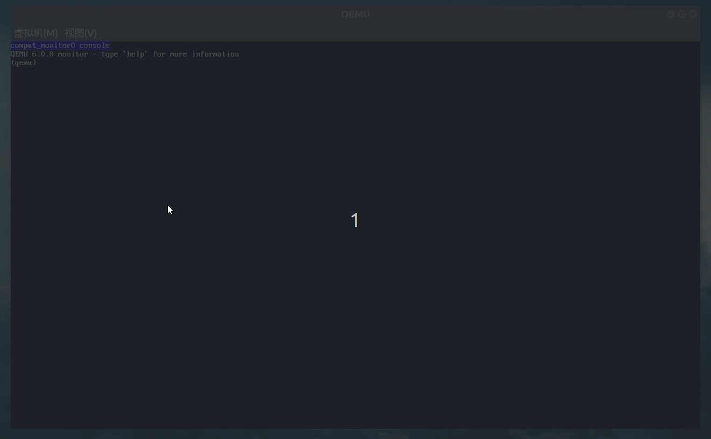

# 基于qemu-riscv从0开始构建嵌入式linux系统ch7. OpenSBI Domain

### OpenSBI Domain介绍

在上一节中，我们已经成功运行了OpenSBI，观察输出log可以看到有一组Domain0的信息打印出来，然后会进入到下级boot流程。那么Domain是做什么用的呢？实际上Domain是用来将SOC内部硬件人为的划分不同权限区域，然后分别独立运行，其使用了riscv的权限管理的硬件保护单元，如PMP等。OpenSBI运行在系统的M模式，而不同Domain的上层程序只能工作在S模式或者U模式，即便是Linux Kernel也必须接收OpenSBI的Domain权限限制，domain划分带来一个好处，比如你希望SOC中的一部分core在smp模式下运行linux内核，而另一部分core工作在amp模式下，单独运行裸机程序或者RTOS会非常容易操作，将其划分到不同Domian即可，除此之外，Domian还可以划分内存地址，mmio地址，可以进行较为细致的权限划分。

### 更新设备树文件添加安全的Domain

既然了解了Domain，那么该如果使用呢？很简单，由于现在opensbi已经支持了fdt设备树，只需要将domain信息添加到设备树文件dts中，即可配置好domain，以下给出相关设备树文件（带注释）：

```
	chosen {
		stdout-path = "/soc/uart0@10000000";

		opensbi-domains {  /* 定义opensbi-domains描述节点 */
		    compatible = "opensbi,domain,config"; /* 节点名称 */

            tmem: tmem {   /* 定义内存节点 */
                compatible = "opensbi,domain,memregion";  /* 节点名称 */
                base = <0x0 0xb0000000>; /* 起始地址注意64位地址哦 */
                order = <28>; /* 内存大小即size=2^28 */
            };

            tuart: tuart {  /* 定义mmio节点 */
                compatible = "opensbi,domain,memregion";  /* 节点名称 */
                base = <0x0 0x10002000>; /* 起始地址 */
                order = <8>; /* size=2^8 */
                mmio;  /* mmio属性 */
                devices = <&uart2>; /* 关联到设备节点上 */
            };

		    allmem: allmem { /* 定义内存节点，这个节点保护所有地址 */
		        compatible = "opensbi,domain,memregion";
		        base = <0x0 0x0>;
		        order = <64>;
		    };

            tdomain: trusted-domain { /* 定义domian节点 */
                compatible = "opensbi,domain,instance";  /* 节点名称 */
                possible-harts = <&cpu7>; /* dumian中允许使用的cpu core */
                regions = <&tmem 0x7>, <&tuart 0x7>, <&allmem 0x7>;/* 各个内存/mmio区域的权限，3bit读写运行权限 0x7拥有全部权限 */
                boot-hart = <&cpu7>; /* domian中用于boot的core */
                next-arg1 = <0x0 0x00000000>; /* 下级程序的参数 */
		        next-addr = <0x0 0xb0000000>; /* 下级程序的起始地址 */
		        next-mode = <0x0>; /* 下级程序的允许模式 0为U模式，1为S模式 */
                system-reset-allowed; /* 允许复位 */
            };

		    udomain: untrusted-domain {
		        compatible = "opensbi,domain,instance";
		        possible-harts = <&cpu0 &cpu1 &cpu2 &cpu3 &cpu4 &cpu5 &cpu6>;
		        regions = <&tmem 0x0>, <&tuart 0x0>, <&allmem 0x7>;
				boot-hart = <&cpu0>;
		        next-arg1 = <0x0 0x82200000>;
		        next-addr = <0x0 0x82000000>;
		        next-mode = <0x1>;
		        system-reset-allowed;
		    };
		};
	};
```

如果你对设备树已经比较熟悉了，那么这将非常容易理解。

### OpenSBI代码流程分析

5-2节中我们讲解了opensbi启动代码的流程，可知，最终进入从代码后会在init_coldboot函数内执行相关设备驱动的初始化工作，在这期间将存在以下初始化sbi_domain_init-->sbi_hsm_init-->sbi_domain_finalize-->sbi_platform_final_init-->sbi_hsm_prepare_next_jump-->sbi_hart_switch_mode涉及到domain相关的初始化阶段以及最终hart boot。

sbi_domain_init函数初始化一个root domain，目前是当用户没有提供任何domian时，则默认以root域启动，且设备树会直接传递下一级，这样sbi的域保护意义其实就不大了，当然sbi的其他功能例如统一系统调用等仍然存在价值。sbi_platform_final_init函数会调用到我们之前编写的partfrom函数quard_star_final_init而该函数会调用fdt_domain_fixup将今天我们设备树中的opensbi-domian节点中的信息进行parse，进一步调用sbi_domain_register注册domain。domain注册完毕hart进入最后阶段boot。sbi_hart_switch_mode函数会将跳转地址写入RISCV的特殊寄存器csr寄存器然后执行mret指令切换到S模式或U模式，这里涉及RISCV特权架构的内容较多，我们后面将在移植RTOS到trusted-domain章节时详细讲解。

### 编写安全Domain测试代码

上文中我们添加了两个domain，udomain作为允许linux内核的域，而tdomain我们作为安全域，后面我们来移植一下其他的rtos在上面，本节我们为了测试domian是否都正确boot，就添加一个trusted_domain的工程来编写个最简单的串口打印的代码。

一个简单的链接脚本和简单的汇编代码，对于已经学习过之前章节的lowlevel_fw代码的大家已经不在话下，这里就不再给出注释了，主要注意下各个地址配置（运行起始和UART2的寄存器地址）。
```
OUTPUT_ARCH( "riscv" )

ENTRY( _start )

MEMORY
{ 
	ddr (rxai!w) : ORIGIN = 0xb0000000, LENGTH = 256M
}

SECTIONS
{
  .text :
  {
    KEEP(*(.text))
  } >ddr
}
```

```assembly

	.section .text
	.globl _start
	.type _start,@function

_start:
	li		t0,	0x100
	slli	t0,	t0, 20
	li		t1,	0x200
	slli	t1,	t1, 4
	add     t0, t0, t1
	li		t1,	'H'
	sb		t1, 0(t0)
	li		t1,	'e'
	sb		t1, 0(t0)
	li		t1,	'l'
	sb		t1, 0(t0)
	li		t1,	'l'
	sb		t1, 0(t0)
	li		t1,	'o'
	sb		t1, 0(t0)
	li		t1,	' '
	sb		t1, 0(t0)
	li		t1,	'Q'
	sb		t1, 0(t0)
	li		t1,	'u'
	sb		t1, 0(t0)
	li		t1,	'a'
	sb		t1, 0(t0)
	li		t1,	'r'
	sb		t1, 0(t0)
	li		t1,	'd'
	sb		t1, 0(t0)
	li		t1,	' '
	sb		t1, 0(t0)
	li		t1,	'S'
	sb		t1, 0(t0)
	li		t1,	't'
	sb		t1, 0(t0)
	li		t1,	'a'
	sb		t1, 0(t0)
	li		t1,	'r'
	sb		t1, 0(t0)
	li		t1,	' '
	sb		t1, 0(t0)
	li		t1,	'b'
	sb		t1, 0(t0)
	li		t1,	'o'
	sb		t1, 0(t0)
	li		t1,	'a'
	sb		t1, 0(t0)
	li		t1,	'r'
	sb		t1, 0(t0)
	li		t1,	'd'
	sb		t1, 0(t0)
	li		t1,	'!'
	sb		t1, 0(t0)
	li		t1,	'\r'
	sb		t1, 0(t0)
	li		t1,	'\n'
	sb		t1, 0(t0)
_loop:
	j		_loop

    .end
```

lowlevel_fw添加对trusted_domain代码的搬运到ddr，然后添加编译脚本。

```
	//load trusted_fw.bin
	//[0x20400000:0x20800000] --> [0x80200000:0x80600000]
    li		a0,	0x204
	slli	a0,	a0, 20      //a0 = 0x20400000
    li		a1,	0xb00
	slli	a1,	a1, 20      //a1 = 0xb0000000
    li		a2,	0xb04
	slli	a2,	a2, 20      //a2 = 0xb0400000
	load_data a0,a1,a2
```

```shell
# 编译trusted_domain
if [ ! -d "$SHELL_FOLDER/output/trusted_domain" ]; then  
mkdir $SHELL_FOLDER/output/trusted_domain
fi  
cd $SHELL_FOLDER/trusted_domain
$CROSS_PREFIX-gcc -x assembler-with-cpp -c startup.s -o $SHELL_FOLDER/output/trusted_domain/startup.o
$CROSS_PREFIX-gcc -nostartfiles -T./link.lds -Wl,-Map=$SHELL_FOLDER/output/trusted_domain/trusted_fw.map -Wl,--gc-sections $SHELL_FOLDER/output/trusted_domain/startup.o -o $SHELL_FOLDER/output/trusted_domain/trusted_fw.elf
$CROSS_PREFIX-objcopy -O binary -S $SHELL_FOLDER/output/trusted_domain/trusted_fw.elf $SHELL_FOLDER/output/trusted_domain/trusted_fw.bin
$CROSS_PREFIX-objdump --source --demangle --disassemble --reloc --wide $SHELL_FOLDER/output/trusted_domain/trusted_fw.elf > $SHELL_FOLDER/output/trusted_domain/trusted_fw.lst
dd of=fw.bin bs=1k conv=notrunc seek=4K if=$SHELL_FOLDER/output/trusted_domain/trusted_fw.bin

```

最后就是添加qemu运行参数，我们需要将串口2的打印输出出来，因此需要添加三个--serial选项，将输出定位到qemu提供的仿真终端控制台上，使用vc:1280x720来配置控制台分辨率。

```shell
SHELL_FOLDER=$(cd "$(dirname "$0")";pwd)
DEFAULT_VC="1280x720"

$SHELL_FOLDER/output/qemu/bin/qemu-system-riscv64 \
-M quard-star \
-m 1G \
-smp 8 \
-drive if=pflash,bus=0,unit=0,format=raw,file=$SHELL_FOLDER/output/fw/fw.bin \
--serial vc:$DEFAULT_VC --serial vc:$DEFAULT_VC --serial vc:$DEFAULT_VC --monitor vc:$DEFAULT_VC --parallel none
```

完成后执行run.sh，可以看到弹出如下终端界面，切换到串口0和串口2可以分别查看打印情况，如一下图gif所示。



到这里本篇内容讲述完成。本节内容学习熟悉针对opensbi中的domain深入了解，并且再次巩固了汇编代码编写，下一节我们将开始移植U-boot到我们udomian中，以便开展后面的内核移植工作。

> 本教程的<br>github仓库：https://github.com/QQxiaoming/quard_star_tutorial<br>gitee仓库：https://gitee.com/QQxiaoming/quard_star_tutorial<br>本节所在tag：ch7