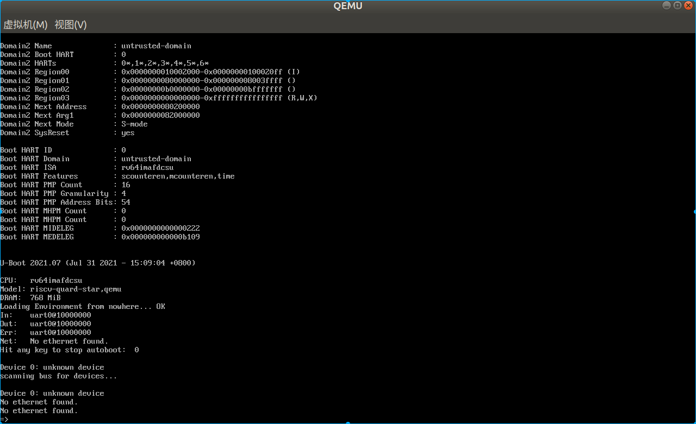

# 基于qemu-riscv从0开始构建嵌入式linux系统ch8. U-Boot

### U-Boot介绍

终于我们的项目来到了u-boot，相信很多学习过嵌入式的朋友都听过或熟悉u-boot这个项目，在arm嵌入式开发中uboot常常作为二级loader甚至一级loader，用来引导linux内核。uboot早期是作为BootLoader开发的，主要功能就是loader+boot，如今的u-boot相比早期仅仅是从非易失性加载内核引导内核，还拥有了更多功能，比如通过网络功能，更新升级固件等等，因此我们的项目里也将uboot移植进来作为流程的一部分，以便功能的完整性，而如果你是真正开发产品，也可以选择直接opensbi引导kernel跳过uboot阶段。

另外，uboot有一个spl功能的支持，是将uboot分为两部分bl0和bl1，bl0通常运行在xip模式的flash内，其运行只需要少量的内存，进行初始化ddr空间操作并加载bl1部分到ddr内进行后续uboot操作。而我们就不需要spl功能，我们有前级opensbi来负责BL0阶段的功能。

### U-Boot编译

废话不多说了，直接进入正题，首先去下载uboot源码，这里我要下载最新的uboot-2021.07，为什么要这么新的版本呢，其实这里还有个小故事，在开始做这个系列博客前，我已经做了一部分工作了，当时需要使用qemu的fw_cfg传递参数给目标机，当时我使用了qemu5.2和uboot-2021.04的版本，qemu的riscv的virt并没有加入fw_cfg支持，而uboot甚至连fw_cfg的mmio驱动都没有，只有x86的驱动，因此我花了些时间实现了mmio的驱动，当时打算提交patch给uboot上游，结果发现在uboot-2021.07-rc5版本有开发者刚刚提交mmio的驱动，早知道就不用自己写了，刚好赶在我们这个系列博客开始之时，uboot-2021.07正式版发布了，我们就直接使用这个版本了，不用担心驱动缺失的问题了。[u-boot](http://www.denx.de/wiki/U-Boot/)官方下载地址在这个链接里。

首先我们先不做任何修改，直接使用riscv64_smode_defconfig的配置进行编译，生成的u-boot以及map文件我们拷贝到输出目录方便后面使用，另外为了uboot的调试可以使用objdump将反汇编文件输出到u-boot.lst内以供查看。

```shell
# 编译uboot
if [ ! -d "$SHELL_FOLDER/output/uboot" ]; then  
mkdir $SHELL_FOLDER/output/uboot
fi  
cd $SHELL_FOLDER/u-boot-2021.07
make CROSS_COMPILE=/opt/riscv64--glibc--bleeding-edge-2020.08-1/bin/riscv64-linux- qemu-riscv64_smode_defconfig
make CROSS_COMPILE=/opt/riscv64--glibc--bleeding-edge-2020.08-1/bin/riscv64-linux- -j16
cp $SHELL_FOLDER/u-boot-2021.07/u-boot $SHELL_FOLDER/output/uboot/u-boot.elf
cp $SHELL_FOLDER/u-boot-2021.07/u-boot.map $SHELL_FOLDER/output/uboot/u-boot.map
cp $SHELL_FOLDER/u-boot-2021.07/u-boot.bin $SHELL_FOLDER/output/uboot/u-boot.bin
$CROSS_PREFIX-objdump --source --demangle --disassemble --reloc --wide $SHELL_FOLDER/output/uboot/u-boot.elf > $SHELL_FOLDER/output/uboot/u-boot.lst
```

uboot同样需要设备树文件，我们将重新编写一份设备树文件用于uboot和linux kernel与opensbi使用的设备树不同。主要是删除了opensbi的domian相关内容，如下：

```
/dts-v1/;

/ {
	#address-cells = <0x2>;
	#size-cells = <0x2>;
	compatible = "riscv-quard-star";
	model = "riscv-quard-star,qemu";

	chosen {
		bootargs = "console=ttyS0";
		stdout-path = "/soc/uart0@10000000";
	};

	memory@80000000 {
		device_type = "memory";
		reg = <0x0 0x80000000 0x0 0x30000000>;
	};

	cpus {
		#address-cells = <0x1>;
		#size-cells = <0x0>;
		timebase-frequency = <0x989680>;

		cpu0: cpu@0 {
			phandle = <0xf>;
			device_type = "cpu";
			reg = <0x0>;
			status = "okay";
			compatible = "riscv";
			riscv,isa = "rv64imafdcsu";
			mmu-type = "riscv,sv48";

			interrupt-controller {
				#interrupt-cells = <0x1>;
				interrupt-controller;
				compatible = "riscv,cpu-intc";
				phandle = <0x10>;
			};
		};

		cpu1: cpu@1 {
			phandle = <0xd>;
			device_type = "cpu";
			reg = <0x1>;
			status = "okay";
			compatible = "riscv";
			riscv,isa = "rv64imafdcsu";
			mmu-type = "riscv,sv48";

			interrupt-controller {
				#interrupt-cells = <0x1>;
				interrupt-controller;
				compatible = "riscv,cpu-intc";
				phandle = <0xe>;
			};
		};

		cpu2: cpu@2 {
			phandle = <0xb>;
			device_type = "cpu";
			reg = <0x2>;
			status = "okay";
			compatible = "riscv";
			riscv,isa = "rv64imafdcsu";
			mmu-type = "riscv,sv48";

			interrupt-controller {
				#interrupt-cells = <0x1>;
				interrupt-controller;
				compatible = "riscv,cpu-intc";
				phandle = <0xc>;
			};
		};

		cpu3: cpu@3 {
			phandle = <0x9>;
			device_type = "cpu";
			reg = <0x3>;
			status = "okay";
			compatible = "riscv";
			riscv,isa = "rv64imafdcsu";
			mmu-type = "riscv,sv48";

			interrupt-controller {
				#interrupt-cells = <0x1>;
				interrupt-controller;
				compatible = "riscv,cpu-intc";
				phandle = <0xa>;
			};
		};

		cpu4: cpu@4 {
			phandle = <0x7>;
			device_type = "cpu";
			reg = <0x4>;
			status = "okay";
			compatible = "riscv";
			riscv,isa = "rv64imafdcsu";
			mmu-type = "riscv,sv48";

			interrupt-controller {
				#interrupt-cells = <0x1>;
				interrupt-controller;
				compatible = "riscv,cpu-intc";
				phandle = <0x8>;
			};
		};

		cpu5: cpu@5 {
			phandle = <0x5>;
			device_type = "cpu";
			reg = <0x5>;
			status = "okay";
			compatible = "riscv";
			riscv,isa = "rv64imafdcsu";
			mmu-type = "riscv,sv48";

			interrupt-controller {
				#interrupt-cells = <0x1>;
				interrupt-controller;
				compatible = "riscv,cpu-intc";
				phandle = <0x6>;
			};
		};

		cpu6: cpu@6 {
			phandle = <0x3>;
			device_type = "cpu";
			reg = <0x6>;
			status = "okay";
			compatible = "riscv";
			riscv,isa = "rv64imafdcsu";
			mmu-type = "riscv,sv48";

			interrupt-controller {
				#interrupt-cells = <0x1>;
				interrupt-controller;
				compatible = "riscv,cpu-intc";
				phandle = <0x4>;
			};
		};

		cpu7: cpu@7 {
			phandle = <0x1>;
			device_type = "cpu";
			reg = <0x7>;
			status = "okay";
			compatible = "riscv";
			riscv,isa = "rv64imafdcsu";
			mmu-type = "riscv,sv48";

			interrupt-controller {
				#interrupt-cells = <0x1>;
				interrupt-controller;
				compatible = "riscv,cpu-intc";
				phandle = <0x2>;
			};
		};

		cpu-map {

			cluster0 {

				core0 {
					cpu = <0xf>;
				};

				core1 {
					cpu = <0xd>;
				};

				core2 {
					cpu = <0xb>;
				};

				core3 {
					cpu = <0x9>;
				};

				core4 {
					cpu = <0x7>;
				};

				core5 {
					cpu = <0x5>;
				};

				core6 {
					cpu = <0x3>;
				};

				core7 {
					cpu = <0x1>;
				};
			};
		};
	};

	soc {
		#address-cells = <0x2>;
		#size-cells = <0x2>;
		compatible = "simple-bus";
		ranges;

		uart0: uart0@10000000 {
			interrupts = <0xa>;
			interrupt-parent = <0x11>;
			clock-frequency = <0x384000>;
			reg = <0x0 0x10000000 0x0 0x100>;
			compatible = "ns16550a";
		};

		uart1: uart1@10001000 {
			interrupts = <0xa>;
			interrupt-parent = <0x11>;
			clock-frequency = <0x384000>;
			reg = <0x0 0x10001000 0x0 0x100>;
			compatible = "ns16550a";
		};

		plic@c000000 {
			phandle = <0x11>;
			riscv,ndev = <0x35>;
			reg = <0x0 0xc000000 0x0 0x210000>;
			interrupts-extended = <0x10 0xb 0x10 0x9 0xe 0xb 0xe 0x9 0xc 0xb 0xc 0x9 0xa 0xb 0xa 0x9 0x8 0xb 0x8 0x9 0x6 0xb 0x6 0x9 0x4 0xb 0x4 0x9 0x2 0xb 0x2 0x9>;
			interrupt-controller;
			compatible = "riscv,plic0";
			#interrupt-cells = <0x1>;
			#address-cells = <0x0>;
		};

		clint@2000000 {
			interrupts-extended = <0x10 0x3 0x10 0x7 0xe 0x3 0xe 0x7 0xc 0x3 0xc 0x7 0xa 0x3 0xa 0x7 0x8 0x3 0x8 0x7 0x6 0x3 0x6 0x7 0x4 0x3 0x4 0x7 0x2 0x3 0x2 0x7>;
			reg = <0x0 0x2000000 0x0 0x10000>;
			compatible = "riscv,clint0";
		};
	};
};
```

修改用于opensbi的dts文件中domain的启动地址：

```
udomain: untrusted-domain {
    compatible = "opensbi,domain,instance";
    possible-harts = <&cpu0 &cpu1 &cpu2 &cpu3 &cpu4 &cpu5 &cpu6>;
    regions = <&tmem 0x0>, <&tuart 0x0>, <&allmem 0x7>;
    boot-hart = <&cpu0>;
    next-arg1 = <0x0 0x82000000>; /* 这两个地址之所以改为这个原因是因为默认的riscv64_smode_defconfig配置uboot使用了这两个地址，我们先使用默认配置跑起来uboot，后续会重新规划内存分配 */
    next-addr = <0x0 0x80200000>; 
    next-mode = <0x1>;
    system-reset-allowed;
};
```

dts编译以及固件打包：

```shell
# 生成uboot.dtb
cd $SHELL_FOLDER/dts
dtc -I dts -O dtb -o $SHELL_FOLDER/output/uboot/quard_star_uboot.dtb quard_star_uboot.dts

# 合成firmware固件
if [ ! -d "$SHELL_FOLDER/output/fw" ]; then  
mkdir $SHELL_FOLDER/output/fw
fi  
cd $SHELL_FOLDER/output/fw
rm -rf fw.bin
dd of=fw.bin bs=1k count=32k if=/dev/zero
dd of=fw.bin bs=1k conv=notrunc seek=0 if=$SHELL_FOLDER/output/lowlevelboot/lowlevel_fw.bin
dd of=fw.bin bs=1k conv=notrunc seek=512 if=$SHELL_FOLDER/output/opensbi/quard_star_sbi.dtb
dd of=fw.bin bs=1k conv=notrunc seek=1K if=$SHELL_FOLDER/output/uboot/quard_star_uboot.dtb
dd of=fw.bin bs=1k conv=notrunc seek=2K if=$SHELL_FOLDER/output/opensbi/fw_jump.bin
dd of=fw.bin bs=1k conv=notrunc seek=4K if=$SHELL_FOLDER/output/trusted_domain/trusted_fw.bin
dd of=fw.bin bs=1k conv=notrunc seek=8K if=$SHELL_FOLDER/output/uboot/u-boot.bin
```

修改lowlevelboot程序添加以下内容加载uboot和对应的dtb文件（注意地址即可）。

```assembly
	//load qemu_uboot.dtb
	//[0x20100000:0x20180000] --> [0x82000000:0x82080000]
    li		a0,	0x201
	slli	a0,	a0, 20       //a0 = 0x20100000
	li		a1,	0x820
	slli	a1,	a1, 20       //a1 = 0x82000000
    li		a2,	0x8208
	slli	a2,	a2, 16       //a2 = 0x82080000
	load_data a0,a1,a2

	//load u-boot.bin
	//[0x20800000:0x20C00000] --> [0x80200000:0x80600000]
    li		a0,	0x208
	slli	a0,	a0, 20      //a0 = 0x20800000
    li		a1,	0x802
	slli	a1,	a1, 20      //a1 = 0x80200000
    li		a2,	0x806
	slli	a2,	a2, 20      //a2 = 0x80600000
	load_data a0,a1,a2
```

ok，各部分准备就绪，执行编译脚本，启动运行。



这里输入help可以查看uboot集成的命令，不熟悉uboot的朋友可以尝试各种命令，对uboot加以熟悉。

### U-Boot代码流程初分析

riscv目前uboot的启动代码位于u-boot-2021.07/arch/riscv/cpu/start.S内，链接脚本位于u-boot-2021.07/arch/riscv/cpu/u-boot.lds，可以查看源码发现程序从_start开始执行，针对smp系统boot核心执行早期的初始化流程，大致流程为board_init_f-->>harts_early_init-->>gd_init-->>relocate_code-->>board_init_r。board_init_r开始就全面进入C代码了，而之前boad_init_f阶段,定义在u-boot-2021.07/common/board_f.c中init_sequence_f函数表，主要进行内存时钟等初始化以及一些早期初始化内容，虽然是使用C代码，但一定要注意此时仅仅初始化了部分全局变量（主要是gd）。board_init_r位于u-boot-2021.07/common/board_r.c，init_sequence_r函数指针表内包含依次进行初始化的内容，包含一些驱动的初始化（dm驱动管理结构），列表最后一项就是run_main_loop-->>main_loop，main_loop位于u-boot-2021.07/common/main.c，其中主要进行cli_init，autoboot_command，cli_loop，也就是初始化uboot中的命令行终端，并加载执行自动boot指令，关于自动boot即Uboot的Distro Boot我们后面章节要展开讨论这个问题，本节仅仅对uboot代码流程做一个初步分析，经过我的简单描述，你应该已经建立起对uboot程序流程的初步认知，总结即时uboot分为两阶段初始化，第一阶段board_init_f，是早期初始化，涉及内存等基础初始化，然后展开data段，bss段，堆栈等后进入board_init_r，完成驱动初始化，之后进入命令行cli中执行外部命令或自动加载内核流程。

到这里本篇内容讲述完成。本节内容成功编译运行u-boot到我们udomian中，并对u-boot有了初步认识，但是很多配置细节以及内存地址的选择我这里没有描述清楚，下一节我们将对其进行展开描述。

> 本教程的<br>github仓库：https://github.com/QQxiaoming/quard_star_tutorial<br>gitee仓库：https://gitee.com/QQxiaoming/quard_star_tutorial<br>本节所在tag：ch8