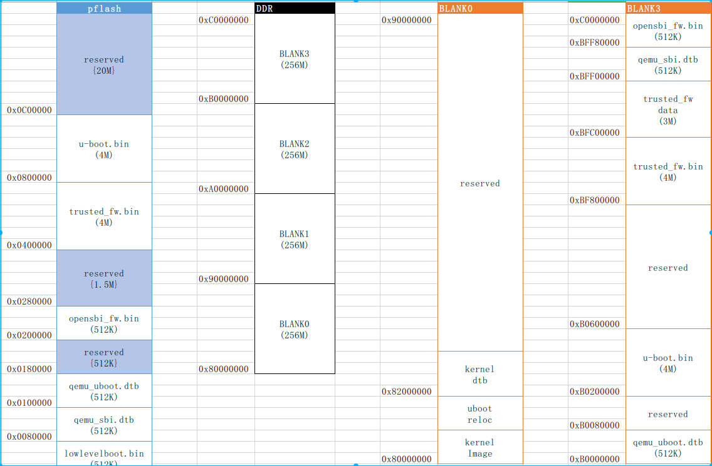

# 基于qemu-riscv从0开始构建嵌入式linux系统ch9. U-Boot platform添加与内存分配重规划

### 物理内存规划

在上一节中，我们已经成运行了uboot，但是默认的配置并不那么适合我们的系统，如果是在真实的ic设计开发时，软件团队往往需要在早期就规划好系统内存的使用方案，包括各级boot且需要考虑固件升级等情况，因此这节我们也针对我们的内存空间做一重新规划调整。

如下图所示，最终规划如下，pflash存储所有的低阶固件文件和资源，由位于pflash最前段的lowlevelboot将其他的固件资源文件加载到ddr中，并启动opensbi执行内存域权限划分，进一步分别boot各个domain，DDR最高地址1M范围为opensbi的安全内存域，紧接着的7M范围为core7运行的安全domain区域。其他区域为linux内核运行区域。其中DDR BLANK3低地址为uboot的加载区域，执行uboot的bl0阶段，之后uboot会将自身reloc到DDR的BLANK032M地址处向下动态生长，在该区域进行bl1阶段，并从文件系统中加载内核和设树文件，内核预留地址为BLANK0最低地址，设备树地址BLANK0的32M区域，当内核真正启动初始化时，所有reloc地址和设备上所在位置内存均释放给回内核。详细内容可以参考下图：



制定好内存规划后，我们整理要加载的固件地址如下：

```
load opensbi_fw.bin 
[0x20200000:0x20400000] --> [0xBFF80000:0xC0000000]
load qemu_sbi.dtb
[0x20080000:0x20100000] --> [0xBFF00000:0xBFF80000]
load trusted_fw.bin
[0x20400000:0x20800000] --> [0xBF800000:0xBFC00000]
load qemu_uboot.dtb
[0x20100000:0x20180000] --> [0xB0000000:0xB0080000]
load u-boot.bin
[0x20800000:0x20C00000] --> [0xB0200000:0xB0600000]
```

按照上述内容重新编写lowlevelboot代码，这次我们注意下一点细节，仅需要使用core0进行加载即可，其他smp core等待加载完毕直接跳转运行即可。

```assembly
	.macro loop,cunt
    li		t1,	0xffff
    li		t2,	\cunt
1:
	nop
	addi    t1, t1, -1
	bne		t1, x0, 1b
    li		t1,	0xffff
	addi    t2, t2, -1
	bne		t2, x0, 1b
	.endm

	.macro load_data,_src_start,_dst_start,_dst_end
	bgeu	\_dst_start, \_dst_end, 2f
1:
	lw      t0, (\_src_start)
	sw      t0, (\_dst_start)
	addi    \_src_start, \_src_start, 4
	addi    \_dst_start, \_dst_start, 4
	bltu    \_dst_start, \_dst_end, 1b
2:
	.endm

	.section .data
	.globl  _pen
	.type	_pen,%object
_pen:
	.word   1

	.section .text
	.globl _start
	.type _start,@function
_start:
    csrr    a0, mhartid
	beq		a0, zero, _no_wait
_loop:
	loop	0x1000
	la		t0, _pen
	lw		t0, 0(t0)
	beq		t0, zero, _run
	j       _loop
_no_wait:
	la		t0, _pen
	la		t1, 1
	sw		t1, 0(t0)
	//load opensbi_fw.bin 
	//[0x20200000:0x20400000] --> [0xBFF80000:0xC0000000]
    li		a0,	0x202
	slli	a0,	a0, 20
    li		a1,	0xbff
	slli	a1,	a1, 20
	li		a2,	0x800
	slli	a2,	a2, 8
	add 	a1,	a1, a2
	add 	a2,	a1, a2
	load_data a0,a1,a2

	//load qemu_sbi.dtb
	//[0x20080000:0x20100000] --> [0xBFF00000:0xBFF80000]
    li		a0,	0x2008
	slli	a0,	a0, 16
    li		a1,	0xbff
	slli	a1,	a1, 20
	li		a2,	0x800
	slli	a2,	a2, 4
	add 	a2,	a1, a2
	load_data a0,a1,a2

	//load trusted_fw.bin
	//[0x20400000:0x20800000] --> [0xBF800000:0xBFC00000]
    li		a0,	0x204
	slli	a0,	a0, 20
    li		a1,	0xbf8
	slli	a1,	a1, 20
    li		a2,	0xbfc
	slli	a2,	a2, 20
	load_data a0,a1,a2

	//load qemu_uboot.dtb
	//[0x20100000:0x20180000] --> [0xB0000000:0xB0080000]
    li		a0,	0x201
	slli	a0,	a0, 20
	li		a1,	0xb00
	slli	a1,	a1, 20
    li		a2,	0x800
	slli	a2,	a2, 8
	add 	a2,	a1, a2
	load_data a0,a1,a2

	//load u-boot.bin
	//[0x20800000:0x20C00000] --> [0xB0200000:0xB0600000]
    li		a0,	0x208
	slli	a0,	a0, 20
    li		a1,	0xb02
	slli	a1,	a1, 20
    li		a2,	0xb06
	slli	a2,	a2, 20
	load_data a0,a1,a2

_run:
    csrr    a0, mhartid
    li		a1,	0xbff
	slli	a1,	a1, 20
	li		t0,	0x800
	slli	t0,	t0, 8
	add 	t0,	a1, t0
	la		t1, _pen
	sw		zero, 0(t1)
    jr      t0


    .end
```

最后不要忘记设备树里的boot地址和参数地址配置和trusted_domain的链接脚本地址修改。

### 添加platform到uboot

其他各个驱动代码中的地址已经确定完成，最后就是添加uboot的platform代码，实现上述内存划分。

- 首先创建目录u-boot-2021.07/board/emulation/qemu-quard-star，添加三个文件Kconfig、qemu-quard-star.c、Makefile，注意以下内容中get_effective_memsize是限制uboot的reloc生长top地址。

```
if TARGET_QEMU_QUARD_STAR

config SYS_BOARD
	default "qemu-quard-star"

config SYS_VENDOR
	default "emulation"

config SYS_CPU
	default "generic"

config SYS_CONFIG_NAME
	default "qemu-quard-star"

config SYS_TEXT_BASE
	default 0xB0200000

config BOARD_SPECIFIC_OPTIONS # dummy
	def_bool y
	select GENERIC_RISCV
	select CMD_QFW
	select QFW_MMIO
	imply AHCI
	imply SMP
	imply BOARD_LATE_INIT
	imply CMD_POWEROFF
	imply CMD_EXT2
	imply CMD_EXT4
	imply CMD_FAT
	imply CMD_FS_GENERIC
	imply DOS_PARTITION
	imply ISO_PARTITION
	imply EFI_PARTITION
	imply SYS_NS16550
	imply SIFIVE_SERIAL
	imply SYSRESET
	imply SYSRESET_CMD_POWEROFF
	imply SYSRESET_SYSCON
	imply VIRTIO_MMIO
	imply VIRTIO_PCI
	imply VIRTIO_NET
	imply VIRTIO_BLK
endif
```

```c
// SPDX-License-Identifier: GPL-2.0+

#include <common.h>
#include <dm.h>
#include <env.h>
#include <fdtdec.h>
#include <image.h>
#include <log.h>
#include <init.h>

int board_init(void)
{
	return 0;
}

int board_late_init(void)
{
	return 0;
}

phys_size_t get_effective_memsize(void)
{
	return 32*1024*1024;
}

```

```
# SPDX-License-Identifier: GPL-2.0+

obj-y	+= qemu-quard-star.o
```

- 添加以下内容到u-boot-2021.07/arch/riscv/Kconfig

```
config TARGET_QEMU_QUARD_STAR
	bool "Support QEMU Quard-Star Board"
```

- 创建文件u-boot-2021.07/include/configs/qemu-quard-star.h

```c
/* SPDX-License-Identifier: GPL-2.0+ */
#ifndef __CONFIG_H
#define __CONFIG_H

#include <linux/sizes.h>

#define CONFIG_SYS_SDRAM_BASE		0x80000000
#define CONFIG_SYS_INIT_SP_ADDR		(CONFIG_SYS_SDRAM_BASE + SZ_2M)

#define CONFIG_SYS_LOAD_ADDR		(CONFIG_SYS_SDRAM_BASE + SZ_2M)

#define CONFIG_SYS_MALLOC_LEN		SZ_8M

#define CONFIG_SYS_BOOTM_LEN		SZ_64M

#define CONFIG_STANDALONE_LOAD_ADDR	0x80200000

#define RISCV_MMODE_TIMERBASE		0x2000000
#define RISCV_MMODE_TIMER_FREQ		1000000

#define RISCV_SMODE_TIMER_FREQ		1000000

/* Environment options */

#ifndef CONFIG_SPL_BUILD
#define BOOT_TARGET_DEVICES(func) \
	func(QEMU, qemu, na) \
	func(VIRTIO, virtio, 0)

#include <config_distro_bootcmd.h>

#define BOOTENV_DEV_QEMU(devtypeu, devtypel, instance) \
	"bootcmd_qemu=" \
		"if env exists kernel_start; then " \
			"bootm ${kernel_start} - ${fdtcontroladdr};" \
		"fi;\0"

#define BOOTENV_DEV_NAME_QEMU(devtypeu, devtypel, instance) \
	"qemu "

#define CONFIG_EXTRA_ENV_SETTINGS \
	"fdt_high=0xffffffffffffffff\0" \
	"initrd_high=0xffffffffffffffff\0" \
	"kernel_addr_r=0x84000000\0" \
	"fdt_addr_r=0x88000000\0" \
	"scriptaddr=0x88100000\0" \
	"pxefile_addr_r=0x88200000\0" \
	"ramdisk_addr_r=0x88300000\0" \
	BOOTENV
#endif

#endif /* __CONFIG_H */
```

- 创建文件u-boot-2021.07/configs/qemu-quard-star_defconfig

```
CONFIG_RISCV=y
CONFIG_NR_DRAM_BANKS=1
CONFIG_ENV_SIZE=0x20000
CONFIG_TARGET_QEMU_QUARD_STAR=y
CONFIG_ARCH_RV64I=y
CONFIG_RISCV_SMODE=y
CONFIG_DISTRO_DEFAULTS=y
CONFIG_FIT=y
CONFIG_DISPLAY_CPUINFO=y
CONFIG_DISPLAY_BOARDINFO=y
CONFIG_CMD_BOOTEFI_SELFTEST=y
CONFIG_CMD_NVEDIT_EFI=y
CONFIG_OF_PRIOR_STAGE=y
CONFIG_SYS_RELOC_GD_ENV_ADDR=y
CONFIG_DM_MTD=y
```

- 将上一节编译脚本uboot指定的配置修改为以下内容

```
make CROSS_COMPILE=/opt/riscv64--glibc--bleeding-edge-2020.08-1/bin/riscv64-linux- qemu-quard-star_defconfig
```

之后进行build.sh，就可以顺利运行查看效果，本节内容对内存进行了重新规划，不改变原本的功能，因此执行qemu后得到的输出应同上一节内容相同，但是使用的内存地址发生了变化。到这里本篇内容讲述完成。下一节我们将要给qemu再增加两个虚拟外设ip——virtio与fw_cfg，以便开展linux kernel的运行，我们现在距离内核越来越近了。

> 本教程的<br>github仓库：https://github.com/QQxiaoming/quard_star_tutorial<br>gitee仓库：https://gitee.com/QQxiaoming/quard_star_tutorial<br>本节所在tag：ch9（注意本节正文内容在ch9的tag下存在一些遗漏代码，在这个commit下进行了修复009acd128b707b075132c729b7bf098dd97865b0）。
