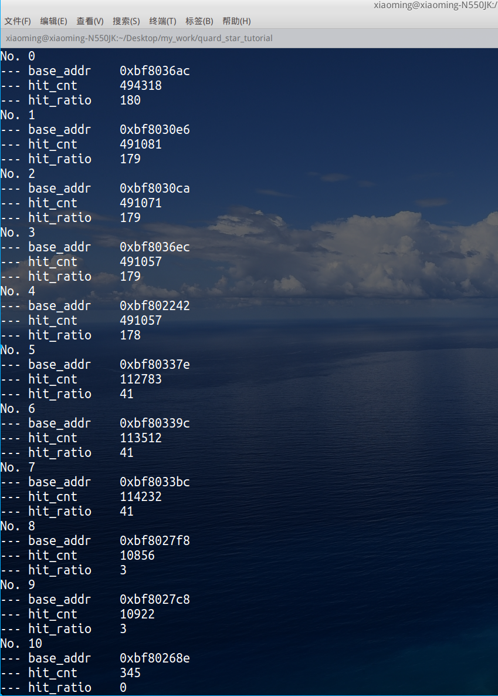

# gcc编译选项pg在嵌入式profile中应用

## 问题引入

首先说明下，本文主要是描述下使用gcc的-pg编译选项在嵌入式的裸机或RTOS系统环境下实现一些函数级别的profile或者做代码覆盖率测试甚至实现trace功能。关于这个编译选项在[GCC文档](https://gcc.gnu.org/onlinedocs/gcc-11.2.0/gcc/Instrumentation-Options.html#index-pg)有描述，但是这里要注意一点，该选项一般来讲是配合glibc中的gprof实现完备且较为复杂的性能跟踪，而众所周知在MCU级别的嵌入式开发环境往往没有操作系统加持，仅有RTOS甚至是裸机环境，因此本文提出一种简易的可以在裸机环境实现简单但有效的trace实现思路。笔者已经比较久没有在RTOS开发了，最近在研究了解使用linux kernel中的ftrace中突然来了灵感，因此记下了这个话题，趁中秋节假日完成了本文。

## 设计实现

### 开发环境

笔者目前没有MCU硬件平台，而且最近一段时间一直在研究RISCV架构，因此这示例就使用qemu-riscv64的环境，我之前移植了freertos在这个平台上作为部分核心上的子系统，正好可以进行本次实验。对我的这套开发环境的搭建兴趣的朋友可以阅读我的系列博客——《[基于qemu-riscv从0开始构建嵌入式linux系统](https://blog.csdn.net/weixin_39871788/article/details/118469061)》。但是这里要强调的是本文方法完全可以应用在其他常见嵌入式平台例如arm的cortex-m、cortex-r、cortex-a以及riscv32系列等等。

### -pg编译选项

该选项一般配合glibc中的gprof使用，常规用法需要在编译和链接是均加入该选项，而在newlibc的环境下，无gprof的实现，因此我们仅仅需要在编译选项加入-pg即可。

```Makefile
-	@$(CC) -c $(CFLAGS) -Wa,-a,-ad,-alms=$(OBJ_DIR)/$(notdir $(<:.c=.lst)) $< -o $@
+	@$(CC) -c $(CFLAGS) -pg -Wa,-a,-ad,-alms=$(OBJ_DIR)/$(notdir $(<:.c=.lst)) $< -o $@
```

-pg选项的作用是给所有函数前增加调用一个名为_mcount的hook函数，定义如下：

```c
void _mcount(uint64_t caller_ra);
```

而我们正是实现该函数来达到我们所需的目的，这个函数可以使用汇编或c来实现，本文为简单易懂使用c代码进行。

### 设计思路

我们知道添加-pg编译选项后，代码中的所有函数执行正式功能前调用_mcount钩子函数，先添加个_mcount空函数，查看反汇编结果代码片段如下：

```
int main(void)
{
    bf803820:	1141                	addi	sp,sp,-16
    bf803822:	e406                	sd	ra,8(sp)
    bf803824:	8506                	mv	a0,ra
    bf803826:	496000ef          	jal	ra,bf803cbc <_mcount>
    bf80382a:	ffffd517          	auipc	a0,0xffffd

    ...

    void dump_regs(struct stack_frame *regs)
{
    bf803866:	1141                	addi	sp,sp,-16
    bf803868:	e406                	sd	ra,8(sp)
    bf80386a:	e022                	sd	s0,0(sp)
    bf80386c:	842a                	mv	s0,a0
    bf80386e:	8506                	mv	a0,ra
    bf803870:	44c000ef          	jal	ra,bf803cbc <_mcount>
```

可以看到果然在每个函数前都调用了_mcount，那么如果我们在_mcount中将程序的ra寄存器中地址读出，我们就知道是那个函数调用了我们，而统计这些调用者就可分析代码覆盖率，计算一定时间的调用率就可以得到得到代码调用密度等信息。这里再提一下如果是arm就读取lr/r14(链接寄存器)。这里使用内嵌汇编读取ra到curr_ra变量，查看反汇编代码：

```c
void _mcount(uint64_t caller_ra)
{
    uint64_t curr_ra;
	__asm__ __volatile__("mv %0, ra":"=r"(curr_ra));
}
```

```
bf803ab8:	1141                	addi	sp,sp,-16
bf803aba:	e406                	sd	ra,8(sp)
bf803abc:	8506                	mv	a0,ra
bf803abe:	ffbff0ef          	jal	ra,bf803ab8 <_mcount>
bf803ac2:	8786                	mv	a5,ra
bf803ac4:	60a2                	ld	ra,8(sp)
bf803ac6:	0141                	addi	sp,sp,16
bf803ac8:	8082                	ret
```

这里出现了问题，就是如果_mcount本身也被插入了_mcount调用，形成递归调用，这样就无法跳出了，其实很好解决，只有告诉编译器这个函数不插入hook即可。__attribute__ ((no_instrument_function))修饰函数即可（该方法同样适用于你不关心不打算计入统计的函数），修改如下：

```c
void __attribute__ ((no_instrument_function)) _mcount(uint64_t caller_ra)
{
    uint64_t curr_ra;
	__asm__ __volatile__("mv %0, ra":"=r"(curr_ra));
}
```

```
bf803ab8:	8786                	mv	a5,ra
bf803aba:	8082                	ret
```

代码很简单，就将ra读取到了curr_ra，那么剩下的实现就容易了，我们对我们采集到的curr_ra进行计数统计，就可以分析很多问题了，我这个给出一个示例实现：

```c
//profiling.c
#include "profiling.h"
#include "debug_log.h"


#define PROF_MASK       (~(PROF_ERR - 1))
#define ARRAY_SIZE(x)   (sizeof(x) / sizeof((x)[0]))

typedef struct
{
	uint64_t base_addr; /*!< (aligned) base address range of PC sample            */
	uint64_t hit_cnt;   /*!< hit count (a decay mecahnism automatically drops it) */
	uint64_t hit_ratio; /*!< 10-bit resolution hit ratio,                         */
} prof_unit_t;

typedef struct
{
	uint32_t prof_cnt; /*!< totoal hit count of profiling  */
	uint32_t decay_ndx; /*!< which item to decay its hit_cnt */
	prof_unit_t items[PROF_CNT];
} prof_t;

prof_t call_prof;
uint64_t ignr_list[] =
{
	0xbf802a0a,
	// todo: add pc address ranges that you do not care, such as idle function.
    0,
    0,
};

/**
 * @brief 记录采样pc地址
 *
 * @param p_item 记录列表
 * @param pc 样本pc指针
 */
void __attribute__ ((no_instrument_function)) prof_on_hit(prof_unit_t *p_item, uint64_t pc)
{
	/* 记录地址，增加hitcnt，计算hitRatio */
	p_item->base_addr = pc & PROF_MASK;
	call_prof.prof_cnt += PROF_HITCNT_INC;
	p_item->hit_cnt += PROF_HITCNT_INC;
	p_item->hit_ratio =(uint32_t)(((uint64_t)(p_item->hit_cnt) << 10) / call_prof.prof_cnt);

	/* Item冒泡排序 */
	prof_unit_t tmp_item;
	for (; p_item != call_prof.items && p_item[0].hit_cnt > p_item[-1].hit_cnt; p_item--)
	{
		tmp_item = p_item[0];
		p_item[0] = p_item[-1];
		p_item[-1] = tmp_item;
	}
}

/**
 * @brief 采样PC指针
 *
 * @param pc 样本PC指针
 */
void __attribute__ ((no_instrument_function)) profiling(uint32_t pc)
{
	uint32_t i;
	prof_unit_t *p_item = &call_prof.items[0];

	/* 遍历忽略列表，忽略指定区域pc */
	for (i = 0; i < ARRAY_SIZE(ignr_list); i++)
	{
		if (pc - ignr_list[i] < PROF_ERR)
        {
			return;
        }
	}

#if PROF_DECAY
	/* 衰减处理，定时减少hitCnt数，以便忽略仅在初始化时密集度高的代码 */
	if (call_prof.items[call_prof.decay_ndx].hit_cnt > 1)
	{
		call_prof.items[call_prof.decay_ndx].hit_cnt--;
		call_prof.prof_cnt--;
	}
	if (++call_prof.decay_ndx == PROF_CNT)
    {
		call_prof.decay_ndx = 0;
    }
#endif

	uint32_t free_ndx = PROF_CNT;

	/* 搜索已经存在的pc样本 */
	for (i = 0, p_item = call_prof.items; i < PROF_CNT; i++, p_item++)
	{
		if (p_item->base_addr == (pc & PROF_MASK))
		{
			prof_on_hit(p_item, pc);
			break;
		}
		else if (free_ndx == PROF_CNT && p_item->hit_cnt == 0)
		{
			/* 记录空的items */
			free_ndx = i;
		}
	}

	if (i == PROF_CNT)
	{
		if (free_ndx < PROF_CNT)
		{
			/* 分配新items */
			prof_on_hit(call_prof.items + free_ndx, pc);
		}
		else
		{
			/* 替换最后一个items */
			free_ndx = PROF_CNT - 1;
			call_prof.prof_cnt -= call_prof.items[free_ndx].hit_cnt;
			call_prof.items[free_ndx].hit_cnt = 0;
			prof_on_hit(call_prof.items + free_ndx, pc);
		}
	}
}


void __attribute__ ((no_instrument_function)) _mcount(uint64_t caller_ra)
{
    uint64_t curr_ra;
	__asm__ __volatile__("mv %0, ra":"=r"(curr_ra));
#ifndef PROF_CUSTOMIZE_PROC 
    profiling(curr_ra-4);
#else 
    /* TODO: 
       1.通过自定义协议将curr_ra数据发出进行处理，例如通过串口发送到pc处理或
        写入flash/sd等存储设备。
       2.caller_ra是我们采集到的函数结束时的返回地址，因此有条件的情况下尝试
         对这个地址的代码段进行修改甚至可以动态hook这个函数的end时机，因此可
         以对函数进行trace，例如统计函数的执行时间，这里仅抛砖引玉。
     */
#endif
}

void print_profiling(void)
{
#ifndef PROF_CUSTOMIZE_PROC 
    for(uint64_t i=0;i<PROF_CNT;i++)
    {
        debug_log("No. %d\n",i);
        debug_log("--- base_addr\t 0x%lx\n",call_prof.items[i].base_addr);
        debug_log("--- hit_cnt\t %ld\n",call_prof.items[i].hit_cnt);
        debug_log("--- hit_ratio\t %ld\n",call_prof.items[i].hit_ratio);
    }
#endif
}
```

```c
//profiling.h
#ifndef _PROFILING_H_
#define _PROFILING_H_


#include <stdint.h>
#include <string.h>

#define PROF_DECAY            1   // whether hitCnt should decay, faster decay makes most time consuming functions seems to have even more hit count
#define PROF_CNT              30
#define PROF_ERR              1
#define PROF_HITCNT_INC       10

//#define PROF_CUSTOMIZE_PROC

extern void print_profiling(void);

#endif /* _PROFILING_H_ */
```

我们在某个task中每10s调用一次print_profiling，运行程序输出结果如下：




此时查看检测到base_addr地址就可以知道那些地址会被较高频次的调用，对于这些函数进行针对优化也许可以提升你的程序性能，这对于现在在mcu平台运行一些简单的算法调优或许有些价值。

## 结语

本文最后给出的示例仅仅是抛砖引玉，也许你已经注意到了void _mcount(uint64_t caller_ra)函数带有一个参数caller_ra，该地址我们没有使用，但其也有一些价值，这个地址是_mcount函数的调用者自身完成执行后的返回地址，如果我们在返回地址处进行一些hook，我们可以统计每个函数的执行时间，例如在_mcount中启动计时器，在caller_ra时结束计时以此进行函数级别的trace。

另外本文中以统计的形式对高频次调用的函数进行技术，为了节省内存开销只统计了30个地址，如果你需要完整的进行代码覆盖率测试，其实完全可以在_mcount实现将采集的地址通过串口/USB等将数据发送给PC，通过PC上位机进行实时分析绘图，又或者将数据保存日志到sd卡/flash等存储设备中，以便脱机日后分析。

最后这里要说明一点，在使用RTOS时还需要注意一下多线程并发的问题，以免统计结果不准确，而本文示例仅为说明实现的较为粗糙，若在实际项目中使用请务必理解原理并妥善设计。
